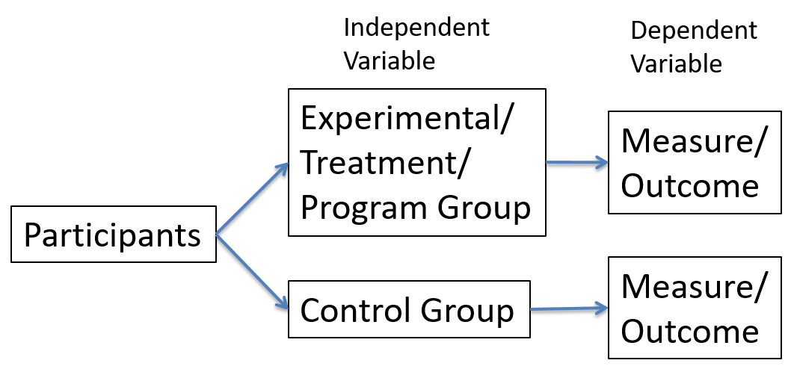
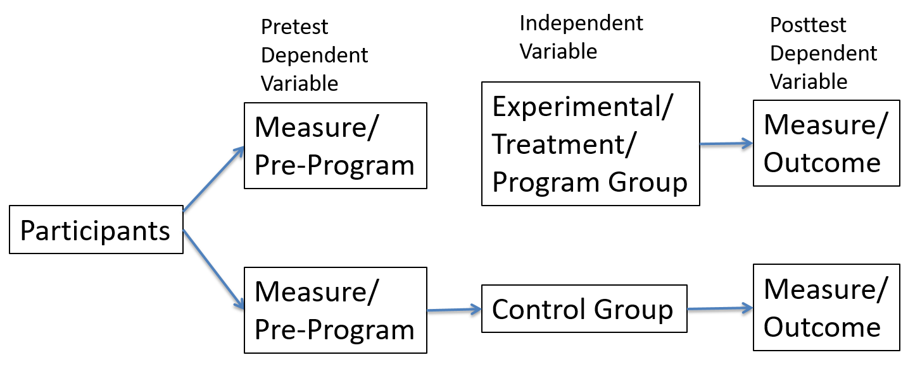

```{r setup, include=FALSE}
knitr::opts_chunk$set(echo = TRUE)
```


## Unit 10

Exploring Different Types Of Experimental Design


## Overview Of Experimental Design

In the last unity we introduced some very important aspects of experimental design: the experimental/treatment group, the control group, and randomization. We also discussed how the control is used to compare the experimental/treatment group to a group that is not exposed to the treatment. This is a type of alternative explanation or counterfactual.


## Overview Of Experimental Design

In this unit we will continue to discuss experimental design and discuss some of the details of the various designs. As with all of the methods we have discussed, there are many considerations when deciding on the best method for the type of the research that is being conducted. The same is true with experimental methods. There are many different types of experimental designs that may be better suited for certain types of research and evaluation than others.


## Measuring Outcome Only

The simplest type of experiment would be to simply measure the outcome of a program. This can be a very efficient, cost effective, and time saving method of program evaluation. These are all very important factors to consider when evaluating a program. Organizations must continue to function during the evaluation and factors such as these should always be considered. 


## Measuring Outcome Only

Sometimes when you only measure the outcome of the program it is called a post-test only. This is because you only test or measure the outcome after the program implementation. Fig. 10.1 shows a diagram of the post-test only experimental design. The first box represents all of the participants and they have not yet been assigned a group. The next two boxes (one on the bottom and one on the top) represents the participants being split and assigned to either the treatment group that experiences the program or the control that does not. Finally there is the measurement of the outcome from each group. At this point the researcher can compare and evaluate the results and outcome of the experiment. Remember, that if this is a true experiment the participants were randomly assigned to one of the two groups.


## Measuring Outcome Only

Fig. 10.1




## Measuring Outcome Only

Often the simplest designs are actually better than creating overly complicated designs. However, there are some disadvantages of the post-test only design that only measures the outcome of the program. The one main disadvantage is that it is not possible to tell how much each group improved, remained the same, or perhaps the outcomes were worse than before the program. This is because there is no baseline comparison. There is important information in the results with the comparison to the control group. For, example it is possible that both groups had worse outcomes, but the outcomes for the control group were worse than the treatment group. There is no way to know without knowing the measure of the dependent variable before the program began.

## Measuring Before The Program And The Outcome After

Fortunately there are other ways to design an experiment. One simple solutions is to measure the dependent variable before the program is implemented. If this is done there will be a baseline to compare how each group changed, whether that be improved, became worse, or stayed the same. Researchers can still compare the group outcomes. However, now they can also compare the groups before the program was implemented. This allows for much more information from which to draw conclusions. For example, it is possible that the groups were different on the dependent variable, both before the program was implemented and after. This would indicate an alternative variable or explanation that was not measured. Randomization should create equal groups on average, but there is always a possibility that the randomization had some errors.


## Measuring Before The Program And The Outcome After

Fig. 10.2 shows the diagram of how how to measure the dependent variable before the program is implemented and also after when there are outcomes. This diagram is very similar to Fig. 10.1 where it is a post-test only design. This design is also called a pre-test-post-test design. As you can see after the box that includes all of the participants they are assigned to one of two boxes. The boxes are both measure/pre-program. This box represents the measurement of the dependent variable before receiving either the treatment/program or the control/no program. The rest of the diagram is identical to Fig. 10.1.


## Measuring Before The Program And The Outcome After

Fig. 10.2




## Measuring Before The Program And The Outcome After

There are other advantages that come with measuring the dependent variable and other important variables related to a program. It is possible that there are certain types of members of the organization that have certain characteristics that are not of interest in the evaluation or that may present variables that could create a situation with too many variables that would lead to results that are less informative. This is not a situation where the researcher is choosing the data only to confirm the hypothesis. Sometimes there are certain variables that actually add other components to the research that would create less clear results. Measuring before the program allows for prescribing of participants. For example, the researcher may be interested in how the program affects recently hired members of the organization. Therefore, it would be good to firescreen and only select new members. 


## Measuring Before The Program And The Outcome After

Another advantage is when people or participants drop out or do not complete the study. Let us return to the pay and productivity example. Again, let us assume that some people are less motivated than others. One difference in this case is that because of random assignments, both groups should be very similar or the same on average. However, it is possible that the program, in this case pay raise, could interact whit certain personal characteristics and the pay raise could change the behavior of certain types of people.


## Measuring Before The Program And The Outcome After

In this case, let us assume that a pay raise actually encourages less motivated people to remain in the study or evaluation. However, less motivated people that do not receive a pay raise may not feel as much of a need to complete the study. This scenario may lead to more people that are less motivated in the control group to drop out and not complete the study, whereas the pay raise is a factor that keeps less motivated people in the study in the treatment group. What would this possibly do to the results?


## Measuring Before The Program And The Outcome After

The treatment group may increase productivity due to the pay raise. However, motivation may also be a factor in productivity, but perhaps was not measured. In the control group there was a much larger drop-out rate among less motivated people. Therefore, the control group now consists of mostly highly motivated people. If in fact motivation is also related to productivity then the control group will actually become more productive than it would be for the less motivated people that dropped out. This may lead to the difference in productivity between the treatment group with the pay raise and the control group to be much smaller or there may be no difference at all. This result would be due to the groups no longer being the same in all ways, except the independent variable, because the treatment group maintained the less motivated people, but the control group lost many of the less motivated people.


## Measuring Before The Program And The Outcome After

The difference between the make-up of the two groups can alter the results. The results are not as reliable because now there is another explanation, and that is there is another unmeasured variable besides pay that accounts for the level of productivity. However, we measured the productivity before the implementation of the program and we can compare the drop-out rates of each group. After analyzing both the results will show a difference in the drop-out rates. This also illustrates the importance of measuring variables that may not be of interest for the evaluation. If motivation was also measured it would become clear that there was a specific type of person that dropped out more often in the control group.


## Overview Of Two Types Of Experimental Design

We have discussed two types of experimental design. One was the simplest type of experiment where only the outcome of the program was measured. The other was where the dependent variable was measured before the program and after the outcome of the program. Both have advantages and disadvantages. One important component in both of these designs is the random assignment of participants to each level of the independent variable or program change. This helps to keep the groups as equal as possible except in terms of the independent variable.


## Looking Forward

- We will continue to discuss advantages and disadvantages of different designs, and solutions to removes some disadvantages.

- We will continue to introduce more types of experimental design. 
