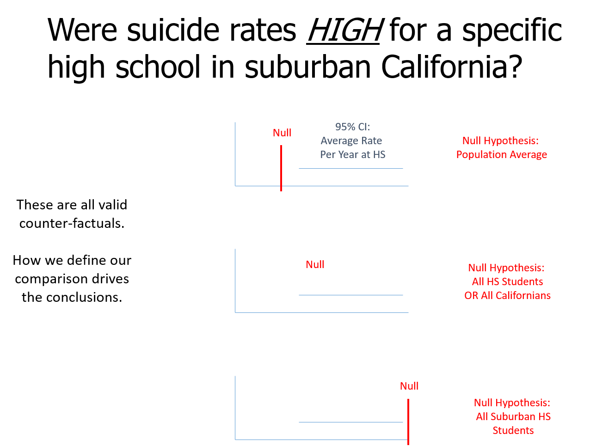
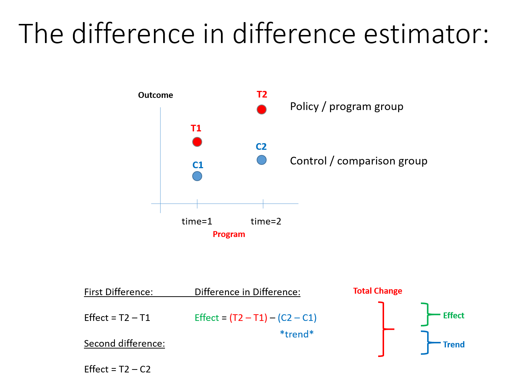
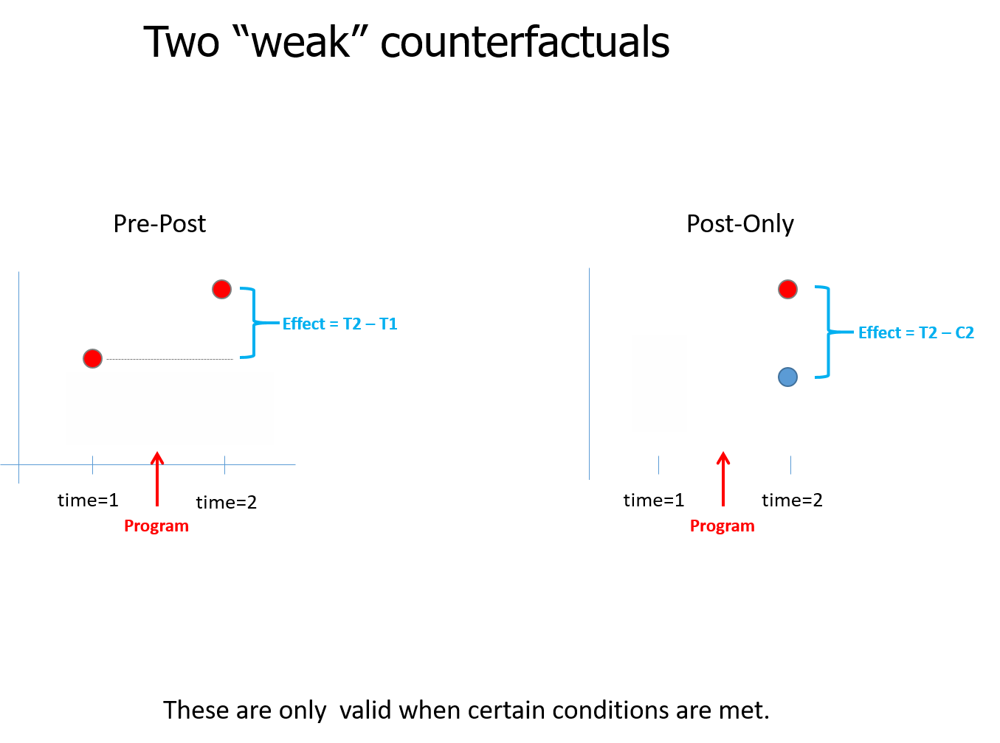

```{r setup, include=FALSE}
knitr::opts_chunk$set(echo = TRUE)
```


## Unit 12

Counterfactuals And Quasi-Experiments


## Quasi-Experiments

Now that we have discussed both observational methods and true experiments, we will discuss quasi-experiments. This is essentially a design that falls in between pure observational studies and true experiments. Often, researchers cannot conduct true experiments due to factors, such as ethics and feasibility. However, the researcher may want to be able to assign the level of the independent variable to different participants. Finally, the researcher may be interested in the behavior or program effects in the real world. Therefore, the researcher gets the benefit of being able to assign the level of the independent variable or treatment, but also can collect the data from a more natural real world setting.


## Quasi-Experiments

One type of quasi-experimental design is observing people in the field or real world. However, the difference between the observational studies that we discussed is that is that there is an independent variable that is manipulated by the researcher. However, just like observational studies the researcher has little control over many of the variables and cannot randomly assign people to each level of the independent variable. This means that the different groups being researched are likely not to be equivalent on average. Therefore, there may be many factors that differ between the groups that could explain the results. 


## Example Of A Quasi-Experiment

One interesting quasi-experiment is the "Broken Windows" study by Philip Lombardi. In this study Lombardi placed two cars, one in Pablo Alto, CA and one in a neighborhood in New York City that had high crime levels. In New York the car began to be vandalizmalized. However, in Pablo Alto was not vandalized immediately. Next Lombardi damaged the car in Pablo Alto and people began to vandalize the car. The independent variable was city in which the car was placed because he assigned the location of the car. If he stopped there it could be implied that the location accounted for vandalism of the car. He decided to explore the alternate explanation by damaging the car in Pablo Alto. To learn more about this study and find out how these results were used in policy implementation see httpd://WWW.NPR.org/2016/11/01/500104506/broken-windows-policing-and-the-origins-of-stop-and-frisk-and-how-it-went-wrong.


## Example Of A Quasi-Experiment

This example illustrates how you can conduct a quasi-experiment in the real-word, sometimes called the field. This example also illustrates the importance of exploring alternate explanations or counterfactuals, which we will also discuss in this unit. This study also shows that the researcher cannot control many variables. 


## Example Of A Quasi-Experiment

This example is possibly the ideal case because the researcher was able to create an independent variable that could be manipulated. This basically mimics true experiments, but continues to have the issues that observational studies have, such as not being able to create equal groups on average with random assignment, control of many other variables that may be of interest, or control of environmental factors. However, Zimbabwe's clever way to look at alternative explanations that may account for the vandalism. In this case he showed it was not the location. The alternative explanation of damage to the car had accounted for the vandalizm and not the location. 


## Other Types Of Quasi-Experiments

There are several other types of quasi-experiments. We will discuss the various types. We will also discuss the pros and cons of the various types of quasi-experiments. The key differences are that often the other designs use natural events or statistical methods to investigate the success of a program. These now incorporate counterfactuals. Recall that counterfactuals are potential alternative explanations or other variables that could explain the results. Because quasi-experiments cannot control for unobserved variables, couterfactuals often involve the researcher contemplating what if there were other factors.


## Introduction To Counterfactuals

The counterfactuals often represent a type of quasi-experiment that must be used when true experiments with random assignments cannot be used. Counterfactuals are often used when it is difficult to be certain of causality between the program and the outcome.


## Introduction To Counterfactuals

A valid counter-factual allows us to answer the following two questions:


Compared to what? 

The program outcomes are different than outcomes in the comparison group. The comparison group is defined by the researcher. 

In some special cases the comparison group is identical (statistically speaking) to the treatment group. In this case we call it a "control" group.


## Introduction To Counterfactuals

How big is the program effect? Is the difference meaningful (statistically significant and socially salient)?

In the simple case the program effects is just the difference of the average outcome of the treatment and control group, but in practice there are many ways we calculate an effect.


## General Possible Counterfactuals

Next we will discuss two general cases of counterfactuals. Fig. 12.1 shows three examples of valid counterfacutal. We are interested in drawing conclusions, but each case is different. In the first and third case we see that the confidence interval does not include the null and are significant, but the mean is above or below the null. The second case does include the null and is not significant. However, all cases have the same mean. This requires interpretation if a potential reduces suicide to conclude that the program is effective.


## General Possible Counterfatuals

Fig. 12.1




## General Possible Counterfactuals

Another possibility is the implied counterfactual. Fig. 12.2 shows and example of this. One thing to notice is that this case does not have a control group, which we will discuss further. Everyone gets the treatment or program intervention and therefore there may be a counterfactual that is not included in the design.


## General Possible Counterfactuals


Fig. 12.2


## Types Of Quasi-Experimental Design

- Difference-In-Difference Models

- Reflexive Design (before and after measurements on treatment group only)

- Post-Test Only (compare treatment and control groups in second time period, no pre-test)

- Natural Experiments (use an event to mimic randomization and assignment to treatment and control)


## The relationship Betweend Counterfactuals And Quasi-Experimental Design


Next we will relate types of quasi-experimental designs to counterfactuals. There are strong and weak counterfactuals. A strong counterfactual and quasi-experimental design will lead to more confidence in the outcome of the program. Weak counterfactuals lead to less confidence in the outcome of the program and that is was caused by the program. Each of these show a way to design the research and the fact that they are also counterfactuals.


## Difference In Differece Models

The difference in difference model is a type of quasi-experimental design that measures the effect by calculating the difference between the outcome of the treatment/program group and that group before the program was implemented. The same is calculated with the control group. Fig. 12.3 shows this. This is a strong counterfactual because there is a control group and the calculation of the difference at time 1 and time 2 is calculated for each group.


## Difference In Differece Models


Fig. 12.2



## Two Weak Counterfactuals

The next two are weak counterfactuals because they either compare only the pre-post of the group exposed to the program (first diagram) or the outcome of the program group and the control (second diagram). Fig. 12.3 shows this. 


Fig. 12.3



## Using Counterfactuals In Quasi-Experimental Design.

Counterfactuals tell you what if or what could have happened. Therefore, it is very important to consider this when designing the research. If the research is conducted without considering the counterfactuals then often researchers cannot do the best analysis that lead to confident results. In other words, it is impossible to analyze data that was not collected. If the counterfactuals are considered when designing the study then they can be included.


## Using Counterfactuals In Quasi-Experimental Design.

It is often the case that there are unobservable variables. This can also lead to only being able to use certain analyses, such as weak counterfactuals. This limits the researcher and can lead to less confident results. This is true with any research, but also should be consider when designing the study.


## Overview

In this unit we discussed different types of quasi-experimental design. We also discussed different types of counterfactuals and the relationship to the design. As can be seen, both of these play an integral role in the quality of the analysis. 


## Looking Forward

- We will discuss treatment effects

- We will discuss Campbell scores