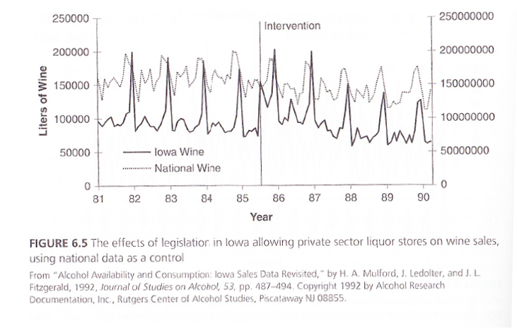

```{r setup, include=FALSE}
knitr::opts_chunk$set(echo = TRUE)
```


## Unit 14

Campbell Scores Continued


## Overview Of Campbell Scores Continued

In the last unit we introduced the first five Campbell Scores in greater detail. In this unit we will discuss the remaining five and tie these concepts together in regards to creating quality, valid, and reliable research designs. Once the research is designed well and conducted the statistical analyses can be conducted to show the results and outcome.


## Testing As A Competing Hypothesis

Testing is a factor that we have discussed earlier in terms of practice effects. A good example of this is when the research design is a pre-test post-test design or a repeated measures design. These designs measure the dependent variable two or more times. This measure is often a test and participants can improve each time they take the test or dependent measure. Therefore, the researcher should consider how the multiple tests may be the counterfactual that explains some improvement in test scores. 


## Testing As A Competing Hypothesis

This problem only applies to a small set of programs.  The researcher can tests, use post-test only designs, or use a control group that receives the test evaluate the testing effect. The other solution is using the Solomon-Four Group design where some people are not given a pretest or tested multiple times. This will provide the comparison to evaluate the testing as a competing hypothesis.


## Regression To The Mean

An often overlooked explanation for outcomes, especially very positive and improving outcomes is regression to the mean. Consider how often you see examples of repeated success that is well beyond the average or typical rate. How many baseball teams win the World Series multiple times back to back? The reality is that not many. The basic concept of regression to the mean is that the mean success rate is typically not well above the overall mean success rate of other people or parties.


## Regression To The Mean

Daniel Kahneman described a very good example for regression to the mean. Air Force trainers began to believe that reward and positive feedback often resulted in worse performance in the pilots. The pilots would perform well, received positive feedback and then perform worse. However, the reward and positive feedback was not causing the decrease in performance. The pilots had a mean level of performance, but sometimes performed better. However, because the mean level of performance is lower than outperforming by definition, it is very likely that other performances of the pilot will not be as good. Therefore, the pilots were regressing back to their mean level of performance after outperforming their typical skill level.


## Regression To The Mean

There are solutions to minimize results that are not typical or representative of mean results. One is to simply conduct the test multiple times so that the outliers or performances much better or much worse than the mean are not the basis for the conclusion. This will provide a good estimate of the true mean results. A researcher could also not select a study group from the top or bottom of the distribution in a single time period (only high or low performers). This will also help to minimize erroneous conclusions due to regression to the mean.


## Example Of Regression To The Mean


Weirdly enough, surgery's invasiveness may explain some of its potency. Studies have shown that invasive procedures produce a stronger placebo effect than non-invasive ones, said researcher Jonas Bloch Thorlund of the University of Southern Denmark. A pill can provoke a placebo effect, but an injection produces an even stronger one. Cutting into someone appears to be more powerful still. Even without a robust placebo effect, an ineffective surgery may seem helpful. Chronic pain often peaks and wanes, which means that if a patient sought treatment when the pain was at its worst, the improvement of symptoms after surgery could be the result of a condition's natural course, rather than the treatment. That softening of symptoms from an extreme measure of pain is an example of the statistical concept of regression to the mean.

https://fivethirtyeight.com/features/surgery-is-one-hell-of-a-placebo


## Measurement Error

It is also important for the researcher to consider the quality of the research design and how the results are measured. This is similar to the importance of a reliable coding system. If the methods for measuring the outcome or the dependent variable are not very reliable the results may have errors in the measurement of the outcome. If there is significant measurement error in the dependent variables, it will bias the effects towards zero and make programs look less effective. The best solution is to be sure that the methods for measuring the dependent variable are very reliable. It is also good to test the measures before conducting the study with a pilot test to be sure that the measures will work and be reliable.


## Time-Frame Of A Study

A researcher must also consider the time-frame of a program evaluation. Organizations are not static and are constantly changing and evolving. Therefore, the evaluation must take place in an appropriate time-frame. One way in which the time-frame could lead to misleading results is that if there was not enough time for the program to take effect or have the full impact on the outcome. In this case the program may actually be working, but there was not enough time since the implementation of the program.


## Time-Frame Of A Study

It is also possible that the study is too long. This may create a situation where other factors change and impact of the program may be difficult to observe because of other factors affecting the organization. In addition, if the program is too long than there is greater risk for attrition and participation drop-out. As we have seen this can lead to changes in the outcome due to the attrition and not necessarily the program. The solution is to review previous research when designing the study in order to choose the appropriate time-frame based on what has worked in the past. Fig. 14.1 shows an example of this. The vertical line represents the beginning of alcohol sales from private stores. If the study is only considering the time-frame immediately following the change it appears that consumption increases. However, if the time-frame is longer you can see that consumption is not much different than before the change.


## Time-Frame Of A Study

Fig. 14.1




## Intervening Events

Finally, there may be events that affect only one of the study groups, but not the other. This could be an event that affects either the treatment group or the control group, but not both. This would add another variable or factor that may change the outcome of the program. Because of this possibility it is very important for the researcher to be aware and search for any factors that may not have been accounted for that occurred during the evaluation or study. If there is an intervening event, it may be hard to remove the effects from the study, but should at least be accounted for as a potential limitation to the study.


## Overview Of Cambpell Scores And Counterfactuals

We have discussed the details of counterfactuals, competing hypotheses, and Campbell Scores. Campbell Scores can be used as a guideline when designing research, conducting research, and analyzing research. The researcher can continually consider and search for factors for each type of Campbell Score to maintain the highest quality of research and have the highest confidence in the results. Understanding these Campbell Scores also helps the researcher determine the effect that is due to the treatment by possibly removing other factors from aspects such as certain types of trends.


## Wrap Up

We have covered many different types of research designs and how to implement the design to conduct quality research. Each type of design may have its advantages and disadvantages and a researcher can choose the most appropriate method or design. We have progressed throughout this course with the goals of objectivity, validity, and reliability in research. Ultimately we were able to understand the process of research to end with how to critique research and search for counterfactuals. Taken together, all of the concepts will help to create excellent research to evaluate programs.


