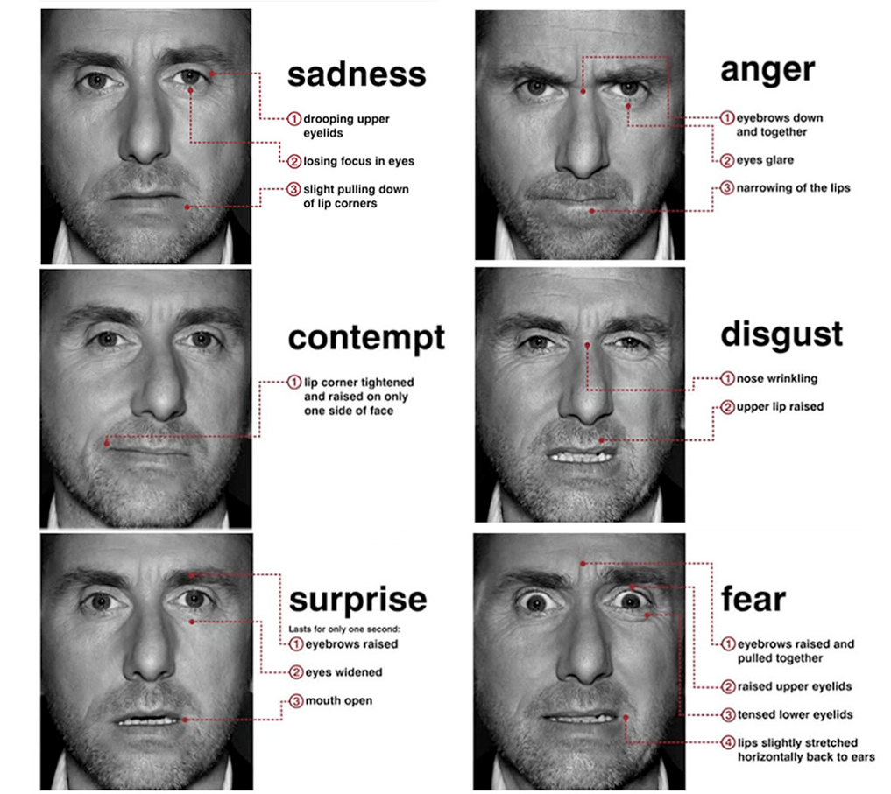

```{r setup, include=FALSE}

knitr::opts_chunk$set(echo = FALSE)

```


## Unit 8

Understanding The Specifics Of A Systematic Coding System


## Overview Of Systematic Coding System

In the last several units we encountered many occasions where a coding system is needed. In observational evaluation, whether the researcher was revealed or not, the researcher must observe, record, and code behaviors, interactions, and processes of the organization. In methods that involve surveyes, especially with open ended questions, there may be much uncertainty regarding how to interpret each response. The same is true with interviews. The respondents may provide many details, but they are often free to respond however they would like.


## Overview Of The Need For A Coding Systme And A System Of Data Collection

Because of the nature of simply observing and free-response answers with little to no restriction, the researcher must interpret the observable behavior or responses. This is typical in obervational studies, surveys, and interview responses. This is where it is very important to develop a very reliable and valid coding system and a method for collecting data.


## How To Develop A Coding System

After a researcher knows the research question, they create a hypothesis and the type of research method to evaluate a program in an organization, the next step is usually developing a coding system. As we discussed in previous units, this is especially true for observational, survey, and interview studies.


## How To Develop A Coding System

We now can further explore the systematic coding system. At this point the researcher knows the goals of the research and evaluation. Next the researcher will determine exactly what behaviors, interactions, processes, or physical expressions to look for when collecting data. These will depend on the variables that must be collected. For example, if the research depends on how different members of the organization, such as mangagement and employees, interact the coding system must be designed to code for specific types of interaction. Another possiblity is judging the satisfaction or emotional reactions of members of the organization. If this is a case then the coding system must include these factors.


## How To Develop A Coding System

It is very important to create precise and systematic codes for everything in which the researcher is interested. If we take the example of the interactions between management and employees, the researcher must specify what types of interactions must be coded. The researcher may be interested in generaly positive, negative, and neutral interaction. Or perhaps the researcher is interested in supportive, punative, engaging, or authoritative interactions. This will determine the specific codes that will be used.


## How To Develop A Coding System

The next step is to define each behavior. There can be much uncertainty, especially when observing the interactions, but also if asking open-ended questions about the interactions. In defining the interaction, the research must decide how specific phyiscal states and verbal interaction indicate a that there is a specific type of interaction. For example, if the management is providing resources and opportunities, in addition a physical state of each person looking positive, such as smiling, this could indicate a supportive interaction. This could then be one definition of a supportive interaction.


## How To Develop A Coding System

However, if the opposite were true and resources were taken away and the physical state showed frowning or anger, this could indicate a punative interaction. Now that these two types of interactions are defined, the next step is to create the actual coding system. We just discussed a few behaviors and signs of supportive or punative interactions, such as facial expresstions and resources. There may be others. For example, what words were used by each person, how often were certain positive or negative words uses, who used the words, what were the reactions to the words, and what occured after the interaction (changes in work behavior, etc.). There are likely many more signs of the different categories of interactions.


## How To Develop A Coding System

One important thing to note is that these behaviors, interactions and codes are being defined before the research and evaluation is conducted. This is very important. This helps to maintain objectivity by knowing exactly what classifies into each category. If this is not done before then the researcher is susceptable to the influence of what is being observed. This can lead to the researcher looking for behaviors that confirm the hypothesis, but ignoring the behaviors that do not support the hypothesis or success of the program. 

## How To Develop A Coding System

The behaviors and interactions are essentially the codes that will be used. Another important practice is to create the optimal number of codes, similar to the number of questions in a survey. There must be a sufficient number of codes to fully classify the type of interaction between management and employees. However, too many codes may become confusing. More importantly if the researcher must observer and record too many codes then the data collection will become difficult and overwhelming. It is likely that the researcher will miss some of the behaviors to code.


## How To Develop A Coding System

The next step is to create a method of recording the data and codes. This could be on a sheet of paper, but more likely it is better to record the data and codes in a computer spreadsheet or database. This will make the process efficient and most easy. Finally, the researchers must practice this at length. This will make the recording and coding process as productive as possible.


## How To Develop A Coding System

Finally, there are some exceptions to some rules. One important one is that while a researcher should have the recording and coding system developed and rehearsed before conducting the research, there are often behaviors and other factors that were not anticipated. It is a good practice to anticipate unexpected observations and have a system to record and code these unexpected observations. This is consistent with the underlying theme that no individual method is perfect. One caution is that the researcher must observe unexpected behaviors that both support and do not support the hypothesis. Because researchers are people they are susceptible to biases. This is a reason to anticipate new behaviors and interaction in organizations and it is very important to have a method in the recording and coding system to collect unexpected information.


## An Example Of How To Code

If we continue the example of supportive or punative interactions, the researcher must define certain characteristics, such as the physical or emotional state of the management and employees. We discussed smiling, frowning, and showing anger. How would a researcher define these physical, emotional states, and also facial expressions? The solution is to delvelop or use a systematic coding system. Fig. 8.1 shows an example of how to use a systematic coding system to code the facial expressions to use as data for the evaluation of supportive or punative interactions.


## An Example Of How To Code


Fig. 8.2




-Eckman Facial Action Coding System; TNS Consulting


## An Example Of How To Code

Each coding system will be different dending on what is acually being coded, such as behaviors, observable outcomes, or interactions. In this case we are using facial experessions to represent supportive or punitive interactions. If you notice the pictures are not simply labeled with the emotion that they represent. There is a systematic method that is used to code for each emotion. For example, anger has a system where the eybrows are down and together, eyes glare, and narrowing of the lips.


## An Example Of How To Code

This is how to maintain an objective way to classify which emotion the person is exhibiting. If we saw those characteristics in our example we would conclude that it is likely the person is angery and the interaction is likely punitive. These codes are created to exact rather than simply interpreting the emotions as we think they are. Much interpretation is removed. This is only one example, but shows the precision, detail, and objectivity with which the codes are created. All codes should have these characteristics.


## Overview Of Coding


We have discussed the importance of creating a systematic coding system that is used when behaviors, responses, and any type of observable data must be interpreted. We discussed the steps of that lead up to the actual development of a coding system. Finally, we discussed the details of how to create actual codes.


## Looking Forward

- We will begin to discuss types of methods that are more experimental in nature

- We will begin with simple experimental designs and progress to more complex designs

- We will discuss the advantages and disadvantages of experimental methods in program evaluation


