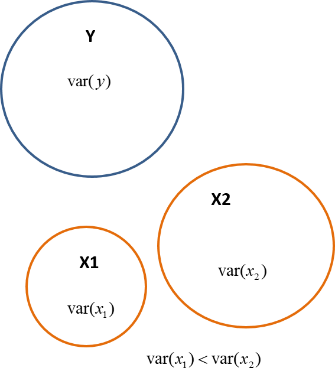
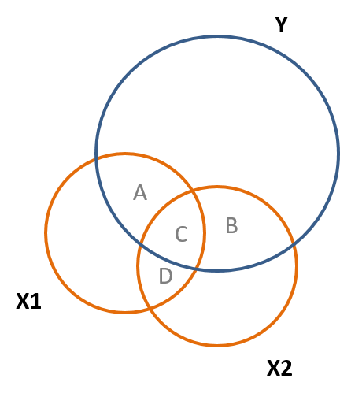
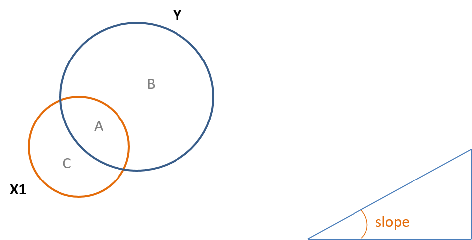
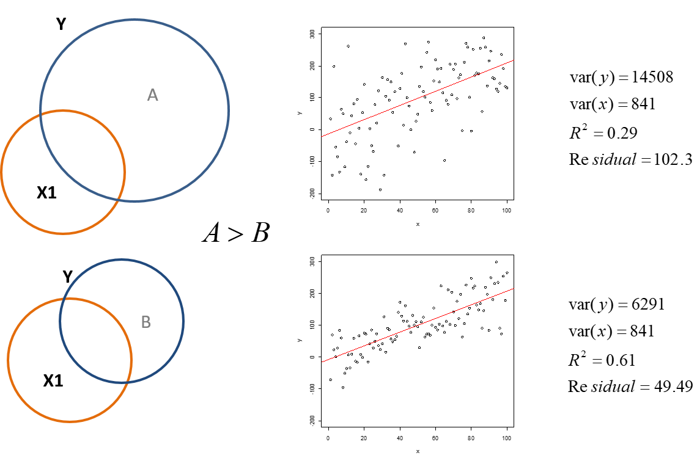

```{r setup, include=FALSE}
knitr::opts_chunk$set(echo = TRUE)
```


## Unit 7

Bellentine Venn Diagrams


## Overview Of Bellentine Venn Diagrams

Diagrams, graphs, and charts can be very helpful in statistics. These are tools that help to visually represent equations and concepts that are used in statistics. Bellentine Venn Diagrams are a great way to many of the concepts that we have just recently discussed by representing them visually.


## Concepts That Bellentine Venn Diagrams Can Represent

These diagrams help show the following concepts:

-Variance (larger variance means larger circle)

-Covariance (larger covariance means more overlap between two circles)

-Residual (portion of $Y$ that is not covered by all independent variables)


## Concepts That Bellentine Venn Diagrams Can Represent

-Explained variance (portion of the variance of $y$ that is accounted for by $x$)

-R-square (ratio of the residual to total variance)

-Slope (ratio of covariance to variance of $x$)

-Standard error (ratio of residual to variance of $x$)


## Visualizing Concepts With Venn Diagrams: Variance


The Venn Diagrams very nicely show these statistical concept and the variance is a very clear concept that is represented. Recall that variance is how spread the data is from the mean. Therefore, we can represent the variance with a circle and then the wider the circle is or the larger the diameter is a larger variance. Fig. 7.1 shows that $x_1$ has a smaller variance than $x_2$.


## Visualizing Concepts With Venn Diagrams: Variance


Fig. 7.1




## Visualizing Concepts With Venn Diagrams: Variance

Eq. 7.1 shows the variance of $y$, Eq. 7.2 shows the variance of $x_1$, and Eq. 7.3 Shows the variance of of $x_2$.

Eq. 7.1

$var(y) = \Sigma{(y_i} - \bar{y})^2$


## Visualizing Concepts With Venn Diagrams: Covariance

The covariance is represented by the overlap of the circles in the diagrams. Because the covariance shows how two variables relate, this means that they share variation together and therefore must overlap. In Fig. 7.2 you can see that
$x_1$ and $y$ share space in the diagram and covary together.


Fig. 7.2




## Visualizing Concepts With Venn Diagrams: Covariance

You can also see that $x_1$ and $x_2$ overlap in Fig. 7.2. Recall the partitioning of variance, a related topic, therefore the $cov(x,y) = A+B$ and the $cov(x_1,x_2) = C+D$.

## Visualizing Concepts With Venn Diagrams: Correlation

Recall that the correlation involves covariance and therefore will be reflected in a similar way in the Venn Diagrams. Fig. 7.3 shows this, and the correlation is also what is called the standardized slope.

Fig. 7.3


## Visualizing Concepts With Venn Diagrams: Correlation

This relationship between the covariance and correlation can be seen in Eq. 7.2. The abreviation of std stands for the standard deviation.

Eq. 7.2

$cor(x_1,y) = cov(x_1,y)/(std(x_1)std(y))$ 


## Visualizing Concepts With Venn Diagrams: Slope

From your prerequisit courses in statisics you may recall that in a normal distribution z scores are standardized scores that place everything in units of standard deviations, which are the same because it is 1 for each. The same can be accomplished by standardizing the slope in a regression. Also, recall that the slope of a line is the rize over the run, or the change in in $y$ divided by the change in $x$. This can be seen in Fig. 7.4 and in Eq. 7.3.


## Visualizing Concepts With Venn Diagrams: Slope


Fig. 7.4



Eq. 7.3

$B_1 = cov(x,y)/var(x) = A/(A+C)$


## Visualizing Concepts With Venn Diagrams: $R^2$ And Regression Residual

Finally, $R^2$ represent the percentage of the explained variance in a regression. The Venn diagrams visually illustrate this very well. In other words, a percentage of the explained variance would be calculated by the ratio of the explained variance of a variable divided by the total variance of the same variable. A similar example is if you flip a coin 1000 times it is very likely to result in heads close to 500 times and close to tails 500 times. To the percentage of heads would be aroung 500/1000 or $50%$. The analogous situation for $R^2$ can be seen in Fig. 7.5. Also, $e$, or the error term is proportional to $B$ in the diagram.


## Visualizing Concepts With Venn Diagrams: $R^2$ And Regression Residual


Fig. 7.5


## Visualizing Concepts With Venn Diagrams: $R^2$ And Regression Residual

Eq. 7.4 shows the equation to calculate $R^2$ and how it is represented using the Regions of A and B in Fig. 7.5.

Eq. 7.4

$R^2 =$ explained $var(y)/var(y)$ is approximately $= A/(A+B)$


## Visualizing Concepts With Venn Diagrams: $R^2$ And Regression Residual

Fig. 7.6 shows two different examples of data and the calculations of the variances of $x$ and $y$ in each example. You will notice that the slopes are the same, but the data in the first example is more spread out than the second example. This is also reflected in the larger variance of $y$ in the first example. The larger variance leads to a larger residual. Because the variance and residual in the first example are larger also leads to a smaller $R^2$ or percentage of the explained variance in the regression.

## Visualizing Concepts With Venn Diagrams: $R^2$ And Regression Residual


Fig. 7.6





## The Error And Impact On The Slope And Standard Error

We just noticed that if we increase the variance of $y$, but not $x$ the slope does not change. However, if we increase the variance of $x$ the standard error will decrease as we have discussed earlier. Because the slope equals $B/(A+C)$ in a diagram, such as Fig. 7.5, increasing the variance will decrease the slope. Also, as can be seen in Eq. 7.3, increasing the covariance of $x$ and $y$ will lead to a larger slope because the numerator in the equation increases. 


## The Error And Impact On The Slope And Standard Error

Systematic measurement error does not impact either variance or covariance, and thus the slopes and standard errors in a model will be identical. You can show this by taking some height and weight measures, running a regression, then adding a foot to everyone's height. We just shift the entire distribution up, but do not change the relationship. Note in the two regressions the only thing that changes is the intercept, not the slope or the $R^2$ This is why linear transformation of variables (converting from Fahrenheit to Celsius as an example) is harmless to inferential models, except form infering when the independent variable $x=0$. This is because you may want to know the baseline or the value of the intercept $B_0$. 


## Defining Other Variables For Future Units

Finally, we will introduce some important concepts regarding variables that will be used in the future. The first are control variables. These are variables that may not be of particular interest to us, but however the may be related to the dependent variable and can affect our regression results.


## Defining Other Variables For Future Units

Related to control variables are omitted variables. These are also variables that could potentially affect the regression results, but are omitted from the regression. It is very important to consider variables that we did not use.


## Defining Other Variables For Future Units

Finally there are instrumental variables. An instrumental variable is a third variable that may be correlated with the independent variable that is of interest. However, it is only related to the dependent variable through the relationship with the independent variable. Instrumental variables are used when we cannot infer causality by using randomized experiments. We will discuss all of these concepts in the future.


## Looking Forward.

-We will discuss in more detail the impact of adding control variables to the regression model.

-We will discuss partitioned regression, which will help to uncover the "true" slope of the independent variable.
