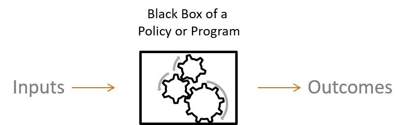
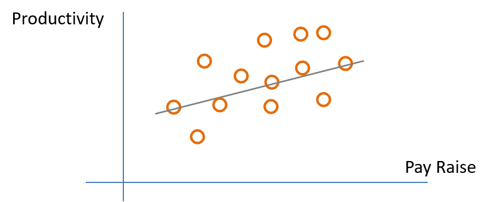
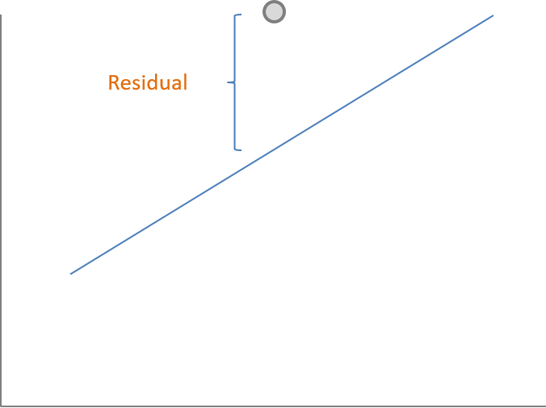
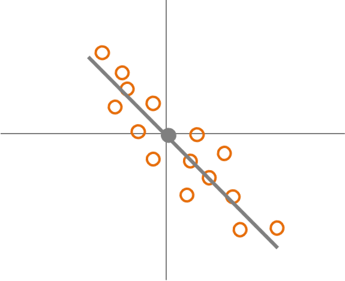
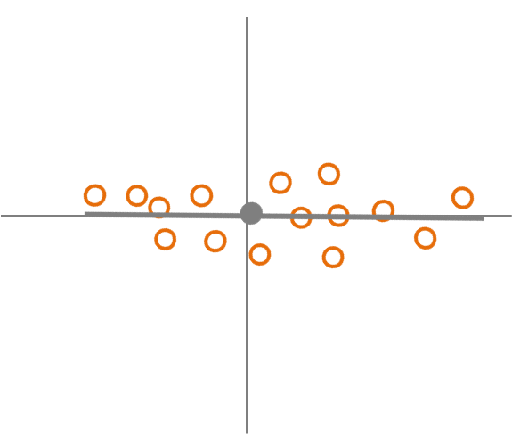
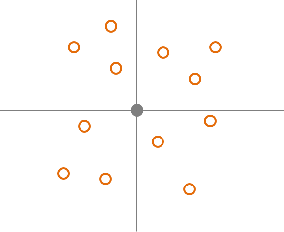
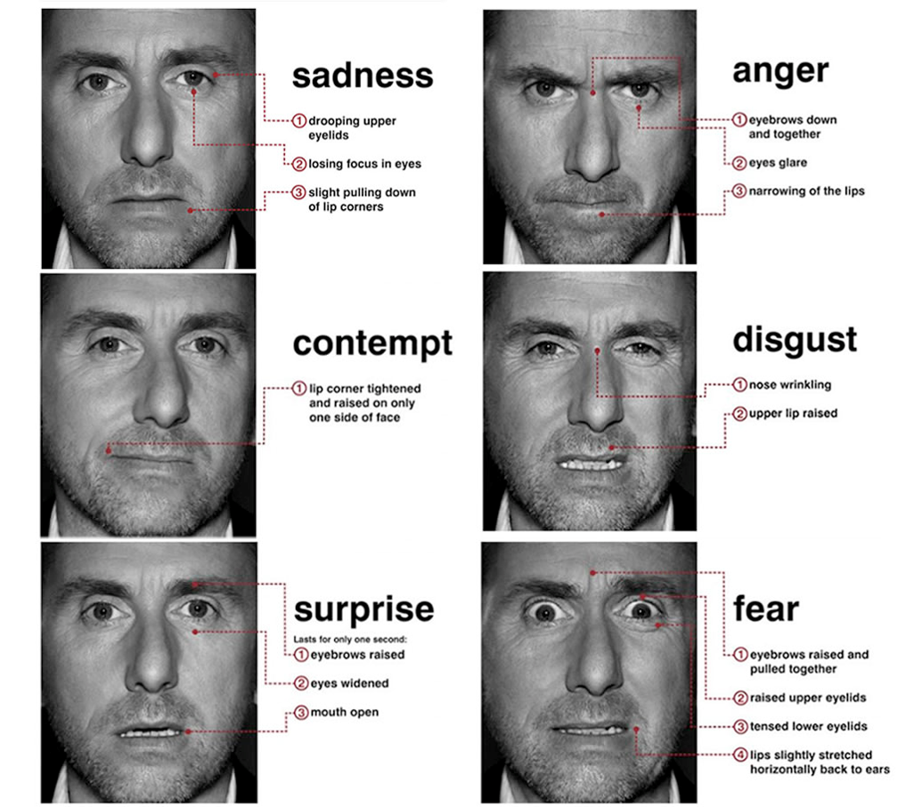

--- 
title: "Program Evaluation: Methods and Design"
author: "Joshua Manning, Jesse Lecy"
date: "`r format(Sys.time(), '%d %B, %Y')`"
site: bookdown::bookdown_site
output: bookdown::gitbook
documentclass: book
bibliography: [book.bib, packages.bib]
biblio-style: apalike
link-citations: yes
description: "This text serves as reference material for a course sequence in applied regression analysis and research design offered at an advanced undergraduate or master's level for students in applied social science."
---
```{r include=FALSE, cache=FALSE}
knitr::opts_chunk$set(
  warning = FALSE,
  message = FALSE,
  comment = "#>",
  collapse = TRUE,
  cache = TRUE,
  out.width = "70%",
  fig.align = 'center',
  fig.width = 6,
  fig.asp = 0.618,  # 1 / phi
  fig.show = "hold"
)


options( dplyr.print_min = 6, dplyr.print_max = 6 )
```

# Welcome {-}

This is a _sample_ book written in **Markdown**. You can use anything that Pandoc's Markdown supports, e.g., a math equation $a^2 + b^2 = c^2$.


```{r include=FALSE}
# automatically create a bib database for R packages
knitr::write_bib(c(
  .packages(), 'bookdown', 'knitr', 'rmarkdown'
), 'packages.bib')
```

<!--chapter:end:index.Rmd-->

```{r include=FALSE, cache=FALSE}
knitr::opts_chunk$set(
  warning = FALSE,
  message = FALSE,
  comment = "#>",
  collapse = TRUE,
  cache = TRUE,
  out.width = "70%",
  fig.align = 'center',
  fig.width = 6,
  fig.asp = 0.618,  # 1 / phi
  fig.show = "hold"
)


options( dplyr.print_min = 6, dplyr.print_max = 6 )
```
# (PART) REGRESSION {-}

```{r setup, include=FALSE}
knitr::opts_chunk$set(echo = TRUE)
```

# R Markdown

This is an R Markdown document. Markdown is a simple formatting syntax for authoring HTML, PDF, and MS Word documents. For more details on using R Markdown see <http://rmarkdown.rstudio.com>.

When you click the **Knit** button a document will be generated that includes both content as well as the output of any embedded R code chunks within the document. You can embed an R code chunk like this:

```{r cars}
summary(cars)
```

## Including Plots

You can also embed plots, for example:

```{r pressure, echo=FALSE}
plot(pressure)
```

Note that the `echo = FALSE` parameter was added to the code chunk to prevent printing of the R code that generated the plot.

<!--chapter:end:part_01_ch_01.Rmd-->

```{r include=FALSE, cache=FALSE}
knitr::opts_chunk$set(
  warning = FALSE,
  message = FALSE,
  comment = "#>",
  collapse = TRUE,
  cache = TRUE,
  out.width = "70%",
  fig.align = 'center',
  fig.width = 6,
  fig.asp = 0.618,  # 1 / phi
  fig.show = "hold"
)


options( dplyr.print_min = 6, dplyr.print_max = 6 )
```

# Program Impact


### Why do we use statistical models for program evaluation?

In unit 1 we introduced the general purpose of statistics and quantitative methods

In unit 2 we will provide a more formal definition of how statistics is used and what it can tell us about a program


### Reminder from Unit 1: Advantages of Statistical Evaluation 

- Statistical models can be used with to analyze data that will show the quality, program impact, and where the impact occurs.
- Quantitative and statistical analysis can attempt to give an unbiased evaluation. It can provide us with outcomes associated with probabilities, level of confidence, and the size of the effect. It can also provide information about the specific relationship between the program, the effect, and the impact.
- Variables can be used to represent the program and its effect.


## The Regression Equation


In unit 1 we saw that the regression line is represented by a linear equation (Eq. 1.1). We also saw regression coefficients, often represented by the upper case Greek letter Beta, show the slope of the regression line. In this case the slope is Beta with a subscript of 1. Here we only have up to $B_{1}$. This means that there is only one independent variable. Over next few weeks we will begin to see that we can have more than on independent variable represented by $B_{1}, B_{2}, B_{3},...B_{i}$.   

(Eq. 2.1) Regression Equation: $Y = B_{0} + B_{1}X_{1}$


The Beta with a subscript 0, ($B_{0}$), shows the intercept or where the regression line crosses the horizontal axis, Eq 2.1. How can we interpret this? If the value of $x_1$ is 0 for a data point then $B_{1}$ is multiplied by 0, which would make $B_{1}X_1 = B_{1}0 = 0$ Because it is equal to zero all that remains is Eq 2.2.

(Eq. 2.1) Regression Equation: $Y = B_{0} + B_{1}X_{1}$

(Eq. 2.2) Intercept of Regression Equation: $Y = B_{0}$


### Hypothetical Example of Interpreting the Regression Equation

A manager may want to increase productivity of the employees by implementing a new or altered program in the organization. There may be many ways that this could happen, such as better technologies, implementing work teams, or creating a better work environment. The manager proposes a simple solution: increase pay. Therefore, the manager believes that employees will be more productive with more pay.


The manager implements the pay raise and the employees are very satisfied with the increased income. Everything seems to be going well, but how does the manager know if the increased pay was associated with increased productivity. In other words: did the program work? The manager decided to simply compare raw productivity data would not lead to enough confidence that it was successful. The solution is using statistical methods for evaluation.


Recall that program evaluation can be interpreted as a blackbox model (Fig. 2.1) with inputs and outcomes.

(Fig. 2.1)


In this case there are inputs of pay raise and outcomes of productivity levels. 

(Fig. 2.2)


Because the manager has inputs (pay raise) and outputs (productivity) the manager can use these to run a regression analysis.


(Eq. 2.3) Regression Eq: $Productivity = B_{0} + B_{1}Pay Raise$


The manager ran the regression analyis and the results show that 
$B_{0} = 50$ units of productivity and that $B_{1} = 5$.


(Eq. 2.4) Regression Eq: $Productivity = 50 + 5Pay Raise$


How should the manager interpent these results? Because $B_{0}$ is 50 it means that this is the expected productivity if there was no pay raise. Because $B_{1}$ is 5 it means that for each unit or dollar of a pay raise you would expect productivity to increase by 5 units.


(Eq. 2.4) Regression Eq: $Productivity = 50 + 5Pay Raise$


## Confidence Intervals

How can we be confident of our estimate of program impact?

From the example we saw that for each dollar we expect to see an increase of 5 units of productivity. Does this mean that for every employee each dollar of pay raise translates into 5 unit of productivity? That would mean we would be perfectly confident that the regression equation describes each employee perfectly. Therefore the regression equation would resemble Fig. 2.3.


```{r pay-variance, out.width='32.8%', echo=F, fig.cap='The variance of pay productivity'}

```


However, in the real world people are all different and there is variance in how the pay raise will impact productivity for each individule employee. Fig. 2.4 shows that some employees have smaller increase in prodcutivity for a dollar of pay rais and some a larger increase.


In statistics we can use confidence intervals. Confidence intervals tell us if we repeat an experiment many times we would expect a certain percentage of the experiments to contain the true mean in the confidence interval. Often people use 95% confidence intervals. Therefore, if the experiment is repeated 100 times we would expect 95 of those experiments to contain the true mean within the confidence interval.

This also applies to regression. At the 95% level if the experiment is repeated 100 times we would expect 95 of those experiments to contain the true $B$ or regresion slop  within the confidence interval. Later we will see how confidence intervals are calculated, but in order to calculate the confidence interval you must first calculate the standard error or $s$.


## Confidence Intervals For Hypothesis Testing

Fig. 2.5 shows a visualization of using confidence to test the hypothesis that $B_{1}$ for pay raise is significantly greater than the true population $B$, (A), or not significantly greater, (B), or Significantly less, (C). For A and C the confidence interval does not contain the null or true population $B$ and therefore A shows $B_{1}$ significantly greater than the true population $B$ and C significanly less than the true population $B$. However, because in B the confidence interval includes the null of the true population $B$ there is no significant difference.


```{r pay-conf-int, out.width='50%', fig.show='hold', echo=F, fig.cap='Confidence interval of pay raises'}

```

## The Standard Error

The standard deviation and variance are closely related. The standard deviation essentially shows the average distance between each data point and the mean. The standard error is simply a standard deviation used for the sample mean or the $B$ estimated from the sample. First we will review the variance and standard deviation.


## The Variance and Standard Deviation Of The Mean


Eq.2.6


Eq.2.7


Eq. 2.6 shows the equation for calculating the variance. $\sigma^2_{x}$ is the symbol for the variance. $\bar{x}$ is the sample mean and $x_{i}$ is each individual data point. Therefore, $x_{i}$ - $\bar{x}$ is the size of the deviation of each data point from the mean. The subscript $i$ stands for index, therefore $x_{1}$ is the first data point. $\Sigma$ represents the summation. Therefore, $\Sigma(x_{i} - \bar{x})$ is the summation of the deviation of each data point from the mean.
$n$ is the sample size or number of data points. 


When thinking about the variance formula, why not just use the average of the summation of the deviations of each data point? Because the mean will be the center of the data, the sum of deviations will always equal 0. Therefore, if the deviations are squared the deviations all become positive. 


Because the variance uses squared deviation it is not in the same units a the data points or the mean. The solution is to take the square root of the variance, Eq. 2.7, which is called the standard deviation or $\sigma$. This puts the variance into the same units as the data points and the mean. In addition, it is easier to interpret.


### Hand Calculation Of The Variance

Below shows how to calculate the variance by hand using Eq. 2.6. The data set shows the grades of 5 students of a quiz with a maximum of 10 points. The entire data set is represented by $X$.

$X = [10, 8, 9, 6, 10]$


First calculate the deviation from the mean for each data point.

$10 - 8.6 = 1.4$

$8 - 8.6 = -0.6$

$9 - 8.6 = .4$

$6 - 8.6 = -2.6$

$10 - 8.6 = 1.4$


The second step is to square each deviation from the mean.

$1.4^2 = 1.96$

$-.6^2 = .36$

$.4^2 = .16$

$-2.6^2 = 6.76$

$1.4^2 = 1.96$


The third step is tha sum or add the squared deviations from the mean. This is called the sum of the squared deviations.

$\Sigma(x_{i} - \bar{x})^2) = 1.96 + .36 + .16 + 6.76 + 1.96 = 11.2$


The fourth step is to calculate the sample size minus 1.

$5 - 1 = 4$


The final step is to divide the sum of squared deviations by the sample size minus 1.

$\sigma^2 = \Sigma(x_{i} - \bar{x})^2)/(n-1)$

$\sigma^2 = 11.2/4 = 2.8$

To calculate the standard deviation we simply take the square root of the variance or 2.8.

$\sigma = \sqrt{\sigma^2} = \sqrt{2.8} =1.673$  


## The Standard Error Of The Sample Mean

Recall that the standard error is used when we do not know the true population standard deviation and only obtain a standard deviation of a sample. One very interesting fact is that the distribution of the means of each sample converges to a normal distribution as the number of samples become very large. This is refered to as a sampling distribution. The concept that the sampling distributions of the means approaches a normal distribution is called the Central Limit Theorem. Because of the Central Limit Theorem the mean and standard error are our best estimates of the population statistics even though we only have one sample. Therefore, we will use the standard error instead of the standard deviation when we conduct inferential statistics from a sample. 


### Calculating The Standard Error Of The Mean

Eq. 2.8 shows the standard error denoted by $SE_{\bar{x}}$. This is the formual that we will used for statistical analyses, such as confidence intervals. 

Eq. 2.8


```{r std-err-mean, out.width='32.8%', fig.show='hold', echo=F, fig.cap='Standard Error of the Mean'}
knitr::include_graphics( "figures/Standard_Error_Mean_Equation.png" )
```


### Hand Calculating The Mean And Standard Error Of Samples.

Recall that we calculated the variance and standard deviation previously with 5 data points.If those 5 data points are the population, we can take substes of those 5 data points as samples. Below are all the possible samples of 3 data points.

Sample Data Sets:

$X_{1} = [10, 8, 9]$     $X_{2} = [10, 9, 6]$   

$X_{3} = [10, 6, 10]$    $X_{4} = [8, 9, 6]$    

$X_{5} = [8, 6, 10]$     $X_{6} = [8, 10, 10]$  

$X_{7} = [9, 6, 10]$     $X_{8} = [9, 10, 10]$  

$X_{9} = [6, 10, 10]$    $X_{10} = [6, 10, 8]$


### Calculating The Standard Error

The first step is to calculate the standard deviations for each data set. We have alreatdy calculated the standard deviation by had previously. Therefore, the standard deviations are provided below.

$X_{1} = 1$      $X_{2} = 2.08$

$X_{3} = 2.31$   $X_{4} =1.53$

$X_{5} = 2$      $X_{6} = 1.15$

$X_{7} = 2.08$   $X_{8} = .578$

$X_{9} = 2.31$   $X_{10} = 2$


The final step is to divide the standard deviations by the sqare root of n or the sample size. For each data set the sample size is 3.

$1/\sqrt(3) = .58$  $2.08/\sqrt(3)$

$2.31/\sqrt(3) = 1.33$ $1.53/\sqrt(3) = .88$

$2/\sqrt(3) = 1.55$ $1.15/\sqrt(3) = .67$

$2.08/\sqrt(3) = 1.20$ $.578/\sqrt(3) = .33$

$2.31/\sqrt(3) = 1.33$ $2/\sqrt(3) = 1.55$


### Recap Of The Standard Error

Conceptually both the standard deviation and the standard error are identical (both measure the 'average' error we expect when we make a guess about the population statistic using a sample statistic, and the formula for the confidence interval will be the same no matter which we use).

The formula for the standard error for each sample statistic has been derived by mathematicians, and provides the theoretical foundations for inferential statistic. We don't have to take multiple samples to calculate the average error directly. Statistical theory has already established the relationship between descriptive statistics of a sample and the standard error.


## Summary: What we covered in this unit


* We introduced the regression model and how to interpret the slope of the program and the impact on the outcome.

* We introduced how to know if there is confidence in a program and the concept of confidence intervals.

* We introduced the standard error and when we use it rather than the standard diviation.

* We calculated step-by-step the variance, the standard deviation, and the standard error.


### Looking Ahead

* We will cover the interpretation of the standard error.

* We will cover the details of calculating confidence intervals.

* We will cover the regression model in more detail.


<!--chapter:end:part_01_ch_02.Rmd-->

```{r include=FALSE, cache=FALSE}
knitr::opts_chunk$set(
  warning = FALSE,
  message = FALSE,
  comment = "#>",
  collapse = TRUE,
  cache = TRUE,
  out.width = "70%",
  fig.align = 'center',
  fig.width = 6,
  fig.asp = 0.618,  # 1 / phi
  fig.show = "hold"
)


options( dplyr.print_min = 6, dplyr.print_max = 6 )
```
# Confidence Intervals


**What is the standard error and how is it used?**

In unit 2 we showed that the standard error is a type of standard deviation. This describes how variable the data is and how far the data is from the mean.

The important difference is that the standard error is used when there is an inferential statistical analysis using a sample and the true population statistics are not known.

Confidence interval tell us how confident we can be that the there is a difference between the null hypothesis.


## How The Size Of The Standard Error Represents Confidence

Recall that the standard error describes the variability of the data. The more variable the data the less confidence there is. For example, assume that every week you get paid very different amounts. Some weeks you get paid a large amount, some weeks a reasonable and moderate amount, but other weeks you get paid very little. This type of pay is very variable. Would you have much confidence in the amount of money you have to spend every week? Most likely you would have little confidence. This is because the variability is so large. The standard error is similar. Large standard error lead to less confidence. However, smaller standard errors allow for high confidence. Next we will introduce how to calculate standard errors followed by the details of confidence intervals.


### Factors That Influence The Size Of The Standard Error

The main factor that affects the size of the standard error is the sample size. Because the denominator of the standard error is the square root of the sample size (Eq.3.1) as the sample size gets larger the standard error becomes smaller.


### The Standard Error Of The Mean Equation

Eq. 3.1


### Factors That Influence The Size Of The Standard Error In Regression

We will discuss more details about the regression model in the next few units. Recall that because every data point does not usually fall in a perfect line there is usually space between each data point and the regression line. The distance between the data point and the regression line is called the error term or residual (Fig.3.1). One way to decrease the size of the standard error is to add more variables. 


### The Residual In Regression


Fig. 3.1



### Factors That Influence The Size Of The Standard Error In Regression

Recall that the regression slope, $B$, describes the impact on the dependent variable or output. It describes how many units the output will increase or decrease for every one unit of change of the independent variable or input. There is also a standard error of $B$. The calculation is similar. Eq. 3.1-3.4 show the formulas to calculate the variance and standard deviation of the slope. In Eq. 3.3 $SSE$ is the sum of squared error term. It is analogous to the sum of the deviation of the sum of the deviations from the each data point and the regression line. Eq. 3.5 Shows the formula for the standard error of the regression slope. Just as with the standard error of the mean you must first calculate the variance.


### The Variance And Standard Deviation Of The Regression Slope Equation

Eq. 3.2
$SSE = ({\hat{y}_i} - \bar{y})^2$

Eq. 3.3


Eq. 3.4


### The Standard Error Of The Regression Slope Equation

Eq. 3.5


Two other ways to decrease the size of the standard error are (1) increase the sample size and (2) to increase the variance of $x$. Increasing the sample size will decrease the variance of the regression slope by increasing the denominator of the variance (Eq.3.5). Similarly, increasing the variance of $x$ will increase the denominator of the standard error of the slope leading to a smaller $SE_b$.


## Standard Errors And Confidence Intervals

Recall that Confidence intervals tell us if we repeat an experiment many times we would expect a certain percentage of the experiments to contain the true mean in the confidence interval. Often people use 95% confidence intervals. 

If the experiment is repeated 100 times we would expect 95 of those experiments to contain the true mean within the confidence interval.

In order to calculate confidence intervals we must know how variable the data are. This is estimated by the standard error. We can now use the standard error to calculate the confidence interval 


### Calculating The Confidence Interval Of The Mean

Recall that the standard error is a type of standard deviation. However, it is used when we are calculating statistics from a sample and do not know the true population statistics. The formulas and equations are very related and similar. You likely have seen in earlier statistics courses how to calculate the t-statistic. 


The t-statistic is used to determine the probability that you would get the results that you obtain from your sample if the results were due to random chance. In other words, it is very similar to confidence intervals. If you are interested in a probability or p-value of less than 5% or .05 to be significant then a t-statistic that shows the p-value is less than .05 you believe that the results were not due to random chance, rather they were due because there is a true difference between the mean of your sample and the population mean. For example, a t-statistic that shows a p-value of less than .05 in a study where you wanted to know if a drug worked better than a placebo you would infer that the results of the drug were not due to random chance.


The t-statistic is integrally involved in the calculation of confidence intervals. One reason is that, as with t-tests, we have a probability value or in this case a confidence level. In calculating the t-statistic for the confidence interval we must know the degrees of freedom. A t-statistic for the mean has $n-1$ degrees of freedom or the sample size minus 1. The t-statistic for the regression slope, $B$, the degrees of freedom are $n-k-1$ or the sample size minus the number of regression paramaters, $B$'s, minus 1.


<!--chapter:end:part_01_ch_03.Rmd-->

---
output:
  html_document:
    df_print: paged
    theme: cerulean
    highlight: haddock
    toc: yes
    toc_float: yes
    code_fold: hide
    number_sections: true
    fig_caption: true
---
```{r include=FALSE, cache=FALSE}
knitr::opts_chunk$set(
  warning = FALSE,
  message = FALSE,
  comment = "#>",
  collapse = TRUE,
  cache = TRUE,
  out.width = "70%",
  fig.align = 'center',
  fig.width = 6,
  fig.asp = 0.618,  # 1 / phi
  fig.show = "hold"
)


options( dplyr.print_min = 6, dplyr.print_max = 6 )
```


# The Regression Residual


**Viewing The Regression Line As A Conditional Average**

In statistics, conditional basically means if you know the value of one variable you either know or can estimate the value of another variable. In other words, if you tell me the level of $x$, I can tell you the average $y$ for someone with that level of $x$. In terms of the regression x is the value of the input or independent variable of a program and $y$ is the outcome or dependent variable of the program. Therefore, $y$ is dependent or conditional on $x$. 


## Regression Residuals And Errors 

Recall the example of pay raise and productivity. In the real wold people vary. The regression line gives us the best linear fit or prediction of what productivity or $y$ will be if we know the pay raise or $x$. Therefore $y$ is conditional on $x$. However, the true values of productivity conditional on each person's productivity varies by person and therefore varies around the regression line instead of being perfectly on it. (Fig. 4.1)


Fig. 4.1


As in Fig. 4.1, the data will cluster around the regression line, but not on it. The residual is calculated from the actual value of $y$ minus the predicted value of $y$ or $\hat{y}$, which is a point on the regression line. (Fig. 4.2)


## The Residual In Regression


Fig. 4.2


### Interpreting And Using The Residual In Regression


The regression line tells us our best linear estimate of $y$ conditional on $x$. This can also be said as $y$ given $x$, which is represented mathematically as ${y|x}$. However, because the actual data usually cluster around the regression line each data point likely has a regression residual.


The regression residual can be either positive or negative. In other words, some data points will be above the regression line leading to a positive residual and some data points will be below the regression line leading to a negative residual.  


A good example of residuals in regression is "The Math of Cities".  This example is based on data from the Census. It basically shows that the size of the city is related to productivity. For this study they used the number of patents as a measure of productivity. This is reasonable because it is a measure of ingenuity and the creation of new ideas and products. To listen to the researchers go to https://www.wnycstudios.org/story/96043-its-alive/ and listen to the time 12:30-17:30.


### How The Residual Describes Over-performing and Under-performing

Let us consider the example of "The Math of Cities". What does it mean to be over-performing or under-performing relative to city size? If a city over-performs relative to the regression line the number of patents or productivity will lead to a positive residual. If you under-perform relative to the regression line the number of patents or productivity will lead to a negative residual. Fig. 4.3 shows the regression line and how some cities are above the line and over performing and some below and under-performing. 


Fig. 4.3


As we have noted residuals can be positive or negative, and reflect over-performing and under-performing in "The Math and Cities" example. Fig. 4.4 shows the residuals represented by the red line connecting each data point and the regression line. These red vertical lines represent the distance between the data points and the regression line. The positive residuals are the the red lines above the regression line and the negative residuals are the red lines below the regression line. ${e}$ in the regression equation represents the error or the regression residual.


Fig.4.4


## How Do We Know The Best Fitting Regression Line For Our Data

Finding the best fitting regression line uses mathematics that can be calculated by hand. Luckily computers identify the regression line based upon the criteria of "line of best fit" for the data. In most cases, this means that we are finding the line that minimizes the distance between the line and all data points, i.e. minimizing the error in the model. These errors are the red lines representing the regression residuals (Fig. 4.4). 


### The Calculation Of The Regression Line

Calculating the regression line and slope coefficients must find the best fitting line. Therefore, it would be a better fit if there is minimum error or residuals for the entire set of data points. Just as we did with the variance, we could not use the absolute error, but rather we squared the deviations from the mean. To calculate the regression line we will also need to square the error or residuals.


Eq. 4.1 shows the regression line that we have studied previously. This equation has a subscript ${i}$ for ${x}$ and ${y}$. This subscript represents each data point. Therefore, we have a specific value for each $y_{i}$ or the dependent variable and for each $x_{i}$, which is taken directly from data that was collected. 


Eq. 4.1

$y_{i} = B_{0} + B_{1}x_{i} + e_{i}$


To calculate the best fitting regression line we must minimize the error for the entire data set. Therefore, we will minimize the sum of squared errors or residuals. With a little algebra Eq. 4.1 can be rearranged to give you the equation in terms of the error term/residual with it on the left side of Eq. 4.2. This is essentially solving for the error term ${e}$. The next step is to sum the squared errors/residuals of each data point. This is shown in Eq. 4.2.


Eq. 4.2

$e_{i} = y_{i} - B_{0} - B_{1}x_{i}$

Eq. 4.3

$\Sigma(e_{i} = y_{i} - B_{0} - B_{1}x_{i})^2$


The next step is to minimize Eq. 4.3 or the sum of squares of the residuals. This requires calculus and is beyond the scope of this course. Once Eq. 4.3 is minimized you can calculate the intercept and slope coefficients of the regression line $B_{0}$ and $B_{1}$. This is called the ordinary least square regression or OLS. Statistical packages, such as R and others, can give you the OLS regression line. 


### Implications Of Squaring Residuals

Using sum of squares in both variance and calculating regression lines has important consequences in regard to misinterpreting the meaning of the sum of squares. If we think back to the variance and standard deviation of the mean, because the variance is in terms of squared deviation each unit of increase in the data leads to a squared difference. This leads to an increasingly larger increase in variance for each unit a data point is from the mean.


Her are examples of squared deviations leading to misinterpreting the absolute deviations. These are the results of squaring each deviation from the mean. If a data point deviates $1$ point from the mean then $1^2$ is $1$. If a data point is $2$ units from the mean then $2^2$ is $4$. If a data point is $3$ units from the mean then $3^2$ is $9$. This leads to the squared deviations from the mean increasing much more quickly than the absolute deviations. In this example we can see this by noticing $2^2$ being $4$ times a deviation of $1$ and $3^2$ being $9$ times a deviation of $1$. The solution was to take the square root to put the squared units into the same units as the original data. This is the same with the squared residuals. This is important when considering outliers. Outliers using squared residuals can have an extreme effect on the analysis.


**The Regression Line Passes Through Both The Mean Of Y And Mean Of X**

Once the sum of the squared residuals is minimized to calculate the regression line the results give the equation for the intercept $B_{0}$ (Eq. 4.4) and the equation for the regression slope $B_{1}$ (Eq. 4.5). Remember that the "hat" over the $B's$ represent the fitted or estimates and the "bar" over $x$ and $y$ represent the mean. This will imply that the regression line passes through the mean of $x$ and the mean of $y$.


## The Regression Coefficient Equations Estimates


Eq. 4.4


$\hat{B_{0}} = \bar{y}-\hat{B_1}\bar{x}$


Eq. 4.5

$\hat{B_{1}} = (\Sigma(x_{i}-\bar{x})({y}_{i}-\bar{y}))/(\Sigma(x_{i}-\bar{x})^2$


## Looking Forward

1. We will explore the regression slope further.

1. We will discuss how there is variability and a standard error of the regression slope as there is with the mean.

1. We will also discuss how variables vary together, which can be measured by the covariance.


## Figure Example

```{r fig1, fig.cap='Here is a Figure Caption', }

plot( rnorm(50), rnorm(50), cex=0.5*sample(1:5,25,T), bty="n", pch=19, col="gray" )

```

In \@ref(fig:fig1) we see examples of plotting in R, and another example in \@ref(fig:fig2).


```{r fig2, fig.cap="plotting example", }

plot( rnorm(50), rnorm(50), cex=0.5*sample(1:5,25,T), bty="n", pch=19, col="firebrick" )

```


<!--chapter:end:part_01_ch_04.rmd-->

```{r include=FALSE, cache=FALSE}
knitr::opts_chunk$set(
  warning = FALSE,
  message = FALSE,
  comment = "#>",
  collapse = TRUE,
  cache = TRUE,
  out.width = "70%",
  fig.align = 'center',
  fig.width = 6,
  fig.asp = 0.618,  # 1 / phi
  fig.show = "hold"
)


options( dplyr.print_min = 6, dplyr.print_max = 6 )
```
# The Regression Slope


## Variance Revisited

Recall from Unit 2 we discussed the variability and variance of the data. We therefore are intersted in how the data is spread out from the mean of the data. To assess how the data is spread out from the mean we want a measure for how spread out or how the data deviates from the mean $\bar{x}$ This is accomplished by using the following calculation:  $\Sigma(x_{i} - \bar{x})$, which is the summation of the deviation of each data point from the mean. The complete formula for calculating the variance is Eq. 5.1

Eq. 5.1
$\sigma^2 = \Sigma(x_{i} - \bar{x})^2)/(n-1)$


We also saw that if you add all of the deviations from the mean, the distance from the mean of each data point, it will always be $0$. To solve this problem of the sum of the deviations being $0$ we squared each deviation, which you can see in Eq. 5.1.


## The Standard Deviation Revisited

Recall that we calculated the standard deviation by taking the square root of the variance. This is necessary because the squared deviations from the mean are in squared units. However, the original data and the mean are not in squared units. Taking the square root of the variance it puts the standard deviation in the original units. 


### Squared Residuals

Related to the variace, we minimized the sum of the squared residuals, or the distance of each data point from the regression line. This will give us the best estimation for the regression line. 


## Covariance

So far we have discussed how the data varies around the mean and varies around the regression line. Often we are interested in how two variables vary together. In otherwords, as one variable increase does the other variable increase or decrease. How two variables vary with each other is called the covariance. This is related to regression slopes. If the regression slope is positive then as the independent variable increases the dependent variable increases. If the regression slope is negative then as the independent variable increases the dependent variable decreases. 


### Calculating The Covariance

The equation for the covariance will look similar to that of the variance. With the variance we calculated the sum of the squared deviations from the mean. However, with covariance we have two variables. For the covariance we now calculate the sum of the deviations of the two variables multiplied together, variable $1$ or $x$ and variable $2$ or $y$, Eq. 5.2. While similar to the next step in the variance, for the covariance we now add the multiplied deviations of $x$ and $y$, Eq. 5.3.

Eq. 5.2

$(x_{i} - \bar{x})(y_{i} - \bar{y})$

Eq. 5.3

$\Sigma(x_{i} - \bar{x})(y_{i} - \bar{y})$


Finally we divide by $n-1$, or the sample size minus 1. Eq. 5.4. $cov(x,y)$ stands for the covariance. Let us look at Eq. 5.4 more closely. A positive number multiplied by a positive number will result in a positive number. Therefore if $(x_{i} - \bar{x})$ and $(y_{i} - \bar{y})$ are either both positive or both negative then the numerator and thus the covariance will be positive. Alternatively, if $(x_{i} - \bar{x})$ is positive and $(y_{i} - \bar{y})$ is negative than the numerator and thus the covariance will be negative. The third possibility is if $(x_{i} - \bar{x})$ is negative and $(y_{i} - \bar{y})$ is positive than the numerator and thus the covariance will be also be negative.

Eq. 5.4

$cov(x,y)=\Sigma(x_{i} - \bar{x})(y_{i} - \bar{y})/n-1$


We can use the covariance to calculate the correlation between two variables. Corrlation measures the strength of the linear relationship and the direction between two variables. Suppose we were interested in how class size, the independent variable, is related to test scores, the dependent variable. If there is a positive covariance and correlation between the the two variables will increase from bottom left to upper right in a plot, Fig. 5.1.


### Positive Correlation


Fig. 5.1


### Negative Corrleation

If there is a negative covariance and correlation between the the two variables will decrease from top left to bottom right in a plot, 

Fig. 5.2


### Low Correlation

If there is a low to no covariance and correlation (the variables are unrelated) between the the two variables will appear randomly scatterd in the plot with no upward or downward to the right, Fig. 5.3. There are two other possibilitties. If the plot is either arranged in a vertical or horizontal pattern then there is also no correlation. This is because the vertical plot means as $y$ increases then $x$ does not change and the horizontal plot means as $x$increases $y$ does not change.


Correlations are always between $-1$ and $+1$. If the the correlation is closer to $1$, then the correlation is positive and has a strong linear relationship. If the correlation is closer the correlation is to $-1$, then the correlation is negative and has a strong linear relationship. Finally, if the correlation is closer to $0$, then the correlation is low and has a weak linear relationship. A correlation of $0$ would mean that the variables are completely unrelated.


## The Slope 

Recall the equations for the covariance and variance: Eq. 5.4 and Eq. 5.1. We can divide the covariance by the variance as seen in Eq. 5.5. With a little algebra $(n-1)$ in both the covariance and variance will cancel out each other. This will leave us with $[(\Sigma(x_{i} - \bar{x})(y_{i}) - \bar{y})]/[\Sigma(x_{i} - \bar{x})^2)]$. By cancelling each $\Sigma(x_{i} - \bar{x})$ in the numerator and denominator we are left with the components in Eq. 5.6. This is an intuitive formula for the slope because, if you recall from algebra the slope of a line is the change in $y$ divided by the change in $x$.


Eq. 5.5
$cov(x,y)/var(x)=[\Sigma(x_{i} - \bar{x})(y_{i} - \bar{y})/n-1]/[\Sigma(x_{i} - \bar{x})^2)/(n-1)]$

Eq. 5.6
$(y_{i} - \bar{y})/(x_{i} - \bar{x})$


## Looking Ahead

* We will discuss how the variance can be explained with partitioning different variaces

* We will discuss $R^2$ or the coefficient of determination


<!--chapter:end:part_01_ch_05.Rmd-->

```{r include=FALSE, cache=FALSE}
knitr::opts_chunk$set(
  warning = FALSE,
  message = FALSE,
  comment = "#>",
  collapse = TRUE,
  cache = TRUE,
  out.width = "70%",
  fig.align = 'center',
  fig.width = 6,
  fig.asp = 0.618,  # 1 / phi
  fig.show = "hold"
)


options( dplyr.print_min = 6, dplyr.print_max = 6 )
```
# Explaining Variance


The variance can be split up into components of several parts. Intuitively, if you consider a regression model that has two independent variables, $x_1$ and $x_2$. This would imply that the dependent variable, $y$, would have variances from two components that can help explain how the independent variables are related to it.


Two components of the variance are the regression sum of squares, RSS, and the error sum of squares, ESS. Eq's. 6.1 and 6.2 show the equations that are used to calculate RSS and ESS. Finally there are the total sum of squares, TSS, which is simply adding RSS and ESS together.

Eq. 6.1

$RSS = \Sigma(\hat{y_i} - \bar{y})^2$

Eq. 6.2

$ESS = \Sigma(y_i - \hat{y_1})^2$

Eq. 6.3

$TSS = \Sigma(y_i - \bar{y})^2 = RSS + ESS$


## R-Squared

One important measurement in statistics and explaining the variance is R-squared or $R^2$. Basically $R^2$ is the percentage of the variance explained by independent variables or the regression model. This can be seen in Eq. 6.4 by seeing it is simply the ratio of the explained variance or simplified to the explained sum of squares divided by the total sum of squares. This will always give us a value between 0 and 1, which also reflects the ratio or percentage. Because we are using how much the regression explains the explained sum of squares is the same as the regression sum of squares or $RSS$.

Eq. 6.4

$R^2 = RSS/TSS$


Because it is a percentage, sometimes it is easier to use Eq. 6.5. This comes directly from the factor that the ratio and percentage measured by Eq. 6.4 must add to 1. 

Eq. 6.5

$R^2 = ESS/TSS$


## Hand Calculation Of The Regression

Below shows the data you previously used to calculate the variance in Unit 2. The data set shows the grades of 5 students of a quiz with a maximum of 10 points. The entire data set is represented by $Y$. This time we are representing that data with $Y$ because we will treat this as the dependent variable. The data set $X$ will now be used for the hours spent studying for the quiz. 

$Y = [10, 8, 9, 6, 10]$

$X  = [5, 2, 3, 3, 6]$


As an exercise please use the data above to calculate the slope, intercept, predicted Y, residual, and sum of squared errors for the regression. You can use the equations we just showed and have seen earlier. In addition show the following:

1.	Show that the sum of squared errors becomes the numerator in the standard error of the slope
1.	Calculate the regression sum of squares (difference between observed and predicted value)
1.	Calculate the total sum of squared errors $\Sigma(y_2 - \bar{y})^2$ and show that this is the raw variance instead of the average variance
1.	Calculate the R-square as RSS/TSS and 1 - ESS/TSS.
1.	Emphasize that RSS + ESS = TSS, or explained variance plus unexplained variance is equal to total variance.


## Partitioning The Variance Of Y

Now that we have introduced how to calculate the different sum of squares we will discuss the partitioning of the variance. When taking any equation you can add and subtract the same value or same additional variable and the original equation stays the same. Eq. 6.6 shows a generall example of this. We simply add and subtract $C$ and therefore does not change the result of the original equation of $A + B$.


Eq. 6.6

$A + B = A + C - C + B$


Recall that part of calculating the variance involves the deviations of the actual data from the mean. Therefore we can use the deviation as an approximation to represent the variance. Eqq. 6.7 shows the deviation. Just as in Eq. 6.6 we can add and subtract the value of $\hat{y_i}$. Eq. 6.8. This will apprimately represent the variance of $y$.


Eq. 6.7

$y_i - \bar{y}$

Eq. 6.8

$y_i - \hat{y} + \hat{y} - \bar{y}$


If you look closely at Eq. 6.8 you can see that this is now actually a part of the residual sum of squares, Eq. 6.9, and and the regression or explained sum of squares, 6.10.

Eq. 6.9: Residual

$y_i - \hat{y}$

Eq. 6.10: Regression/Explained

$\hat{y} - \bar{y}$


### The Relationship Of R-Squared And Partitioned Variance

Because $R^2$ is the regression or explained sum of squares devided by the total sum of squares we can use the partitioned variance to calculate $R^2$. Recall that the total sum of squares is simply the residual sum of squares plus the regression sum of squares. Therefore, from that partition of the variance we have the regression or explaned sum of squares and the residual sum of squares. These are all of the components that are needed to calculate $R^2$ with Eq. 6.4. Another measurement is r, or the correlation. This shows how two variables correlate positively, correlate negatively or not correlated at all. This is related to the covariance. $R^2$ is simply the square of r.


## Looking Ahead

* We will discuss Bellentine Diagrams and how they relate to correlation.

* We will use the diagrams to visualize the partitioning of the variance now that we have introduced the mathematics.

* We will discuss how the variance of each variable and the size of the circles in the diagrams represent variance. 


<!--chapter:end:part_01_ch_06.Rmd-->

```{r include=FALSE, cache=FALSE}
knitr::opts_chunk$set(
  warning = FALSE,
  message = FALSE,
  comment = "#>",
  collapse = TRUE,
  cache = TRUE,
  out.width = "70%",
  fig.align = 'center',
  fig.width = 6,
  fig.asp = 0.618,  # 1 / phi
  fig.show = "hold"
)


options( dplyr.print_min = 6, dplyr.print_max = 6 )
```
# Ballentine Venn Diagrams


Diagrams, graphs, and charts can be very helpful in statistics. These are tools that help to visually represent equations and concepts that are used in statistics. Bellentine Venn Diagrams are a great way to many of the concepts that we have just recently discussed by representing them visually.


### Concepts That Bellentine Venn Diagrams Can Represent

These diagrams help show the following concepts:

-Variance (larger variance means larger circle)

-Covariance (larger covariance means more overlap between two circles)

-Residual (portion of $Y$ that is not covered by all independent variables)

-Explained variance (portion of the variance of $y$ that is accounted for by $x$)

-R-square (ratio of the residual to total variance)

-Slope (ratio of covariance to variance of $x$)

-Standard error (ratio of residual to variance of $x$)


### Variance


The Venn Diagrams very nicely show these statistical concept and the variance is a very clear concept that is represented. Recall that variance is how spread the data is from the mean. Therefore, we can represent the variance with a circle and then the wider the circle is or the larger the diameter is a larger variance. Fig. 7.1 shows that $x_1$ has a smaller variance than $x_2$.


Fig. 7.1


Eq. 7.1 shows the variance of $y$, Eq. 7.2 shows the variance of $x_1$, and Eq. 7.3 Shows the variance of of $x_2$.


$var(y) = \Sigma{(y_i} - \bar{y})^2$


## Covariance

The covariance is represented by the overlap of the circles in the diagrams. Because the covariance shows how two variables relate, this means that they share variation together and therefore must overlap. In Fig. 7.2 you can see that
$x_1$ and $y$ share space in the diagram and covary together.


Fig. 7.2


You can also see that $x_1$ and $x_2$ overlap in Fig. 7.2. Recall the partitioning of variance, a related topic, therefore the $cov(x,y) = A+B$ and the $cov(x_1,x_2) = C+D$.

## Correlation

Recall that the correlation involves covariance and therefore will be reflected in a similar way in the Venn Diagrams. Fig. 7.3 shows this, and the correlation is also what is called the standardized slope.

Fig. 7.3


This relationship between the covariance and correlation can be seen in Eq. 7.2. The abreviation of std stands for the standard deviation.

Eq. 7.2

$cor(x_1,y) = cov(x_1,y)/(std(x_1)std(y))$ 


## Slope

From your prerequisit courses in statisics you may recall that in a normal distribution z scores are standardized scores that place everything in units of standard deviations, which are the same because it is 1 for each. The same can be accomplished by standardizing the slope in a regression. Also, recall that the slope of a line is the rize over the run, or the change in in $y$ divided by the change in $x$. This can be seen in Fig. 7.4 and in Eq. 7.3.


Fig. 7.4


Eq. 7.3

$B_1 = cov(x,y)/var(x) = A/(A+C)$


## R-Square and the Regression Residual

Finally, $R^2$ represent the percentage of the explained variance in a regression. The Venn diagrams visually illustrate this very well. In other words, a percentage of the explained variance would be calculated by the ratio of the explained variance of a variable divided by the total variance of the same variable. A similar example is if you flip a coin 1000 times it is very likely to result in heads close to 500 times and close to tails 500 times. To the percentage of heads would be aroung 500/1000 or $50%$. The analogous situation for $R^2$ can be seen in Fig. 7.5. Also, e, or the error term is proportional to B in the diagram.


Fig. 7.5


Eq. 7.4 shows the equation to calculate $R^2$ and how it is represented using the Regions of A and B in Fig. 7.5.

Eq. 7.4

$R^2 =$ explained $var(y)/var(y)$ is approximately $= A/(A+B)$


Fig. 7.6 shows two different examples of data and the calculations of the variances of $x$ and $y$ in each example. You will notice that the slopes are the same, but the data in the first example is more spread out than the second example. This is also reflected in the larger variance of $y$ in the first example. The larger variance leads to a larger residual. Because the variance and residual in the first example are larger also leads to a smaller $R^2$ or percentage of the explained variance in the regression.


Fig. 7.6


## The Standard Error

We just noticed that if we increase the variance of $y$, but not $x$ the slope does not change. However, if we increase the variance of $x$ the standard error will decrease as we have discussed earlier. Because the slope equals $B/(A+C)$ in a diagram, such as Fig. 7.5, increasing the variance will decrease the slope. Also, as can be seen in Eq. 7.3, increasing the covariance of $x$ and $y$ will lead to a larger slope because the numerator in the equation increases. 


Systematic measurement error does not impact either variance or covariance, and thus the slopes and standard errors in a model will be identical. You can show this by taking some height and weight measures, running a regression, then adding a foot to everyone's height. We just shift the entire distribution up, but do not change the relationship. Note in the two regressions the only thing that changes is the intercept, not the slope or the $R^2$ This is why linear transformation of variables (converting from Fahrenheit to Celsius as an example) is harmless to inferential models, except form infering when the independent variable $x=0$. This is because you may want to know the baseline or the value of the intercept $B_0$. 


## Defining Other Variables For Future Units

Finally, we will introduce some important concepts regarding variables that will be used in the future. The first are control variables. These are variables that may not be of particular interest to us, but however the may be related to the dependent variable and can affect our regression results.

Related to control variables are omitted variables. These are also variables that could potentially affect the regression results, but are omitted from the regression. It is very important to consider variables that we did not use.

Finally there are instrumental variables. An instrumental variable is a third variable that may be correlated with the independent variable that is of interest. However, it is only related to the dependent variable through the relationship with the independent variable. Instrumental variables are used when we cannot infer causality by using randomized experiments. We will discuss all of these concepts in the future.


## Ahead

-We will discuss in more detail the impact of adding control variables to the regression model.

-We will discuss partitioned regression, which will help to uncover the "true" slope of the independent variable.

<!--chapter:end:part_01_ch_07.Rmd-->

```{r include=FALSE, cache=FALSE}
knitr::opts_chunk$set(
  warning = FALSE,
  message = FALSE,
  comment = "#>",
  collapse = TRUE,
  cache = TRUE,
  out.width = "70%",
  fig.align = 'center',
  fig.width = 6,
  fig.asp = 0.618,  # 1 / phi
  fig.show = "hold"
)


options( dplyr.print_min = 6, dplyr.print_max = 6 )
```
# (PART) RESEARCH DESIGN {-}


# Introduction To Research Design


## Why Do We Need Quality Research Design And Methods?

Recall from Statistical Foundations of Program Evaluation that the three fundamental elements of evaluation research are the choice of the appropriate outcome measure, the assessment of the direct and indirect cost associated with the intervention, and the attribution of effects to underlying causes. 

-Christoph Schmidt 1999

This is an essential part of research design. In particular, the appropriate outcome measure in addition to determining and designing the best income or independent variables is very important. Focusing on these factors and other factors of design are necessary to conduct a valid and quality statistical analysis.


### Overview Of Research Design

In this first unit we will give an overview of importance concepts and factors of research design to get the be picture. Throughout the course we will focus on more details of the important components of designing methods to collect data, use archival data, and work with data that we can obtain in organizations to help evaluate programs.


Learning objectives of these chapters on research design include: 

1. Understanding the goals of research design for evaluating programs
2. Determining the factors and appropriate variables to research to understand the effects of programs
3. Understanding the various methods that can be used to design quality and valid research that will yield data that can be used for a statistical analysis
4. Explore counterfactuals and alternative explanations for results in research


## Why Do We Conduct Studies To Evalueate Programs

As we discussed in Statistical Foundations of Program Evaluation, there are many reasons why systematic and quantitative analysis of programs is very important to understand if the program is successful and the impact the program has. Programs are implemented in many types of settings, including organizations and with public policy. Because these programs have costs and can impact many people it is important to have successful programs. Therefore, program evaluation and analysis of the impact is a vital component.


One simple reason we must conduct these studies for program evaluation is that we are interested in how the organization or system functions and works. We often also need to know how people behave in organizations and respond to changes with program implementation. Through a well designed research study of the programs and systematic analysis of the effects we can answer these questions.


### The Importance Of Understanding The Relationship Among Variables

One basis of program evaluation is that it is important to understand the relationship. Recall from Statistical Foundations of Program Evaluation that these variables often are representing the input and outcome of programs that are used. With a well designed research studies there will be reliable and valid data to measure these variables. These variables will help to understand, not only the impact of the program, but also potentially the processes within the organization that lead to the outcome.


### Variables And Function In Program Evaluation

Recall that variables are used in statistical analysis. We discussed the input or independent variable and outcome or the dependent variable in detail with statistics. In order for the statistical analysis to be useful and valid, first you need to have quality variables. Variables are essentially a measurable characteristic that can take on different values. In addition, statistical analyses do not always have an independent and dependent variable. In this course we will see many ways to design variables and how these different variables may be analyzed in different ways.


### The Function Of Independent And Dependent Variables

We have discussed the differences between independent and dependent variables. How do we design these? We will see in detail the differences between true experiments, quasi-experiments, observational studies, and archival studies. Each of the different types of research designs can have an independent variable and a dependent variable.


While independent variables function as inputs of the program, they are interpreted differently depending on the type of research design. As we will see in a true experiment the researcher actually manipulates the independent variable and has control over it. However, often in program evaluation we are not using true experiments and may need to observe changes in the independent variable that vary naturally or outside of the control of the researcher.


The dependent variable is thought to be the result of changes in the independent variable. In other words, the independent variable is thought to cause the change in the dependent variable. However, as we will see, inferring or concluding the independent variable actually caused the change in the dependent variable will depend on the type of research design. 


### Other Factors

Other Factors That Must Be Considered With The Independent And Dependent Variables

One important thing to consider is that organizations and policies that implement programs involve people, and therefore when designing research it is important to consider different human factors or variables that may influence or have an impact on the relationship between the independent and dependent variables. Recall the example of pay raises and productivity. The data was variable and not perfectly on the regression line. Personal characteristics, such as socio-economic status, education, motivation, etc. may also be factors resulting in more variability. This is related to omitted variables, because these variables may be important. 


### Important Characteristics Of Variables In Research Design

When designing research it is very important to think about the characteristics of the variables. High quality variables and data is necessary to conduct a quality analysis.


One important characteristic is the variable being operable. How a variable is operable is how specific procedures are used to measure or manipulated it. Sometimes there may be variables that are of interest, but are not operable and cannot actually be measured. It is basically essential to be able to actually measure the variable. This concept is one of the first things to consider when designing research. Without operable variables the data would not be able to be collected and programs could not be evaluated.


## Looking Ahead

* A key concept that we will discuss in the next unit is another basic aspect of research design: Validity. Because one goal is to do valid research, there are specific types of validity that must be considered when designing research. 

* We will also begin to discuss different types of research designs in detail, and the pros and cons of the different methods.

* Throughout the course we will continue to explore different ways to develop a high quality research project to conduct program evaluation.


<!--chapter:end:part_02_ch_01.Rmd-->

```{r include=FALSE, cache=FALSE}
knitr::opts_chunk$set(
  warning = FALSE,
  message = FALSE,
  comment = "#>",
  collapse = TRUE,
  cache = TRUE,
  out.width = "70%",
  fig.align = 'center',
  fig.width = 6,
  fig.asp = 0.618,  # 1 / phi
  fig.show = "hold"
)


options( dplyr.print_min = 6, dplyr.print_max = 6 )
```

# Validity and Reliability

*Validity And Reliability In Research Design And Program Evaluation*


As we have discussed, program evaluation uses research and statistical analysis to provide what should be the best possible evidence that a program that has been implemented is actually having an impact. Because the quality of research is very important to obtain the best results, it is important to consider the formal understanding of what makes quality research. It is often important in research design and analysis to formally systematize the research and analysis process. 


One very important aspect of all research is validity. If we spend time and money on a program and then evaluated it we must be concerned about validity. A very simple question to ask is 'What use is the research if the methods and results are not valid? At this point it is extremely important to discuss what is formally meant by validity in research.


## Research Validity

There are several types of validity that are important. However, three are especially integral to research quality. The following are the three types that we will focus on the most:

1. External Validity
2. Internal Validity
3. Construct Validity


### External Validity

In all fields, research does not exist in a vaccum. This is very true for organizations and research methods must consider this. For example, a program may be implemented across an organization, company, or agency. However, all of these may have offices throughout a region, country, or the world. One of the important concepts that involves external validity is does the research results or evaluation of the program apply in the same way for each of these?


Because organizations are diverse and often located in many places, the concept of generalizability is very important. The basic questions are: Do the results of the evaluation or analysis apply to different locations or settings. Consider that the different locations may involve different states or countries, and these different areas may have different cultures and traditions. Therefore, the results from a study in one location may not always accurately describe the effects of the implemented program in all locations. 


In more formal terms external validity tells you if your results can be generalized to different measures, people, settings, and times.

-Cook & Campbell 1979, Steckler & McLeroy -2008


### Breaking Down External Validity

#### What Does It Mean To Generalize To Different Measures?

Measures are a developed method to collect data, such as surveys, observations, experiments, quasi-experiments, etc. (We will discuss the details of theys later in this course). However, in organizations it is often the case that our methods involve data that come from archival or previously collected data. Let us assume we were collecting data to evaluate a program using surveys and by observing the behavior and productivity of people in an organization. If we designed another survey or method of observing that was intended to measure the same concepts or type of data would we get the same results as we originally did. If so then we have high external validity. However, if we get very different results then our measures have lower external validity.


#### What Does It Mean To Generalize To Different People?

As we previously mentioned organizations may have many locations, but also have many people. People vary on many characteristics, such as education, personality, experience, etc. When we evaluate and analyze a program often we can not measure the effect it has on the complete organization. Recall from Statistical Foundations of Program Evaluation that often we must rely on a sample of the entire population. Therefore, our results are estimated from a sample or subset. 

If we cannot generalize our results to the entire organization or population then the evaluation may have limited use. Therefore, researchers often attempt to maximize external validity in order to implement successful programs with a variety of people or employees in the future. 


Similarly to previous factors of external validity, the evaluation and analysis of the program is often limited to a subsets of locations. As mentioned different locations may have different factors and cultures. Cultures could be different in places like different offices or geographical regions. These differences may also introduce different variables that can factor into the evaluation. Therefore, the different settings must be considered when evaluating and interpreting the generalization of the program and results.

#### What Does It Mean To Generalize To Different Times?

Finally, evaluations and analyses are often limited to a specific time or time range. Things may change over time and can influence the success of a program. While the evaluation may be a longitudinal study over a long period of time, the analysis can be used to predict the success in the future. However, it is important to consider the various different and changing factors in the future.


### Pulling Together The Components Of External Validity

When considering the components of external validity there is a common theme. Research is often conducted in a limited or restricted environment. This may limit the measure or how we conduct the study, who is studied, where it is studied, and when it is studied. Therefore, external validity is an important concern of researchers

#### Is External Validity Always Important?

There is a caveat to consider sometimes when thinking about external validity. The researcher must consider the goal of the program evaluation. Perhaps we are only concerned with what is happening currently at a specific location. In this case external validity may not be the primary concern. Another possibility is that the evaluation of the program is not attempting to show what does typically happen, but rather what could happen. Sometimes showing that certain results are possible is important to understand. To further explore this please refer to Mook's "In Defense Of External Invalidity" -1983. In general with all research the purpose of the research is always an underlying consideration.


## Internal Validity

Another very important type of validity is internal validity. When evaluating a program it is often extremely important to be sure that the program actually had an effect. In other words, we would like to know that implementing the program acually caused the changes of the outcome in the organization. Unfortunately, causality is not always easy to be confident in, especially when evaluating a program that has already been implemented.


More formally, internal validity is the extent to which we can be confident that the program (independent variable/input) caused the change or effect (dependent variable/outcome.) There are several things to consider when infering the cause and effect between the independent variable and dependent variable. 


### Breaking Down Internal Validity

One important thing to consider is did the effect happen completely after the program was implemented? It is possible that the resulting change or effect in the organization began before the program began. Sometimes we may not know this. This is another reason to consider this in research design. For example, assume that we implement a program to improve productivity, such as pay increase in the example from Statistical Foundations To Program Evaluation. We use historical data as the baseline for productivity and see an increase after the pay increase. It is possible that the increase in productivity actually began before the pay increase began, but after we measured the baseline productivity. Therefore, there is a chance that the pay increase did not actually cause the increase in productivity. Rather, the program coincided with a productivity increase that was already in progress. One caution though is that the program may have had an impact also. This could be an example of an omitted variable. 

As we see, just because the program was implemented before we measured the change it does not alwayse mean that the program caused the effect. This leads to one of the most important factors to consider. Is there another explanation for the effect measured after the program was implemented. In other words, are there alternative explanations or other variables that actually caused the effect. Other terms for this is a confound or third variable effect. This basically means that there was something that was unmeasured that actually explains the effect, which is similar to the example of productivity increasing before the program was implemented, but the baseline was measured before the productivity increase. Therefore, there could be one or more other variables that actually cause the increase in productivity.

One important way to increase internal validity is to add a control variable. This is basically comparing the group of people that experience the program to a group of people that did not. One thing this could show is that the effect of the program was seen in the group of people that experienced the program, but not in those that did not. However, it is possible that there was a small effect in the control, but the group of people that experienced the program showed a larger effect. Both of these cases could indicate that the program had a causal effect. However, there is still a possiblity that the program did not cause the effect. There still could be an alternative explanation or confounding variables.

We will see in the second course in Statistical Foundations Of Program Evaluation various statistical methods that are used to try to tease out causality. However, one way to be confident about the causal relationship and internal validity is to randomly assign participants to different conditions of the program or independent variable. If we take the simple case of increasing pay to evaluate the increase of productivity, some people in the organization would not receive a pay increase and some people would receive a pay increase. However, it is not enough to simply divide the groups in half.

Consider that we divided the people in the organization into the control group and the program group (sometimes called the experimental group or treatment group). A simple way would be to assign the people that arrived to the organization one day to the treatment group that receiveda pay increase and the remaining people that arrived to the control group that did not receive a pay increase. After evaluating the differnce between the treatment and control group, we observed that the treatment group had a higher productivity increase. Can we now infer causality?

Why would this example have lower internal validity and result in less confidence in pay increases causing increases productivity? Perhaps the people that arrive ealier have higher motivation or some other factor that relates to higher productivity. This would mean that the experimental group was inherently different than the control group. Because of this the goal is to create groups that are the same on all factors except for the pay increase or the category of the independeent variable. In research the method that is often used is randomly assign each person to the experimental group or the cotrol group. This basically creates two groups that are identical on average. We will discuss this further in this course. 


## Construct Validity

The third type of validity that we will discuss in this unit is construct validity. In order to collect data we must have a sytematic way of measuring the concept in which we are interested, such as surveys, interviews, or systematic observation. Therefore, it is important to be sure that the measure or method we use to collect the data actually is measuring what we intend to be measured.


### Breaking Down Construct Validity

Let us consider an example of measuring satisfaction in an organiatzion. We could potentially do this with a survey or interview. When developing the measurements to be used we must be sure that we are measuring what we intend to measure. For example, we may be interested in overall statisfaction or current satisfaction the day of the data collection. If we are actually interested in overall satisfaction, we must create a measure that actually provides data for overall satisfaction and not the current satisfaction of the day. This is essentially construct validity. This is important because the results would be misleading if we were not measuring the concept that is intended, and therefore we would have low construct validity. 


## Reliability

Another important factor in conducting research is the reliability of our measures. It is similar to validity, but represents the consistency of our measures. A reliable measure basically means that if you conduct the test or study with the same measure you should get very close to the same results multiple times, especially with the same participant. This is sometimes called test-retest reliability.


### Breaking Down Reliability

Because we want our measures to be consistent we aim to have small measurement error. As we discussed in the Statistical Foundation of Program Evaluation, minimizing error is important. If there is too much measurement error it is likely not going to be a very reliable measure. 

How can we test reliability? One way would be to see how correlated multiple tests are using our measure. The goal would be to have a high correlation to support our measure being reliable. If it was 0 then they would not be correlated and essentially each test does not have a strong relationship. If it is negative then each test is essentially showing an opposite relationship, which yields very different results each time you test with your measure. Therefore, a strong positive correlation supports a high relationship between each test with our measure and our measure likely has high reliability.


## Looking Ahead

* Now that we have discussed some of the basic and essential underlying concepts in research we will begin to discuss the different methods for research design.

* We will discuss the intricate details of each method to learn how to develop our specific methods for the research and evaluation.

* We have many different types of research methods and will discuss the pros and cons of each type, and relate those pros and cons to the purpose of the research.


<!--chapter:end:part_02_ch_02.Rmd-->

```{r include=FALSE, cache=FALSE}
knitr::opts_chunk$set(
  warning = FALSE,
  message = FALSE,
  comment = "#>",
  collapse = TRUE,
  cache = TRUE,
  out.width = "70%",
  fig.align = 'center',
  fig.width = 6,
  fig.asp = 0.618,  # 1 / phi
  fig.show = "hold"
)


options( dplyr.print_min = 6, dplyr.print_max = 6 )
```
# Introduction to Methods Of Research Design


In this unit we will give a brief overview and introduction to some of the most used methods to evaluate programs and conduct research. In the last unity we discussed validity and reliability, and how that relates to why we do research in the first place. These concepts apply to any field of research. The concepts that we discuss in this unit will be discussed in more detail in future units. However, the important concepts will be introduced here to give a foundation of the methods. 


## Methods Of Research And The Relation To Validity And Reliability

In the last unit we discussed the importance of different types of validity and reliability. This is something that is very important to always keep in mind when considering the method of evaluation or research that should be used. Often, depending on the method of research and the specific design for that particular evaluation there can be different levels of validity and reliability. 


We should always aim for high validity and reliability. Unfortunately, research and evaluation must occur in a wide variety of settings, situations, and with a wide variety of people. These different research conditions often place limitations on the methods that can be used. This can lead to trade offs between the high and low validity of each of the different types and high and low reliability. We will discuss this in more details as we further investigate the different types of research methods. 


## The Relationship Between Variables

Before continuing to the overview of methods we will cover an important aspect of much research: the relationship between variables. We discussed correlation in Statistical Foundation of Program Evaluation. This is basically what we will discuss here. correlation is concerned with two factors: the strength and direction of the correlation. In most cases we aim for high strength of the relationship between variables. However, there are cases where we think that variables should have no relationship. We will discuss this further in this course.


The direction of the relationship is also important to our hypotheses, research design, and ultimately results. There are three possible types of directions: positive, negative, and zero or unrelated. Let us assume we have two variables: x, which is represented as the horizontal line on a scatter plot, and y, which is represented by the vertical line. If there is a positive relationship between x and y then as x increases y increases: the data points have a pattern of going from the bottom left to the upper right of the graph, Fig. 3.1.


### Positive Relationship Between Two Variables

Fig. 3.1


### Negative Relationship Between Two Variables

If there is a negative relationship between x and y then as x increases y decreases: the data points have a pattern of going from the upper left to the bottom right of the graph, Fig. 3.2.





### No Relationship Between Two Variables

If there is a zero or no relationship between x and y then as x increases y increases: the data points have a pattern of going from the bottom left to the upper right of the graph, Fig. 3.3 & Fig. 3.4

Fig. 3.3




Fig. 3.4




### From Relationships Between Variables To Methods Of Evaluating Relationships

Now that we have covered an important underlying theme of how variables are related to each other, we will now cover, in general, several main methods of collecting data for research. It is important to keep in mind some reasons why we evaluate programs. As discussed earlier, programs have many costs, including monetary, organizational change, potential training, etc. In addition, programs may have unforeseen negative factors. Therefore, it is very important to have methods to evaluate the success of the program, but also any negative aspects. Other reasons for research may be we are simply interested in the impacts of the many factors, the process of how the organization functions, or simply how the many factors that are part of the organization (variables) relate to each other. 


## Evaluating Relationships Of Variables In Programs And Outcomes

One very important aspect of designing research is properly define the variables that are involved. Organizations are very complex and dynamical systems with many moving parts. These different factors can all potentially play a role in how a program functions in an organization. Therefore, it is essential to define and understand how you believe these factors interact with the program, and each other once the program is or has been implemented.


Each of these factors could be a potential variable. Therefore, it is very important to think of these factors as potential varliables and how they may relate to the variables that are part of the program. At this point the next thing to consider is after identifying variables that could be factors is to consider how they function: are they factors that could be potential factors and causes of the outcomes of the program implementation or could they be potential factors that are results that are seen in the outcome or results of the program implementations?

These factors are important parts of program evaluation and statists that we have discussed previously: the independent and dependent variables. Let us review the function and differences between independent variables and dependent variables. Independent variables are variables that are free to change or  that the researcher can actually manipulate directly. However, all variables change by definition, but independent variables are thought to be inputs rather than outcomes. In a program this would be factors that change when the program is implemented that could factor into, predict or cause the outcome of the program. 

Dependent variables also change. However, the researcher believes that the change is caused or influenced by the changes in the independent variables. The dependent variable would be the outcome of the implemented program and the independent variables. In the regression model the dependent variables are the $y$'s and the independent variables are the $x$'s.

So far we have focussed mostly on variables that are inputs and changes of the program and outcomes of the program. However, there is a third category of variables that must alwasy be considered when designing research. This third category includes inherent characteristics or factors that that are inherent to the organization and controlled variables other than the independent variable that is the focus of the of interest. Inherent characteristics and control variables are other variables that may predict or cause the outcome of the program. 


Often there are many additional factors that can play a role in the success of a program. Therefore, a good researcher will consider what factors may have a considerable role. Recall from Statistical Foundations of Program Evaluation that omitted variables can drastically affect how the included independend variables are related to the outcome. This is essentially the same issue here. Therefore, a good researcher must design the research considereing these factors.

First, let us consider inherent characteristics tha may be factors. Organizations come with many factors that are simply inherent to the culture of the organization, the structure of the organization, and widely variable characteristics that the people in the organization have. Usually these are characteristics the cannot be changed or are very likely not to be changed. 

As an example let us think about the characteristics that the people in the organization have. There are several that are very common and often used. For example, there are many demographic characteristics, such as living location, education, sex, race, age, and socio-economic status. These are all variables that we must consider, but are not part of the hypothesis or theory that is being evaluated. However, these are easily measured variables and the data should always be collected. The different cultures and structure of the organization also may need to be collected as data. The main point is that there are many uncontrollable factors and variables in organizations that may have an influence on the outcome or affect and interact with the other independent variables. This is why including some may address the omitted variable bias.

Let us discuss controlled variables. These are variables that we would hold constant during the research. In other words, these variables could take on different values, but keep them the same for all of the data that we collect. The reason is that we know they can influence the results, but we are interested in the independent variables of interest in the research. For, with pay raise and productivity, we know that there could be other factors, such as experience or age that may also may influence the productivity. Therefore, researchers often make sure that everyone that participates in the research have the same category of experience and age. One caution is that sometimes allowing these factors to vary often can tell us more about how the independent variable actually influences the outcome with the other more naturally changing factors. Therefore, it is important to consider how these variables are used.


## Overview Of Research Methods

Finally, we will move on a brief overview of very general research methods, which will be discussed in much more detail in later units. An important thing for a person that is conducting research is carefully design the method conducting the research and collecting the data. If the researched is designed poorly even great statistics will not be useful and often the study results are not worth much. One reason is that if that data are not to good level of validity, reliability, and as have errors, bias, inaccuracies or potentially represents or measures something different than the researcher intended then the results cannot be trusted. When thinking about all of the postential costs in program implementation and outcomes one can see why quality evaluation and research is incredible important. 


### Non-Experimental Methods

Non-experimental designs are often used in organizations due to certain limitations. These may include to conduct the evaluation after the program began or the program could be over, true experiments may be interuptive to the functioning of the organization, and also ethical concerns of conducting experiments with employees and members of the organization. For these reasons and possibly others, various types of non-experimental methods are used.

Observational methods are very common. Basically the researcher collects data by oberving the variables, often types of behavior, quality of functioning, and outcomes. We will discuss the advantages and disadvatages of obersvational research further.  Another very populare method is collecting data by using surveys. Simply asking people about how they make decisions, feel about things in the organization, and what they actually do in the organization can be very useful. A third method is using achival data. This is often used in organizations because the data either has already been collected prior to deciding to conduct an evaluation or the data will be collected because the program implementation is in the past. An important take-away here is that all of these methods have advantages and disadvantages, and that due to limitations only certain methods may be practical and offer the type of data that is needed. 


### Experimental Methods

There are several key components that make a research method a true experiment. The first component is that the independent variable, especially the independent variable that is the focuso of the study, is manipulated by the researcher. In observational studies the researcher simply observs how the independent variable changes naturally. In experimental studies the researcher directly changes the value or categore of the independent variable for each person or setting. This helps to make sure that each participant is assigned the experimental condition that is representing the independent variable. In observational studies the researcher does not know all of the factors or why each person is showing the level of the indpendent variable. In an experiment the reason is only because the researcher placed that person in the particular level of the independent variable.

There is one other component that is essential to true experiments. This is that participant or people that you are researching are randomly assigned to different conditions or levels of the independent variable. This accomplishes something that is very important to know in evaluation and research. The first component of having the researcher assign each participant to a specific condition or level of the independent variable helps to make sure that the reason that each participant is in that condition or level is due to the researcher and not some other reason that may expain why they are ther or the outcome. Again, this is related to the omitted variable problem.

The randomization helps to minimize the chance that there are other omitted variables that could explain the results. Randomization basically makes it very unlikely that there are other explanations for how the independent variable leads to the results. Randomization creates the different groups of paricipants that are in one of the different conditions or levels of the independent variable. This leads to minimizing the chance that the participants are differnt on average with other variables and characteristics, but differ only on the condition that they are in with respect to the independent variable. Because of this, researchers can feel more confident that the independent variable caused the change in the dependent variable. We will discuss this much in more detail later in the course. 


## Looking Ahead


We have seen the importance of considering many factors before beginning the evaluation or research of a program. The first important factor we discussed is are the variables and how they may be related to each other and how the independnt variables may be related to the dependent variable. These factors may be very complex and need to be thought about very carefully. The goal is to choose the best and most appropriate variables for the study that can accurately measure the inputs to the program and the ouctomes of the program. We also sall that we must be sure to consider altherative variables that may function as omitted variables.


We also sall there are different methods that we can use for evaluation and research. This is very integrated in the decision of what variables should be used. Each method has advantages and disadvantages, and also practical and ethical limitations may have a role in the appropriate method. Just as with choosing the most appropriate variables for the study, the researcher must deliberate over the different methods that should be used. As we will see the method design is very important in research and researchers should spend much time designing the evaluation and research.


* We will next discuss in much more detail the many methods of non-experimental methods.
* We will discuss the many advantages and disadvantages of non-experimental methods.
* We will begin to discuss the ethical issues in non-experimental methods


<!--chapter:end:part_02_ch_03.Rmd-->

```{r include=FALSE, cache=FALSE}
knitr::opts_chunk$set(
  warning = FALSE,
  message = FALSE,
  comment = "#>",
  collapse = TRUE,
  cache = TRUE,
  out.width = "70%",
  fig.align = 'center',
  fig.width = 6,
  fig.asp = 0.618,  # 1 / phi
  fig.show = "hold"
)


options( dplyr.print_min = 6, dplyr.print_max = 6 )
```
# Non-Experimental Methods For Program Evaluation And Research


When evaluating and researching programs non-experimental methods are often used. As we discussed briefly in the last unit non-experimental methods are the only method that may be able to be used. This can be due to several reasons, such as ethical considerations, the data that is being used is not original data that is collected as part of the research, or the impact of the evaluation process may be intrusive and have negative impacts on the organization. Therefore, researchers are often limited to certain methods. One thing to note is that non-experimental methods are different than experiments because experiments involve the researcher directly manipulating the independent variable and usually involves random assignment of the participants to a particular level or value of the independent variable. We will cover experiments in the future.


## Observational Methods

In general and simple terms, observational methods involve what the name implies. It involves factors such as the researcher observing behavior, organizational processes, characteristics of the organization, and characteristics of the people in the organization.


Below are some general characteristics of observational methods.

* Observing behavior in the field. The field typically means the real world.
* Can be qualitative or quantitative.
* Qualitative simply describes the behavior and the researcher interprets the description.
* Quantitative assigns numerical values to types of behavior and variables. Statistical analysis is used.


### Important Aspects Of Observational methods

The evaluation and research usually occurs in the real world or the field, as opposed to direct questioning of people in the organization or in a laboratory study. Because of this it usually simply observing and recording natural behavior without manipulation or control of the independent variable. 


Because the researcher is observing behavior usually there are no limitations or restriction on how the organization functions or on the people being observed and how they behave. Because of this the natural functioning of the organization and behaviors are observed, and can provide much important information and data. This also allows to observation of natural processes of the organization and behaviors.


### The Importance Of Using A systematic And Replicable Method

Previously we discussed reliability. One of the aspects of reliability was that if you conducted the study several times you would get similar results. Using methods that are systematic and replicable is important, especially when collecting and coding the data. Coding data is important in observational studies because usually the researcher is simply observing behavior, rather than actually getting responses or data directly from the participants. In these types of studies the researcher must observe behavior and code it in a way that can be used for analysis. For example, if the researcher is observing the interactions of people the researcher must be able to determine exactly what type of interaction occurs and other things, such why and what is the meaning of the interaction.


Therefore, the coding must be systematic. It should not simply be what the researcher's opinion is, but rather be scientific and objective. This can be difficult in observational studies because the researcher is often limited with how much specific and personal data that can be collected. For example, if you wanted to know what a person was thinking, often in an observational study this does not involve interactions with the participants or even asking the participants what they were thinking. Therefore, the researcher must interpret the interactions in an unbiased way and an objective way.


Being replicable usually refers to the fact that you create the system of coding in such a manning that other people will be able to use the same system and get very similar results, if not exactly the same results. This helps to remove any bias and ensure objectivity. We will discuss coding further.


## Types Of Observational Methods

Often in program evaluation, we are interested in learning about the processes and how an organization functions. Because of this the researcher may use what is referred to as a field study where natural functioning of an organization and people are simply observed to collect data. 


### Collecting Data

Because observational study often only use observing the organization there are many important things to consider. As we have just discussed it is important to develop the coding system. Before the data can be coded the data must be observed and recorded. It is very important to develop a detailed and specific plan to observe and record the data. A researcher must have a system that that is practical and manageable. This is very similar to having operational variables that we discussed previously. 


This system should be prepared and practiced before the data is actually collected. The researcher should not simply go and begin to observe people without proper preparation. One aspect of all research is that a good research or evaluation takes much time before the research begins. Sometimes this is years.


### Qualitative Versus Quantitative Observational Studies

In general there are two types of using observational studies. The two types are qualitative and quantitative. Basically, if you conduct a qualitative study there is very rarely an actual statistical or econometric analysis. One very common method is a detailed description of everything has occurred, including behaviors and interactions of people in the organization, interpretations of characteristics, such as intentions or bodily expressions, and how the organization functions. In some cases this may involve what is called ethnography. However, that is not the focus of this course. Ethnography may include reports of how often or the number of occurrences of any thing that happens that is of interest.


One important aspect with qualitative data is that the data must often be interpreted by the researcher. This is because the researcher is not directly collecting data, but recording the actual things that are occurring at the organization. While there should be a systematic method to increase objectivity and decrease bias, this often provides the possibility for researchers to be less objective and potentially introduce error. Anytime that someone must interpret data it must be processed by the mind and interpretations can often vary dependent on many factors, including who is doing the interpreting, environmental factors and the setting in which the observation is conducted. There are many ways that these factors can create different interpretation, which may lead to bias and error.


One other type of qualitative study is a case study. Often this involves only one person or possibly several. Case studies can be very detailed, but lack the ability to make many observations with a sufficiently large sample. This can cause problems with external validity and generalization because the data do not come from a larger diverse group of people.


Quantitative analysis involves using numerical values as the data and can use statistical methods. Often it is possible to quantify behaviors and processes that are simply observed. One common way is to code the frequency of something observed. For example, a researcher could observe how many times a negation in an organization is successful versus the number of times it is not. This frequency can then be statistically analyzed. 


It is often possible to create categories of a variable, such as positive interactions, negative interactions, or neutral interactions. This can be used in a regression as dummy variables or similarly in an ANOVA/analysis of variance. Demographics can also be coded into categorical variables. 


## Looking Ahead

We have introduced specific details and considerations when conducting observational studies. Observational studies can be very useful in evaluating organizations. We also over viewed the importance of using systematic and replicable systems. This will help to be sure that our evaluation is objective and scientific in nature, which increases the confidence we can have in the results and outcome of the program.


We discussed the ways to collect quality data by observation. As can be seen, the overall goal is collecting quality data that will yield meaningful results. Finally, we discussed how the data could be analyzed either qualitatively or quantitatively.


* We will continue to discuss observational methods and several pros and cons.
* When considering the pros and cons we will discuss potential improvements.
* We will continue with how to develop and use surveys to collect data for evaluation.


## Naturalistic Observation

In the last unit we over viewed techniques to collect data by simply observing behavior, interactions, and outcomes of programs, in addition to many other factors. This can be a useful tool when trying to understand the variables that are inputs to the organizational system, the process of the organization, and how the outcomes are related to the program. This can be a very powerful tool in understanding the program and how to best develop new programs.


The most typical type of observational studies that are related to our discussion in the last unit are naturalistic observational studies. We briefly discussed this and how observational studies usually occur in the field or in the "real world". We can now discuss some of the details and important factors that are involved in naturalistic observation.


The key word here is "naturalistic". Because this is intended to be natural the researcher usually simply observes the natural interactions and functioning of the organization. Because the researcher is simply observing, collecting and coding data the organization and its members are free to behave naturally as they normally would.


As we discussed in the previous unit, it is very important in observational studies to be objective in our data collection. Therefore, as previously mentioned, a systematic approach is very important. In addition, the researcher must rehearse the data collection process in order to prevent biases from entering into the research and evaluation.

Each evaluation of different programs will vary widely on the details of the specific methods that will be used. If the overall goal of collecting quality and useful data is kept in mind they will all share the general principles that we have discussed. 


### How The Analysis Plan Affects Our Collection Methods

Often researchers do not think enough about the analysis plan while developing the methods for conducting the evaluation. This applies to all types of research and evaluation, but it is particularly important for observational methods. The analysis plan should inform the researcher when determining exactly the behaviors and interaction that will be recorded, in addition as to how to record and code the behaviors and interactions. An example of a general case would be whether the analysis is qualitative or quantitative. If the researcher encodes quantitative data it would be difficult to use qualitative analyses and simply describe the behaviors and interactions.


Another reason to have a well developed analysis plan is to be sure that the researcher not only has the data that can be used in the appropriate analysis, but also that the researcher has all of the data and variables to do a complete evaluation. This is very related to omitted variables. If the researcher contemplates all of the analyses that may need to be completed then this will be informative of exactly which variables should be collected. As with omitted variables, the researcher will often collect data regarding additional variables that are not particularly of interest, but may be important and could affect the results from of the analysis as we saw in Statistical Foundations of Program Evaluation. If the variables are not collected then there are limitations on the analysis that could lead to potentially misspecified models.


### Revisiting Pay Raise And Productivity

Recall we have discussed the hypothetical example of pay raise and the relationship with productivity. When we previously discussed the importance of randomization we showed that if we simply gave pay raises to the first half of the people that showed up to work at an organization and not to the second half of the people we may actually see that people with pay raises had higher levels of productivity. However, it is possible that people that arrive early may be more motivated and motivation may actually account for the productivity level, not the pay raise. The groups were systematically different on a variable that we did not consider. 


Now let us take a similar example from a slightly different viewpoint. Perhaps we knew the pay levels of people that work for the organization and wanted to compare the productivity levels. Therefore, we can now observe productivity levels and code the levels systematically with a naturalistic observational study. In this case we are interested in the independent variable of pay and the dependent variable of productivity, as we were earlier. We conduct the observational study and then correlate the pay level with productivity and discover that there is indeed a positive correlation between the two variables. This supports that implementing pay raise as a simple program may lead to increased productivity. Is this a conclusion to be made with confidence?

We have just discussed the importance of developing an analysis plan before conducting the research. This case is an simple example of how not developing an adequate plan can lead to erroneous conclusions. A well developed analysis plan would also include alternative explanations or counterfactuals. One of these alternative explanations would be arrival time at the organization. A well developed analysis plan should include variables, such as arrival time and any other variables that may explain productivity.

If the analysis plan was developed to include arrival time and other potential factors, we may actually see that pay is not as important as other factors, such as arrival time, which may be a proxy variable for motivation. By omitting this variable, we arrived a conclusion in which we actually should not have complete confidence. This illustrates the importance of a well developed analysis plan. In addition, with all observational studies there are many variables that are difficult to record and we should always consider how other variables may affect our results.


### Advantages Of Naturalistic Observation

Perhaps the best advantage of naturalistic observation is that you have the opportunity to observe people, processes, and the functions of an organization in a real and natural setting. Because organizations function in the real world, why not observe them in the real world? This is the most obvious advantage. As you will continue to see, there are other methods to collect data, but are often not in a natural setting.


As is often the case, naturalistic observation involves the evaluation of an organization without the researcher being directly involved and interfering in the organization. This can be very important for program evaluation because the program is being implemented and we are simply here to evaluate the success. It is often advantageous to observe the program and organization at a distance with no interference. This will help to keep the data pure and unbiased from the perspective of the research if the research is conducted professionally with as much objectivity as possible.


By not being involved in the organization while observing, it also helps to keep the functioning normal and natural without changing the behavior of the people and the typical processes of the organization. This can be very important also. Remaining anonymous during the evaluation and research will prevent the introduction of additional biases. If the researcher was involved this is potentially an alternative explanation for the outcome and may need to be treated as an actual variable in the evaluation.


As we have previously discussed there could be ethical considerations if a researcher becomes involved. Typically observing natural occurrences does not present many ethical dilemmas because it is generally accepted that if people are simply behaving normally then there is much less chance for harm. However, the researcher must always consider any ethical violations and potential harm even when the researcher is concealed and there is not direct participation or influence in the natural behaviors. One of the ethical concerns is that the people in the organization do not know they are being studied. There could also be many confidential aspects of the organization and the researchers may potentially violate privacy concerns. 


### Disadvantages Of Naturalistic Observation

We have discussed that there is rarely a perfect method. This is true of naturalistic observation. An observer can only infer the meaning of the behaviors and processes. Only observable aspects can be recorded as data. During  observation there are many things that go on behind the scene and the researcher cannot include all important factors. In addition, what do all of the behaviors and interactions actually represent? We are often interested in how the various components and people in an organization interact with each other. Perhaps we are interested in the morale of the organization. When a researcher is observing and collecting data from a distance it is difficult to know what these interactions represent and difficult to evaluate morale. This is a reason for a systematic recording and coding system. The system will make sure that everything is interpreted in the best, most consistent, and reliable way possible.

### When A Researcher Reveals Or Participates In The Observation

One way to potentially alleviate some of these disadvantages is for the researcher to reveal to the people in the organization that they are being observed. This could present some important opportunities. One such is that the researcher now relies less on inferring and interpreting the people and interactions. The researcher can now simply observe and ask what was involved or meant by these interactions and processes. This can remove some of the observer's bias.


One concern is that whenever a researcher becomes involved in the organization the people and function of the organization may become altered or influenced by the mere presence of the researcher and evaluation. Whereas we just discussed removing the bias of researcher interpretation we potentially introduced a new bias by altering the functioning of the organization. It can be seen again that no method is always perfect.


While it is true that the mere presence of the researcher may alter the natural behaviors, processes, and functioning of the organization, there can be benefits also. Often people want to assist in the research and they may be more truthful, honest, and freely offer up important information and factors in which the researcher is interested. This can also reveal information that was unobservable when the researcher was not revealed. 

We discussed that not revealing the presence of a researcher can be ethical because they are not involved. However, it can be unethical because the people are unaware and there are very likely confidentiality and privacy concerns. When the researcher is revealed to the organization these concerns decreases. The researcher can now get the permission or consent of the people in the organization. This is always an important factor when conducting any research.


## Reviewing Naturalistic Observation

As we have seen there are many benefits of observing organizations in their natural setting. We have also seen that organizations are very complex and it is difficult for the researcher to interpret the organization and to account for unobservable factors, including many potential alternative explanations for the outcome of the program.


### Looking Aread

- We will continue to discuss other methods of research that will alleviate some of the concerns and disadvantages of pure observational methods.

- We will begin to develop methods for survey design to collect data.


<!--chapter:end:part_02_ch_04.Rmd-->

```{r include=FALSE, cache=FALSE}
knitr::opts_chunk$set(
  warning = FALSE,
  message = FALSE,
  comment = "#>",
  collapse = TRUE,
  cache = TRUE,
  out.width = "70%",
  fig.align = 'center',
  fig.width = 6,
  fig.asp = 0.618,  # 1 / phi
  fig.show = "hold"
)


options( dplyr.print_min = 6, dplyr.print_max = 6 )
```
# Surveys In Program Evaluation

In the previous two units we discussed how to observer organization for research and evaluation. The advantage to observation is that in many cases the organizations would be observed in a manner that was natural. Toward the end we discussed how researchers may want to reveal the research to the people being evaluated. We saw advantages and disadvantages. However, we moved toward actually asking people about the functioning, interactions, and behaviors in organizations, in addition to interpretations and meaning. We now will move further toward researching by directly interacting and inquiring about the organization.


## Surveys In Organizations

Surveys can be another useful tool in research design and evaluation. Sometimes when a researcher must know something about the people and the organization a great way to find out is to simply ask questions. Often this will yield information that is difficult to know when simply observing.


A researcher can be very direct when collecting data with surveys. This can provide a precise level of data that is very useful in evaluation. There is still some level of interpretation, but because the information comes directly from people in the organization there is a deeper level of the information and data obtained from a survey.


## Developing A Reliable And Valid Survey

We have been discussing the need for systematic and replicable methods in observational studies. The same is also very true and very important for survey design. It is easy to overlook certain aspects in developing a survey and individual questions, but much attention to detail and consideration must be taken for a survey to yield high quality and valid data.


Several important steps must be taken before beginning any development in all research methods. The following are important determinations that must be made. What is the research question? Is there and if so what is the hypothesis? What is the goal of the research? Who are the people that are being surveyed? Are there any characteristics of the people being surveyed that may be important to understand? How does the survey planned to be analyzed?

These are questions that are integral to developing a quality survey.


### Initial Steps Before Developing A Reliable And Valid Survey

It is always a good idea to start with the research question. Until a researcher know the question that is being investigated it is difficult to have a direction and plan for developing the research. In program evaluation a typical question may simply be did the program achieve the anticipated outcome? However, the evaluation may also be concerned with what the processes are in the organization once the program was implemented. There could also be many other research questions, such as how was individual performance affected, what was the response of the participants to the program, or how do the participants in the organization feel about the future of the program or the organization as a whole. There may be many other research questions that are dependent on the program and the organization.


The next important step is to determine if there is a hypothesis. In program evaluation it is usually related to successful outcomes of the program. However, it is also possible that the evaluation could be conducted before the outcomes are known and can be measured. This could lead to an exploratory survey that will determine the responses and status of the organization before the program has reached a point to show exact outcomes. An exploratory study may not have a specific hypothesis, but rather is exploring the state of the people, processes, and the organization.


If there is a hypothesis than this will be important in developing a survey. Recall that a hypothesis is an anticipated result of a research project based on the variables and factors being studied. Hypotheses are typically not in a vacuum, but rather are developed over time based on prior studies and knowledge of how variables are related from a long history of research. Often specific hypotheses are being tested for the first time based on the prior research. In program evaluation the hypothesis may have been tested prior, but now the same or similar program is being implemented and therefore the anticipated results and hypotheses are not necessarily unique to a specific program evaluation study.


If there is a hypothesis this will lead to specific data that must be obtained from the survey questions. If the appropriate data is not obtained through the survey questions, it will be impossible to investigate the hypothesis. Without the appropriate or quality data the analysis cannot be successful. Therefore, the researcher must keep the hypothesis in mind when developing the survey in order to have reliable and valid data to investigate the hypothesis. There is a caution here. Sometimes a researcher will develop a survey that is meant to confirm rather than investigate the hypothesis or the outcome of a program. This not only violates ethics, but also will yield results in which the organization cannot be confident. All good research searches for alternative explanations, factors that may disprove the hypothesis in addition to believing the hypothesis and outcomes will be supported by the data. 


A related step is to determine the goal of the research and evaluation. Perhaps the goal is exploratory and not meant to investigate the hypothesis, which can affect the types of questions on the survey. Perhaps, as in the suggested reading by Mook, the goal is not to show what is happening, but rather that something simply can happen under certain conditions. This can be very informative for future programs that will be implemented. 


It is also very important to understand who is being researched and what particular characteristics both they and the organization possess. Without knowing who will complete the survey it can be difficult to develop the survey questions. A part of this are the characteristics. For example, does everyone speak the same language? Are there differences in educational levels and experience? Finally, what is the culture of the organization? All of these factors are important in order to collect quality data. If these factor are ignored it is possible that people may interpret questions in different ways.


Finally, as we discussed in the last unit it is essential to have an analysis plan. As we will see there are many types of questions and responses that require different analysis techniques. This will continue to be a theme throughout this course for every research and evaluation method that is explored.


### Developing High Quality Survey Questions

Now that we have some important first steps covered we can begin to cover how to actually create a survey. When creating the survey it is important to remember that people will be answering the survey questions. Therefore, it is important to understand how to be sure that the questions are interpreted the correct way and also limitations that people have.


We have covered interpretation to some extent already. An important goal of survey design is that everyone interprets the questions in the same way. In everyday life we ask questions and we are often misinterpreted. To obtain reliable data it is important that the questions are easily interpretable. It is important to contemplate carefully about any other possible interpretations of each single question. If you recall construct validity, it is important that we are measuring what we intend do measure as researchers. We must spend much time eliminating alternative interpretations. This is never perfect, because human beings always can interpret things in different ways. If we can minimize this we will have better questions and data.


Another concern is that people have limitations to their cognitive capacity, attention spans, and interest in the survey. This is why it is always good to have simple questions that are not too complex if possible. If a person must spend time thinking about what the question is asking that person is not thinking about the true honest answer. This can cause fatigue while attempting to answer the question and may lead to lower quality answers and data.

Because of the limitations with people it is also important not to ask too many questions or questions that are not necessary for the research and evaluation. This can also cause fatigue and often leads to people automatically answering the questions without effortfully thinking about their answers. However, we will see that sometimes we must violate this principle in order to have a reliable and valid survey.


The next point basically comes from the point of knowing to whom you are asking the questions and their characteristics. If there are certain characteristics of the people or the organizational culture it can cause not only misinterpretation, but also difficulties understanding certain types of questions that are good for some people and organizations, but not necessarily all.

Therefore, always keep the questions simple, clear and to the point. This is also related to limitations in all people, but people and organizations do vary and it is important to create questions that are simple and easily understandable for the particular participants and organization. However, this applies to all participants. Simple, clear and to the point will keep the data reliable. If at all possible the questions should be as simple as the researcher can make them. This does not mean that this is done at the expense of the purpose and meaning of the question, but much care and time should be taken to keep the questions simple.


Another important concept that applies to all survey questions is to be sure the question asks about only one thing at a time. Many researchers fall into the trap of asking about more than one thing in a question. The issue is that a person may not be able to respond to two things in the same way. 


Finally, it is always important not to bias the data in anyway. We previously discussed that it is important to not conduct research in a manner that will ultimately bias the results and confirm a hypotheses because the question can only support the hypothesis. If it does not attempt to look for alternative explanations or even try to disprove the hypothesis then the researcher is designing the survey that is likely to lead to only one outcome: supporting the hypothesis.


In survey questions there is something called a leading question. This is where the question contains information or is worded in a way that biases the respondent to be more likely to answer in a particular way. When this occurs the question leads to answer in ways that may not be entirely the truth because there would be conflict between the information in the question and the natural and truthful answer. The underlying concept is that questions should always be created in an objective manner.


## Details Of Survey Question Design

Last unit we left off with the discussion of how the design of a question could lead respondents to likely answer in a particular way. This will add bias and not be ethical. As we continue this theme, objectivity is very important in research design. We can now discuss some of the detail of how questions could be leading.


In the last unit we covered many of the important principals of survey design. In this unit we will continue to discuss survey design. In this unit we will discuss some more detailed aspects of creating individual questions and also how to create an entire survey that consists of the appropriate questions. We will also take many of these principles and begin discussing interviewing methods.


### How To Ovoid Leading Questions

One type of leading question is when the question provides information that would lead to a particular answer. Continuing with the pay raise and productivity example we can see how you could create a leading question. An example question could be: "Past research has shown pay raises can result in higher productivity. Do you feel that you are more productive with your pay raise?". This is a leading question because it reveals that research already supports the increase in productivity. Because the question tells the respondent that it is already "true" or supported, the respondent may feel like the only correct answer is to say that the pay raise has led to more productivity for the respondent. This is a form of bias.


Another related example is how the question is worded. An example would be: "Would you like a pay raise to increase productivity?". While it may be true that most people would, the wording makes it very unlikely that anyone would say no. This is a subtle point. Because most people would like a pay raise it is unlikely that they would say no. Therefore, some people are actually answering about the pay raise and it does not really matter if the productivity were to increase. The same results could occur if the question involved pay raise and lower productivity. This is because pay raise is a positive aspect of the question and creates a bias toward answering yes. A better wording would be to ask: "Please list the top 3 things that you think would increase productivity?". Now the respondents can answer how they truly feel without bias.


Finally, there is one other factor that may lead or influence that way a respondent answers a question. It is important to avoid very emotional words. Emotional words could be either positive or negative. People are more likely to agree with emotionally positive words and less likely to agree with  emotionally negative words. These words could also potentially elicit emotional responses that in turn affect judgment and the way the question is answered.

- See the work by Jennifer Lerner to learn more about emotions and judgment. See the work by Joshua Greene to learn how presentation of scenarios can affect judgments and responses.


### How To Create Simple And Non-Complex Questions

It is also important to avoid complex questions that may not be very simple and clear. As we have discussed, if the respondent is spending time attempting to understand the question then there is less time and effort spent on simply answering how the respondent feels honestly. An example is: "Do you think having increased disposable income would yield an increase a positive valence of affect". What this question is asking is simple "Do you think having more income would increase happiness?". Using complicated words creates a question that may be difficult for many to understand and interpret.


Another issue with keeping questions simple is to avoid negative wording. Negative wording here is dealing with negatives in the grammatical sense. This is not saying you cannot ask questions about negative topics. For example a question could be: "Do you think not increasing pay will lead to not increasing productivity?". This is a complicated way to ask the question and can cause confusion for the respondent. You could ask the question in a simpler way, such as: "Do you think increasing pay will lead to increasing productivity?" or "Do you think decreasing pay will lead to decreasing productivity?". There could be subtle differences in the interpretation of the two, but essentially they are asking the same concept, which is the belief in the relationship between pay and productivity. 


One final point that is often confused with negatively worded questions can be seen in the questions that were just presented to reverse the negative wording of having the phrases "increasing pay" increasing productivity" decreasing pay" and "decreasing productivity". As mentioned, the two words are essentially asking the same thing. However, the difference in interpretation still exists. This is actually a good thing for survey design. 

The question: "Do you think increasing pay will lead to increasing productivity?" is asking about something in a "positive" way semantically. The question: "Do you think decreasing pay will lead to decreasing productivity?" is asking the question in a "negative" way semantically. As previously stated, these questions are actually asking the same thing. Using both semantically "positive" and "negative" questions is very important in a survey. People sometimes tend to respond with agreement more often to questions that are semantically "positive". Therefore, having both semantically "positive" and "negative" questions in the survey helps to obtain more truthful responses.


### The Importance Of Presenting The Optimal Number Of Questions

The optimal number of questions to include in a survey is not always a simple decision. As we discussed in the last unit, respondents can experience fatigue if the survey is too long. This can lead to simply answering all of the questions in one way without thinking carefully about how to answer. 


The general principle is to use as few questions as necessary. However, there are cases where you need to include more questions and not fewer. One issue can be if the survey has questions that are all about one topic. It may seem that if this topic is what is being researched than that is sufficient. However, as we discussed researcher demand, the respondents may know exactly what you a trying to evaluate. This can lead to biasing and altering the answers because the purpose of the survey is to obvious. 


A solution is to embed other question among the questions that are important. This will help to avoid the situation where the respondents know what you may be trying to show with the data. While we did discuss the importance of not including questions that are not related to the particular research study, this is an example where it is acceptable and better to add unrelated questions.


Often it is important to include more than the minimum number of questions and also to ask about similar topics in multiple questions. Consider being asked something once. It is very possible that you provide an answer, but may not be completely certain of how you feel or think about the question. Because of this, asking multiple question about the same topic allows the researcher to get a better overall response of the true underlying feelings and thoughts about the respondents answer. 


There are also statistical and analytical considerations, which are a factor when determining the optimal number of questions. There must be a sufficient number of questions to be able to statistically analyze the data, enough variance to analyze the data, and also enough statistical power to have a chance of obtaining significant results. This is another example of why it is very important to develop an analysis plan before creating the survey or any type of research method. 


### Ask About Only One Thing At A Time

The final principle that was discussed generally in the last unit is to only ask about one thing at a time. A good survey question will never ask about two different things, concepts, etc. in one question. This can create much difficulty in answering the question.

Let us consider the pay and productivity example. It is possible that people are asked if an increase in pay makes them more productive and improves morale. This seems like a very reasonable question, but on closer examination causes problems. It is very likely that people are more productive and have higher morale with a pay raise. However, some people may view a pay raise as a contractual agreement to work harder and be more productive. It could even lead to lower morale because of factors like stress from the harder work. It is also possible that a pay raise increases morale due to simply appreciating the pay raise, but do not necessarily work any harder. The takeaway is that asking two questions at one time can cause conflict in how to answer and hurts the data.


### How Should Questions Be Ordered In A Survey

We discussed how to decide the optimal number of questions. Now we will discuss the order of questions. The order is very important and can affect the way people respond. One issue is that the respondents should trust the researcher. This will lead to more truthful responses. In an organization, there may be questions that deal with sensitive material, personal interactions, or personal opinions. If the respondents do not fully trust the researcher there is a chance that the respondents will be concerned about answering truthfully to protect themselves. Therefore, it is important not to begin a survey with sensitive or personal questions when possible.

As previously mentioned, it is sometimes important that the respondents do not see exactly the purpose or hypothesis of the research or evaluation. This is the reason to sometimes embed unrelated questions so not to reveal the purpose or the hypothesis. 

A final concern with the order is how the questions in the beginning of the survey could affect the responses in subsequent questions. For example, a question could ask about how someone feels generally about the quality of the organization. Let us assume that a person answered positively. If there are question later in the survey that ask about details of the organization there is a potential internal conflict in the respondent. For example, the question "How do you feel about management at the organization?" could present a conflict if the answer about the organization in general was positive it may be difficult for someone to respond negatively about management because this could contradict the previous answer about management. Therefore, it is important to consider the effect of questions on related subsequent questions.


### Types Of Survey Aswers

There are many ways that a respondent can answer questions. The type of answers often depends on the goals of the research, the type of analysis that will be conducted, and the type of information that is needed from the evaluation. This is similar to many themes that we have seen. One important thing to keep in mind is that surveys may use different types of answers in one survey when it is needed.

One way to design survey questions is to have open-ended questions. This is when people can freely respond however they would like. This can be very useful. As with observational studies, there are many things that a researcher may not know. By allowing a free response a researcher can learn many in depth viewpoints and characteristics of the organization and its functioning. This provides potentially much data that can be very valuable and informative. 


There are some disadvantages with open-ended questions. One is that the respondent may not actually answer questions with the information for which is being asked. The answer can stray from the topic. This would yield data that may not be useful for the evaluation. Sometimes restricting the scope of answer may be more productive. However, any restrictions must maintain objectivity and not limit responses in such a way that will bias answers to confirm a hypothesis.

Open-ended questions have many similarities with observational studies. Open-ended questions must be interpreted by the researcher. As with observational studies, a systematic coding system must exist to be sure that the data is valid and reliable, and also objective. The only difference is that there are now direct questions. This should help to minimize some of the need for interpretation. However, open-ended questions are not as simple to statistically analyze. Therefore, it is very important, as with other methods, to have an analysis plan before creating the survey.

Another class of answers that are used are involve very simple do you agree or disagree answers and yes or no answers. These can be very useful because the answers are very clear and need no interpretation. These are also much more easy to analyze and can be used with several statistical models, such as regression, ANOVA, and simple comparisons of means. One disadvantage is that there are often cases where a respondent is not precisely in a yes or no category. This can lead to lower quality data because either option is not exactly how the respondent feels.

Because having only two choices can sometimes be too restrictive and not allow for the true response, a good way is to expand the options. Instead of asking do you agree or disagree, it could be better to provide a scale of options. These may range from 1-5 where 1 is completely disagree and 5 is completely agree. This is called a Likert Scale. Typically these scales are either 1-5 or 1-7. There are other ranges of scales. One important consideration is to use an odd numbered scale. This will provide a middle point where often the option is "neutral, or "neither agree nor disagree". The other options such as 2 and 4 on a 1-5 scale is often "somewhat disagree" for 2 and "somewhat agree" for 3. This provides a full range of options, while restricting the answers.  

As mentioned, there are other ranges of scales. A researcher should be careful when deciding on the range. If there are too few options then again we encounter the situation of the respondent not being able to answer precisely truthful always. If we have too many options then the respondent may not know exactly how to respond due to too many options to consider. It is also important to label what each number on the scale means. As with keeping questions simple, by not labeling the meaning of each number there is more complexity and need for the respondent to interpret what the number means. 


One final consideration with Likert Scales is that it is important to keep all of the ranges of the scales the same. First, it begins to confuse the respondent when scale ranges change. Second, it is difficult to compare the data from different ranges. However, depending on the type of question there may be a need to have different types of responses, but when using a scale it is best to remain with the same range throughout the survey.


## Review General principles In Survey Design

We have covered some very important principles that should always be considered when developing surveys. As we have seen there are many things to consider before question have actually been created. This is also an underlying theme: much preparatory work is needed before creating the first question.


### Looking Ahead

- We will continue to discuss how to best design a survey.

- We will discuss important procedures that should be used when developing specific questions.

- We will expand upon these procedures and principles and apply them to using interviews for program evaluation.


<!--chapter:end:part_02_ch_06.Rmd-->

```{r include=FALSE, cache=FALSE}
knitr::opts_chunk$set(
  warning = FALSE,
  message = FALSE,
  comment = "#>",
  collapse = TRUE,
  cache = TRUE,
  out.width = "70%",
  fig.align = 'center',
  fig.width = 6,
  fig.asp = 0.618,  # 1 / phi
  fig.show = "hold"
)


options( dplyr.print_min = 6, dplyr.print_max = 6 )
```
# Interviewing Methods


Interviews are very closely related to surveys in research and evaluation. In general all of the principles from survey design apply to interviewing techniques. It is important to ask simple questions, not ask leading questions, consider the number of questions, and ask only one thing in each questions. The order of the questions and the types of responses are also just as important in interviews.


## Collecting Data In Person

Interviews have some advantages. One advantage is question probes. As mentioned with survey questions, sometimes people misinterpret the questions or do not actually answer with the information in which the researcher is interested. Because the interviewer is face-to-face there is the opportunity to ask additional questions when this occurs. This is not meant to be a method to get the answer that the research wants, but rather get an answer that is appropriate for the question being asked.


Sometimes a person may be more comfortable answering directly to a person. However, the opposite can also be true. With surveys there is some level of anonymity. When being face-to-face there is less privacy. The researcher still must keep the data anonymous. 


Another challenge, as with observational studies, there is often a level of interpretation. Luckily with interviews they can be structured more like a survey to limit the interpretation. Another challenge is the demeanor of the interviewer. It is very important for the interviewer to appear neutral and not to have any facial expressions or reactions that may affect how a person responds. Interviews are interpersonal interactions and much care should be take to not let characteristics of the interviewer bias the responses. This why, as with observational studies, preparation, training, and practice is essential before beginning interviews. This also involves a well prepared systematic coding system.


## Looking Ahead

We have covered many details of how to create good questions for asking people directly, whether in a survey format or in an interview setting. We have moved to a closer interaction between the respondents in organizations and the researchers. This presents many potential opportunities, yet also presents new challenges. Surveys and interviews are methods that often can provide additional information.


- We will begin to discuss types of methods that are more experimental in nature

- We will begin with simple experimental designs and progress to more complex designs

- We will discuss the advantages and disadvantages of experimental methods in program evaluation


<!--chapter:end:part_02_ch_07.Rmd-->

```{r include=FALSE, cache=FALSE}
knitr::opts_chunk$set(
  warning = FALSE,
  message = FALSE,
  comment = "#>",
  collapse = TRUE,
  cache = TRUE,
  out.width = "70%",
  fig.align = 'center',
  fig.width = 6,
  fig.asp = 0.618,  # 1 / phi
  fig.show = "hold"
)


options( dplyr.print_min = 6, dplyr.print_max = 6 )
```
# Coding Systems


In the last several units we encountered many occasions where a coding system is needed. In observational evaluation, whether the researcher was revealed or not, the researcher must observe, record, and code behaviors, interactions, and processes of the organization. In methods that involve surveyes, especially with open ended questions, there may be much uncertainty regarding how to interpret each response. The same is true with interviews. The respondents may provide many details, but they are often free to respond however they would like.

Because of the nature of simply observing and free-response answers with little to no restriction, the researcher must interpret the observable behavior or responses. This is typical in obervational studies, surveys, and interview responses. This is where it is very important to develop a very reliable and valid coding system and a method for collecting data.


## How To Develop A Coding System

After a researcher knows the research question, they create a hypothesis and the type of research method to evaluate a program in an organization, the next step is usually developing a coding system. As we discussed in previous units, this is especially true for observational, survey, and interview studies.


We now can further explore the systematic coding system. At this point the researcher knows the goals of the research and evaluation. Next the researcher will determine exactly what behaviors, interactions, processes, or physical expressions to look for when collecting data. These will depend on the variables that must be collected. For example, if the research depends on how different members of the organization, such as mangagement and employees, interact the coding system must be designed to code for specific types of interaction. Another possiblity is judging the satisfaction or emotional reactions of members of the organization. If this is a case then the coding system must include these factors.

It is very important to create precise and systematic codes for everything in which the researcher is interested. If we take the example of the interactions between management and employees, the researcher must specify what types of interactions must be coded. The researcher may be interested in generaly positive, negative, and neutral interaction. Or perhaps the researcher is interested in supportive, punative, engaging, or authoritative interactions. This will determine the specific codes that will be used.

The next step is to define each behavior. There can be much uncertainty, especially when observing the interactions, but also if asking open-ended questions about the interactions. In defining the interaction, the research must decide how specific phyiscal states and verbal interaction indicate a that there is a specific type of interaction. For example, if the management is providing resources and opportunities, in addition a physical state of each person looking positive, such as smiling, this could indicate a supportive interaction. This could then be one definition of a supportive interaction.

However, if the opposite were true and resources were taken away and the physical state showed frowning or anger, this could indicate a punative interaction. Now that these two types of interactions are defined, the next step is to create the actual coding system. We just discussed a few behaviors and signs of supportive or punative interactions, such as facial expresstions and resources. There may be others. For example, what words were used by each person, how often were certain positive or negative words uses, who used the words, what were the reactions to the words, and what occured after the interaction (changes in work behavior, etc.). There are likely many more signs of the different categories of interactions.

One important thing to note is that these behaviors, interactions and codes are being defined before the research and evaluation is conducted. This is very important. This helps to maintain objectivity by knowing exactly what classifies into each category. If this is not done before then the researcher is susceptable to the influence of what is being observed. This can lead to the researcher looking for behaviors that confirm the hypothesis, but ignoring the behaviors that do not support the hypothesis or success of the program. 

The behaviors and interactions are essentially the codes that will be used. Another important practice is to create the optimal number of codes, similar to the number of questions in a survey. There must be a sufficient number of codes to fully classify the type of interaction between management and employees. However, too many codes may become confusing. More importantly if the researcher must observer and record too many codes then the data collection will become difficult and overwhelming. It is likely that the researcher will miss some of the behaviors to code.

The next step is to create a method of recording the data and codes. This could be on a sheet of paper, but more likely it is better to record the data and codes in a computer spreadsheet or database. This will make the process efficient and most easy. Finally, the researchers must practice this at length. This will make the recording and coding process as productive as possible.

Finally, there are some exceptions to some rules. One important one is that while a researcher should have the recording and coding system developed and rehearsed before conducting the research, there are often behaviors and other factors that were not anticipated. It is a good practice to anticipate unexpected observations and have a system to record and code these unexpected observations. This is consistent with the underlying theme that no individual method is perfect. One caution is that the researcher must observe unexpected behaviors that both support and do not support the hypothesis. Because researchers are people they are susceptible to biases. This is a reason to anticipate new behaviors and interaction in organizations and it is very important to have a method in the recording and coding system to collect unexpected information.


### An Example Of How To Code

If we continue the example of supportive or punative interactions, the researcher must define certain characteristics, such as the physical or emotional state of the management and employees. We discussed smiling, frowning, and showing anger. How would a researcher define these physical, emotional states, and also facial expressions? The solution is to delvelop or use a systematic coding system. Fig. 8.1 shows an example of how to use a systematic coding system to code the facial expressions to use as data for the evaluation of supportive or punative interactions.


Fig. 8.2




-Eckman Facial Action Coding System; TNS Consulting


Each coding system will be different dending on what is acually being coded, such as behaviors, observable outcomes, or interactions. In this case we are using facial experessions to represent supportive or punitive interactions. If you notice the pictures are not simply labeled with the emotion that they represent. There is a systematic method that is used to code for each emotion. For example, anger has a system where the eybrows are down and together, eyes glare, and narrowing of the lips.

This is how to maintain an objective way to classify which emotion the person is exhibiting. If we saw those characteristics in our example we would conclude that it is likely the person is angery and the interaction is likely punitive. These codes are created to exact rather than simply interpreting the emotions as we think they are. Much interpretation is removed. This is only one example, but shows the precision, detail, and objectivity with which the codes are created. All codes should have these characteristics.


## Looking Ahead


We have discussed the importance of creating a systematic coding system that is used when behaviors, responses, and any type of observable data must be interpreted. We discussed the steps of that lead up to the actual development of a coding system. Finally, we discussed the details of how to create actual codes.

* We will begin to discuss types of methods that are more experimental in nature.

* We will begin with simple experimental designs and progress to more complex designs.

* We will discuss the advantages and disadvantages of experimental methods in program evaluation.


<!--chapter:end:part_02_ch_08.Rmd-->

```{r include=FALSE, cache=FALSE}
knitr::opts_chunk$set(
  warning = FALSE,
  message = FALSE,
  comment = "#>",
  collapse = TRUE,
  cache = TRUE,
  out.width = "70%",
  fig.align = 'center',
  fig.width = 6,
  fig.asp = 0.618,  # 1 / phi
  fig.show = "hold"
)


options( dplyr.print_min = 6, dplyr.print_max = 6 )
```
# Introduction To Experimental Methods


In the last few units we covered various non-experimental methods. These methods involved either observing behaviors, interactions, and the functioning of organizations or directly asking people questions in organizations. These can be very useful tools in evaluation. 


## Experimental Methods Vs. Non-Experimental Methods

Non-experimental methods have some limitations as we discussed previously. A key limitation is that there are many variables and factors that are unobservable and difficult to measure. When you can observe the variables there is often an interpretation that is needed. One other limitation that is not as much of a problem in experimental methods, is the amount of control that the researcher has over the research and evaluation in non-experimental methods.


### What Makes An Experiment?

What makes an experiment a true experiment. There are several things that are important. There is one very important aspect that is necessary for a research study or evaluation to be an experiment. In an experiment the researcher manipulates the independent variable. By manipulation it means that the researcher assigns the condition of the independent variable in which each person or participant will be or experience in the experiment.


Let us again return to the example of pay raise and productivity. We discussed how we could simply obtain the pay and any amount of raise for each member of the organization. In this case the researcher is simply using pay data that exists with no influence by the researcher. In and experiment the researcher would manipulate or assign the pay raise or no pay raise to each person. This is one way that the researcher has more control in an experiment than in non-experimental methods.

Related to the assignment or manipulation of the independent variable is the experimental or treatment group. If a researcher is interested in the affect of things, such as pay raise, class size, increased taxes, etc. then the people that experience changes in these or a specific level of these would be in the experimental/treatment group. These are specific levels of the independent variable that are assigned to each person by the researcher. The researcher may assign half of the people to receive a pay raise, or smaller class sizes, or higher taxes. These are experimental groups. One ethical caution is that it may not be ethical to experiment by changing class sizes or increasing taxes due to the potential harm that people could experience.

Another important aspect of a good experiment is that it has a control. Control is a word that you will hear used in slightly different ways in research design and statistics/regression. For example we just discussed that in an experiment the researcher has more control. This means that there are not as many unobservable variables or aspects of the study that are outside of the control of the researcher. In the case of an experiment it has a very specific meaning. It is a group that does not experience the treatment and are not in the experimental group. Basically, the control group does not experience any change. These would be people that did not receive a pay raise or did not experience a program in an organization.

What is the purpose of a control group and why is it important? We may wonder why not simply use an experimental or treatment group. For example, we may only be interested investigating if pay raises increase productivity. A researcher increases pay and observe an increase in productivity. It seems that it does have the desired effect. If you recall when discussing pay raise in earlier units, there could have been some other alternative explanation. Therefore, we could not be 100% confident that pay raise was the cause. It may have been motivation, it may have been employee morale, it may have been, changes in management, or it could be one of many possible factors that resulted in increased productivity.


The control group is one way that helps to show that the experimental treatment had an an actual effect in the outcome of a program. The control group allows for a comparison of the experimental group that actually experienced the treatment with the control group that did not. One other thing to note is that because there are many reasons that you could see an effect from the treatment, such as increased productivity when pay increases. It is possible for many reasons that productivity increased. By comparing the productivity levels of the experimental/treatment group with the control group you can see if there was actually a difference.

There are several possibilities if people with a pay raise became more productive. First, the experimental/treatment group that received the pay raise had increased productivity and the control group did not. This would indicate an effect and pay is related to productivity. Second, it is possible that the experimental/treatment group became more productive, but the control group had the same amount of increase in productivity. This would indicate that potentially something other than pay caused the productivity increase. Finally, it is possible that the experimental/treatment group increased productivity, but the control group also increased. However, the experimental/treatment group increase at a higher rate. This would indicate that pay had an effect, but there may also be other factors. This is a topic we will discuss in details called counterfacutals. 

So far we have discussed some key factors that every experiment should have. The researcher manipulates the independent variable, which determines which participants will receive the level of the independent variable. Next, we discussed the control group and how it is needed to have confidence that the treatment or program accounts for the change in the dependent variable or the outcome. However, there is one important factor that is needed to have confidence in being able to infer causality between the independent variable/input and the dependent variable/outcome.


Recall that if a researcher simply assigned a pay raise to the first half of people that showed up to the organization one day and did not for the second people that arrived there could be other factors involved. We also discussed that perhaps people that get to work first have more motivation, which could account for the productivity. Let us assume that the motivation difference is true. The underlying problem here is that the two groups were different on other factors. What this means is if we are looking at only the independent variable of pay everything else should be the same between groups. When they are not the same, it means that the treatment group with higher pay also has higher motivation and the control group has lower pay and also lower motivation. If they are different on two variables at the same time there is no way to tell which factor or variable accounts for the productivity change.

There is one very simple solution that is very common in research. This is the method of randomly assigning participants in the research or evaluation to one of the two groups: the control group or the experimental group. How would this work? In an experiment the goal is to have only one thing that is different between the two groups and that is the level of the independent variable or treatment/program. If everything else is the same and there is an effect in the outcome then the only thing that can account for this is the treatment or program. This is because everyone is exactly the same except for the treatment.

Randomization is a great method to create equal groups. However, it is important to note that the groups are equal on average. There is not a significant difference between the groups and therefore they are statistically the same. Once this is achieved the researcher can infer that there was a causal relationship between the program (pay raise) and the outcome (productivity). There are two points of caution. It is possible that the randomization failed for some reason. You could flip a coin 100 times and get 90 heads. That is not what is expected, but could happen. This is the reason that you want to record any other important variables and compare the two groups to be sure that there is no statistical difference. The other reason is that there may be omitted variables that were not measured. As we discussed in the previous course omitted variables can change the results. Randomization may not be perfect, but if done correctly will let the researcher be confident in the results.


## Looking Ahead

We have covered the general principles and components of simple experiments. These principles and components are very important for all experiments. Sometimes there are limitations with some of these, but there are methods to mitigate some of the effects of the limitations. The key components are the manipulation of the independent variable by the researcher, the control group, and the random assignment of the independent variable.


- We will begin to discuss the specific details of different types of experiments.

- We will discuss the advantages and disadvantages of different types of experiments.

- We will discuss the details of how to properly conduct an experiment.

<!--chapter:end:part_02_ch_09.Rmd-->

```{r include=FALSE, cache=FALSE}
knitr::opts_chunk$set(
  warning = FALSE,
  message = FALSE,
  comment = "#>",
  collapse = TRUE,
  cache = TRUE,
  out.width = "70%",
  fig.align = 'center',
  fig.width = 6,
  fig.asp = 0.618,  # 1 / phi
  fig.show = "hold"
)


options( dplyr.print_min = 6, dplyr.print_max = 6 )
```
## Types Of Experimental Design


In the last unity we introduced some very important aspects of experimental design: the experimental/treatment group, the control group, and randomization. We also discussed how the control is used to compare the experimental/treatment group to a group that is not exposed to the treatment. This is a type of alternative explanation or counterfactual.


In this unit we will continue to discuss experimental design and discuss some of the details of the various designs. As with all of the methods we have discussed, there are many considerations when deciding on the best method for the type of the research that is being conducted. The same is true with experimental methods. There are many different types of experimental designs that may be better suited for certain types of research and evaluation than others.


### Measuring Outcome Only

The simplest type of experiment would be to simply measure the outcome of a program. This can be a very efficient, cost effective, and time saving method of program evaluation. These are all very important factors to consider when evaluating a program. Organizations must continue to function during the evaluation and factors such as these should always be considered. 

Sometimes when you only measure the outcome of the program it is called a post-test only. This is because you only test or measure the outcome after the program implementation. Fig. 10.1 shows a diagram of the post-test only experimental design. The first box represents all of the participants and they have not yet been assigned a group. The next two boxes (one on the bottom and one on the top) represents the participants being split and assigned to either the treatment group that experiences the program or the control that does not. Finally there is the measurement of the outcome from each group. At this point the researcher can compare and evaluate the results and outcome of the experiment. Remember, that if this is a true experiment the participants were randomly assigned to one of the two groups.


Fig. 10.1


Often the simplest designs are actually better than creating overly complicated designs. However, there are some disadvantages of the post-test only design that only measures the outcome of the program. The one main disadvantage is that it is not possible to tell how much each group improved, remained the same, or perhaps the outcomes were worse than before the program. This is because there is no baseline comparison. There is important information in the results with the comparison to the control group. For, example it is possible that both groups had worse outcomes, but the outcomes for the control group were worse than the treatment group. There is no way to know without knowing the measure of the dependent variable before the program began.

### Measuring Before The Program And The Outcome After

Fortunately there are other ways to design an experiment. One simple solutions is to measure the dependent variable before the program is implemented. If this is done there will be a baseline to compare how each group changed, whether that be improved, became worse, or stayed the same. Researchers can still compare the group outcomes. However, now they can also compare the groups before the program was implemented. This allows for much more information from which to draw conclusions. For example, it is possible that the groups were different on the dependent variable, both before the program was implemented and after. This would indicate an alternative variable or explanation that was not measured. Randomization should create equal groups on average, but there is always a possibility that the randomization had some errors.

Fig. 10.2 shows the diagram of how how to measure the dependent variable before the program is implemented and also after when there are outcomes. This diagram is very similar to Fig. 10.1 where it is a post-test only design. This design is also called a pre-test-post-test design. As you can see after the box that includes all of the participants they are assigned to one of two boxes. The boxes are both measure/pre-program. This box represents the measurement of the dependent variable before receiving either the treatment/program or the control/no program. The rest of the diagram is identical to Fig. 10.1.


Fig. 10.2


There are other advantages that come with measuring the dependent variable and other important variables related to a program. It is possible that there are certain types of members of the organization that have certain characteristics that are not of interest in the evaluation or that may present variables that could create a situation with too many variables that would lead to results that are less informative. This is not a situation where the researcher is choosing the data only to confirm the hypothesis. Sometimes there are certain variables that actually add other components to the research that would create less clear results. Measuring before the program allows for prescribing of participants. For example, the researcher may be interested in how the program affects recently hired members of the organization. Therefore, it would be good to firescreen and only select new members. 

Another advantage is when people or participants drop out or do not complete the study. Let us return to the pay and productivity example. Again, let us assume that some people are less motivated than others. One difference in this case is that because of random assignments, both groups should be very similar or the same on average. However, it is possible that the program, in this case pay raise, could interact whit certain personal characteristics and the pay raise could change the behavior of certain types of people.

In this case, let us assume that a pay raise actually encourages less motivated people to remain in the study or evaluation. However, less motivated people that do not receive a pay raise may not feel as much of a need to complete the study. This scenario may lead to more people that are less motivated in the control group to drop out and not complete the study, whereas the pay raise is a factor that keeps less motivated people in the study in the treatment group. What would this possibly do to the results?

The treatment group may increase productivity due to the pay raise. However, motivation may also be a factor in productivity, but perhaps was not measured. In the control group there was a much larger drop-out rate among less motivated people. Therefore, the control group now consists of mostly highly motivated people. If in fact motivation is also related to productivity then the control group will actually become more productive than it would be for the less motivated people that dropped out. This may lead to the difference in productivity between the treatment group with the pay raise and the control group to be much smaller or there may be no difference at all. This result would be due to the groups no longer being the same in all ways, except the independent variable, because the treatment group maintained the less motivated people, but the control group lost many of the less motivated people.

The difference between the make-up of the two groups can alter the results. The results are not as reliable because now there is another explanation, and that is there is another unmeasured variable besides pay that accounts for the level of productivity. However, we measured the productivity before the implementation of the program and we can compare the drop-out rates of each group. After analyzing both the results will show a difference in the drop-out rates. This also illustrates the importance of measuring variables that may not be of interest for the evaluation. If motivation was also measured it would become clear that there was a specific type of person that dropped out more often in the control group.


## Looking Ahead

We have discussed two types of experimental design. One was the simplest type of experiment where only the outcome of the program was measured. The other was where the dependent variable was measured before the program and after the outcome of the program. Both have advantages and disadvantages. One important component in both of these designs is the random assignment of participants to each level of the independent variable or program change. This helps to keep the groups as equal as possible except in terms of the independent variable.


- We will continue to discuss advantages and disadvantages of different designs, and solutions to removes some disadvantages.

- We will continue to introduce more types of experimental design. 

<!--chapter:end:part_02_ch_10.Rmd-->

```{r include=FALSE, cache=FALSE}
knitr::opts_chunk$set(
  warning = FALSE,
  message = FALSE,
  comment = "#>",
  collapse = TRUE,
  cache = TRUE,
  out.width = "70%",
  fig.align = 'center',
  fig.width = 6,
  fig.asp = 0.618,  # 1 / phi
  fig.show = "hold"
)


options( dplyr.print_min = 6, dplyr.print_max = 6 )
```
# Advanced Experimental Design


In the last unit we discussed two types of experimental designs. The first was simply measuring the outcome of the program or experiment. This is good because of the simplicity. However, conducting a pretest and post-test is useful because there is much more information about each group. This design allows for investigating changes from the beginning to the outcome of the program.

One disadvantage is that the pretest can potentially affect the outcome in the post-test. For example, simply measuring the members of the organization before starting the experiment may affect how they experience both the control and the treatment, which can alter the results. It also measures the same thing in both the pretest and post-test. This can lead to participants to improve the outcome because they had a chance to practice the outcome measurement/test before the experiment started. It can also lead to fatigue from taking the measurement/test more than once. We will discuss this further in this unit.


## The Solomon Four-Group Experimental Designs

Fig. 11.1 Shows a diagram of the solution. This solution is called the Soloman Four-Group Design. The diagram has actually four groups instead of the simple two. The two groups at the top of the diagram receive the pretest, whereas the bottom two groups do not. This allows for the comparison of the outcomes for those that receives the pretest and those that do not. If the pretest has an effect on the outcome this comparison will show differences in those that received the pretest and those that did not.


Fig. 11.1


Let us assume that we are interested in how a training program would increase skills at a certain task in an organization. The treatment group would receive training and the control group would not. If we used the simple pretest -post-test design we may see that the treatment group had a higher level of skill after the training program. Does this mean the training program worked? It may.

However, because the pretest uses the same or similar skills measurement, there is another possibility. If we use the Solomon Four-Group design we can compare the results of those that took the pretest with those that did not. We discover that the treatment group that took the pretest scored better in the skills measurement than the treatment group that did not take the pretest. One possible interpretation is that the skills training did work. However, because the treatment group that took the pretest scored higher than the treatment group that did not we could conclude that the pretest also had an effect on the post-test outcome.


Why might this be? One reason could be that the pretest treatment group had a chance to practice by taking the pretest before the training. This essentially supports the conclusion that taking the pretest also improved the scores on the outcome. Another possibility is that those that took the pretest had an idea of what the goal of the experiment was. This could lead participants to answer differently in the post-test. To further explore this we could compare the outcome of the control group that took the pretest to the outcome of the control group that did not. If the control group that did take the pretest had a better outcome score than the control group that did not then it is likely that the pretest had an effect on the outcome. This is important because the independent variable of interest is in the effect of the skills training and not the effect of the pretest.


## Between Subject Design And Within Subject/Repeated Measures Design


So far we have discussed what is called between subjects design. We have only looked at when there are separate groups for each level of the independent variable. This type of experiment is called between subjects design because it compares between different groups and each group consists of the different people. Also, each participant is only in one group or has their own unique value for the independent variable.


A within subjects design, also called a repeated measures design, creates the groups or levels of the independent variable with the participants in a different manner. In this case every participant is in every group. Therefore all of the groups consist of the same people. This is why it is called a within subjects design. The researcher does not compare groups of different people, but rather compares the same people for each group.


It is also called a repeated measures design for this reason. Each participant is subject to every treatment and the control group. Therefore, the measure or outcome/dependent variable is repeated for each participant. This is similar to a pretest post-test experiment where each person is measured on the outcome more than once repeatedly. Fig. 11.2 shows that each participant is in the control group and the treatment group, in addition that there are three measures of the outcome or dependent variable. You can also see that all of the participants experience each level of the independent variable.


Fig. 11.2


### Advantages And Disadvantages

One advantage with repeated measure design is the sample size. Because every participant experiences each level of the independent variable the same number of overall participants will increase the sample size compared to a between subjects design. In Fig. 11.2, which only shows 4 participants overall, suppose that we used 6 subjects instead. The sample size for each group would therefore be 6. However, if we also had 6 participants in the between subjects design we would only have 2 participants in each group because they must be distributed to each group. Therefore, with the same number of total participants the repeated measure design would have 3 times the amount of participants compared to the between subjects design. This would lead to more statistical power.

Another advantage is the the variability regarding characteristics of each group would be that they are essentially the same. This is because each group consists of the same participants. Therefore, important factors, such as the mean age, education levels, etc. will be identical for each group. As you recall that one important characteristic of experiments is that the groups are the same on average, which is accomplished by random assignment to each group. The characteristics of each group are often very important, even though they are not the independent variable of interest. 

As with the simple pretest post-test design, the fact that participants complete the outcome measure more than once could cause differences in the results. In the case of Fig. 11.2 they complete the outcome measure 3 times, including the pretest. Recall that taking the test can lead to the disadvantages of fatigue or practice effects. If there is fatigue from taking the measure multiple times this could lead to not completing the outcome measure carefully, which can lead to biasing the data. With practice effects the participants may gain expertise in complete the measure, which will lead to better responses as the study continues. However, we are not interested in the effect from taking the test multiple times, but rather the effect of the independent variable or program.

One disadvantage, which is related to practice and fatigue, is carryover or order effects. However, this more likely due to receiving each level of the  independent variable. In this case receiving each level of the the order may matter. A simple example is assume the study is interested in the effect of a cancer drug. If the treatments are given in the order of control or no drug, then a low dose, and finally a high dose it is likely that the order will affect the success of the drug. This can be especially true for those that receive the treatment. For example, some medications will build up in a person's body over time. This could change the effect of the drug and potentially be more successful in a person that received a low dose before receiving a high dose.


It is also possible that the drug builds tolerance and becomes less effective for people taking the high dosage after the low dosage. Because the purpose of drug studies is often to compare different dosages and the control the order is not what is of interest. Therefore, order effects are a big concern for researchers. This order may yield results for which the researcher may not have as much confidence.


Luckily there is a solution called counterbalancing. This basically changes the order for the different treatment groups, which in turn allows the comparison of each order to discover if the order did make a difference. For example, some participants will be exposed to the control, then the low dosage, and then the high dosage. Others will be exposed to the low dosage, then the high dosage, and then the control. This will be continued until every possible order has been investigated. Ideally there will be no order effects, but determining if there are is very important. 


## Looking Ahead

We have discussed several important types of experimental designs, including the advantages and disadvantages of post-test only pretest post-test designs. We also discussed the solution to minimize the effects of the pre-test. We Then discussed the advantages and disadvantages of the Solomon four-group design. Finally, we discussed between subjects and within subjects designs.


- We will discuss the counterfactuals. 

- We will discuss quasi-experimental designs


<!--chapter:end:part_02_ch_11.Rmd-->

```{r include=FALSE, cache=FALSE}
knitr::opts_chunk$set(
  warning = FALSE,
  message = FALSE,
  comment = "#>",
  collapse = TRUE,
  cache = TRUE,
  out.width = "70%",
  fig.align = 'center',
  fig.width = 6,
  fig.asp = 0.618,  # 1 / phi
  fig.show = "hold"
)


options( dplyr.print_min = 6, dplyr.print_max = 6 )
```
# Counterfactuals And Quasi-Experiments


## Quasi-Experiments

Now that we have discussed both observational methods and true experiments, we will discuss quasi-experiments. This is essentially a design that falls in between pure observational studies and true experiments. Often, researchers cannot conduct true experiments due to factors, such as ethics and feasibility. However, the researcher may want to be able to assign the level of the independent variable to different participants. Finally, the researcher may be interested in the behavior or program effects in the real world. Therefore, the researcher gets the benefit of being able to assign the level of the independent variable or treatment, but also can collect the data from a more natural real world setting.


One type of quasi-experimental design is observing people in the field or real world. However, the difference between the observational studies that we discussed is that is that there is an independent variable that is manipulated by the researcher. However, just like observational studies the researcher has little control over many of the variables and cannot randomly assign people to each level of the independent variable. This means that the different groups being researched are likely not to be equivalent on average. Therefore, there may be many factors that differ between the groups that could explain the results. 


### Example Of A Quasi-Experiment

One interesting quasi-experiment is the "Broken Windows" study by Philip Lombardi. In this study Lombardi placed two cars, one in Pablo Alto, CA and one in a neighborhood in New York City that had high crime levels. In New York the car began to be vandalizmalized. However, in Pablo Alto was not vandalized immediately. Next Lombardi damaged the car in Pablo Alto and people began to vandalize the car. The independent variable was city in which the car was placed because he assigned the location of the car. If he stopped there it could be implied that the location accounted for vandalism of the car. He decided to explore the alternate explanation by damaging the car in Pablo Alto. To learn more about this study and find out how these results were used in policy implementation see httpd://WWW.NPR.org/2016/11/01/500104506/broken-windows-policing-and-the-origins-of-stop-and-frisk-and-how-it-went-wrong.


This example illustrates how you can conduct a quasi-experiment in the real-word, sometimes called the field. This example also illustrates the importance of exploring alternate explanations or counterfactuals, which we will also discuss in this unit. This study also shows that the researcher cannot control many variables. 


This example is possibly the ideal case because the researcher was able to create an independent variable that could be manipulated. This basically mimics true experiments, but continues to have the issues that observational studies have, such as not being able to create equal groups on average with random assignment, control of many other variables that may be of interest, or control of environmental factors. However, Zimbabwe's clever way to look at alternative explanations that may account for the vandalism. In this case he showed it was not the location. The alternative explanation of damage to the car had accounted for the vandalizm and not the location. 


### Other Types Of Quasi-Experiments

There are several other types of quasi-experiments. We will discuss the various types. We will also discuss the pros and cons of the various types of quasi-experiments. The key differences are that often the other designs use natural events or statistical methods to investigate the success of a program. These now incorporate counterfactuals. Recall that counterfactuals are potential alternative explanations or other variables that could explain the results. Because quasi-experiments cannot control for unobserved variables, couterfactuals often involve the researcher contemplating what if there were other factors.


## Introduction To Counterfactuals

The counterfactuals often represent a type of quasi-experiment that must be used when true experiments with random assignments cannot be used. Counterfactuals are often used when it is difficult to be certain of causality between the program and the outcome.


A valid counter-factual allows us to answer the following two questions:


**Compared to what?**

The program outcomes are different than outcomes in the comparison group. The comparison group is defined by the researcher. 

In some special cases the comparison group is identical (statistically speaking) to the treatment group. In this case we call it a "control" group.


**How big is the program effect?** Is the difference meaningful (statistically significant and socially salient)?

In the simple case the program effects is just the difference of the average outcome of the treatment and control group, but in practice there are many ways we calculate an effect.


### General Possible Counterfactuals

Next we will discuss two general cases of counterfactuals. Fig. 12.1 shows three examples of valid counterfacutal. We are interested in drawing conclusions, but each case is different. In the first and third case we see that the confidence interval does not include the null and are significant, but the mean is above or below the null. The second case does include the null and is not significant. However, all cases have the same mean. This requires interpretation if a potential reduces suicide to conclude that the program is effective.

Fig. 12.1


Another possibility is the implied counterfactual. Fig. 12.2 shows and example of this. One thing to notice is that this case does not have a control group, which we will discuss further. Everyone gets the treatment or program intervention and therefore there may be a counterfactual that is not included in the design.


Fig. 12.2


## Types Of Quasi-Experimental Design

- Difference-In-Difference Models

- Reflexive Design (before and after measurements on treatment group only)

- Post-Test Only (compare treatment and control groups in second time period, no pre-test)

- Natural Experiments (use an event to mimic randomization and assignment to treatment and control)


### The relationship Betweend Counterfactuals And Quasi-Experimental Design


Next we will relate types of quasi-experimental designs to counterfactuals. There are strong and weak counterfactuals. A strong counterfactual and quasi-experimental design will lead to more confidence in the outcome of the program. Weak counterfactuals lead to less confidence in the outcome of the program and that is was caused by the program. Each of these show a way to design the research and the fact that they are also counterfactuals.


### Difference In Differece Models

The difference in difference model is a type of quasi-experimental design that measures the effect by calculating the difference between the outcome of the treatment/program group and that group before the program was implemented. The same is calculated with the control group. Fig. 12.3 shows this. This is a strong counterfactual because there is a control group and the calculation of the difference at time 1 and time 2 is calculated for each group.


Fig. 12.2


## Weak Counterfactuals

The next two are weak counterfactuals because they either compare only the pre-post of the group exposed to the program (first diagram) or the outcome of the program group and the control (second diagram). Fig. 12.3 shows this. 


Fig. 12.3


Counterfactuals tell you what if or what could have happened. Therefore, it is very important to consider this when designing the research. If the research is conducted without considering the counterfactuals then often researchers cannot do the best analysis that lead to confident results. In other words, it is impossible to analyze data that was not collected. If the counterfactuals are considered when designing the study then they can be included.

It is often the case that there are unobservable variables. This can also lead to only being able to use certain analyses, such as weak counterfactuals. This limits the researcher and can lead to less confident results. This is true with any research, but also should be consider when designing the study.


## Looking Ahead

In this unit we discussed different types of quasi-experimental design. We also discussed different types of counterfactuals and the relationship to the design. As can be seen, both of these play an integral role in the quality of the analysis. 


- We will discuss treatment effects

- We will discuss Campbell scores

<!--chapter:end:part_02_ch_12.Rmd-->

```{r include=FALSE, cache=FALSE}
knitr::opts_chunk$set(
  warning = FALSE,
  message = FALSE,
  comment = "#>",
  collapse = TRUE,
  cache = TRUE,
  out.width = "70%",
  fig.align = 'center',
  fig.width = 6,
  fig.asp = 0.618,  # 1 / phi
  fig.show = "hold"
)


options( dplyr.print_min = 6, dplyr.print_max = 6 )
```
# (PART) APPLIED REGRESSION {-}

```{r, include=FALSE}

knitr::opts_chunk$set(echo = TRUE, message=F, warning=F, fig.width = 10)

library( stargazer )
library( knitr )

```


```{css}
p {
color: black;
margin: 0 0 20px 0;
}

td {
    padding: 3px 10px 3px 10px;
    text-align: center;
}

table
{ 
    margin-left: auto;
    margin-right: auto;
    margin-top:80px;
    margin-bottom:100px;
}

h1, h2{
  margin-top:100px;
  margin-bottom:20px;
}

H5{
    text-align: center;
    color: gray;
    font-size:0.8em;
}

img {
    max-width: 90%;
    display: block;
    margin-right: auto;
    margin-left: auto;
    margin-top:30px;
    margin-bottom:20px;
}

pre {
  overflow-x: auto;
}

pre code {
   display: block; 
   padding: 0.5em;
   margin-bottom:20px;
}

code {
  font-size: 92%;
  border: 10px solid #F8F8F8;
  margin-bottom: 2px;
}

code[class] {
  background-color: #F8F8F8;
}

```


# Difference-in-Difference Models

The next lecture introduces an important concept in regression analysis called an "interaction". 

As we will see, this regression technique is important in Program Evaluation because it is used to test for program effects when we don't have the luxery of a true randomized experiment (treatment and control groups are identical except for the treatment), but we do have a strong research design (a treatment and comparision group, and both pre and post-treatment measures). 

This type of design is called a difference-in-difference model. It is one of the most robust and flexible quasi-experimental designs that we have. We can analyze difference-in-difference data using a standard OLS regression model with interactions.

## Example

Let's start with a basic example of a tutoring program within a school. We have test scores from two groups of boys in 3rd grade at a local elementary school. It has been determined that some of the boys have received inadequate preparation for the current math curriculum, so they have been offered additional tutoring. The other boys receive regular classroom instruction throughout the year. The average scores for each group in the pre and post periods look like this:


```{r, echo=F}

T1 <- 55
T2 <- 85
CF <- 75
C1 <- 75
C2 <- 95

palette( c( adjustcolor( "steelblue", alpha.f=1), adjustcolor( "darkred", alpha.f=1)  ) )

plot( c(0,1,0,1), c(T1,T2,C1,C2), bty="n",
      xlim=c(-0.5,2), ylim=c(50,100),
      col=c(1,1,2,2), pch=19, cex=6, 
      xaxt="n", yaxt="n",
      xlab="", ylab="", main="Performance on Exam Measuring Proficiency in Arithmetic" )


segments( x0=0, x1=1, y0=C1, y1=C2, col=2, lwd=2 )
segments( x0=0, x1=1, y0=T1, y1=T2, col=1, lwd=2 )

text( c(0,1,0,1), c(T1,T2,C1,C2), c(T1,T2,C1,C2), cex=1.5, col="white" )

axis( side=1, at=c(0,1), 
      labels=c("End of 2nd Grade",
      "End of 3rd Grade" ) )

text( 1.1, T2, "Treatment Group", col="Steelblue", pos=4, cex=1.5 )
text( 1.1, C2, "Comparison Group", col="darkred", pos=4, cex=1.5 )


```


### Gains Realized by Comparison Group (The First Difference)


As we try to measure the impact of a specific program we have to keep in mind that other factors may influence outcomes over time. These are often referred to as secular trends, or changes that we expect to see independent of the intervention.

$$ \textrm{Trend} = C2 - C1 = 95 - 75 = 20 $$


### Gains Realized by the Treatment Group (The Second Difference)

If we want to determine program impact we can measure the change in the treatment group based upon our outcome level before receiving the treatment and after receiving the treatment. This shows total change over the treatment period. It will also contain both changes attributable to program impact, as well as general changes attributable to trend.

$$ \textrm{Treatment Group Gains} = T2 - T1 = 85 - 55 = 30$$


### Realized Gains Minus Expected Gains (Diff-in-Diff)

In order to isolate program impacts we must subtract out the gains that we would expect the treatment group to make independent of the program. The total gain minus the gain from trend is called the difference-in-difference estimate.

$$ \textrm{Treatment Gains - Trend} = (T2 - T1) - (C2 - C1) = 30 - 20 = 10 $$
In this case we can see that the tutoring program is leading to gains of an extra ten points more than what we would expect from a typical third grader over the year not enrolled in the program.


## The Counterfactual

Any time we measure the impact of a program we must compare the final state of the treatment group to some other state of the world. The sensible question is to ask, what would this group look like if it had not received the treatment?

> The counterfactual tells us what the treatment group would look like if there was no program impact.

If we have the luxury of performing a randomized experiment then from the statistical standpoint the control group embodies the counterfactual. If randomized is done successfully the only difference between the treatment and control group will be, on average, whether the members received the treatment or not. This simplifies our lives because after the study we can attibute all of the differences in group means to the program effects.

```{r, echo=F}

T1 <- 20
T2 <- 50
CF <- 35
C1 <- 20
C2 <- 35

palette( c( adjustcolor( "steelblue", alpha.f=1), adjustcolor( "darkred", alpha.f=1)  ) )

plot( c(-0.1,1,0.1,1), c(T1,T2,C1,C2), bty="n",
      xlim=c(-0.5,2), ylim=c(10,60),
      col=c(1,1,2,2), pch=19, cex=6, 
      xaxt="n", yaxt="n",
      xlab="", ylab="", main="Performance on Exam Measuring Proficiency in Arithmetic" )


segments( x0=0.1, x1=1, y0=C1, y1=C2, col=2, lwd=2 )
segments( x0=-0.1, x1=1, y0=T1, y1=T2, col=1, lwd=2 )

text( c(-0.1,1,0.1,1), c(T1,T2,C1,C2), c(T1,T2,C1,C2), cex=1.5, col="white" )

axis( side=1, at=c(0,1), 
      labels=c("End of 2nd Grade",
      "End of 3rd Grade" ) )

text( 1.1, T2, "Treatment Group", col="Steelblue", pos=4, cex=1.5 )
text( 1.1, C2, " Comparison Group", col="darkred", pos=4, cex=1.5 )
text( -0.2, T1, "C1 = T1", col="black", pos=2, cex=1.5 )


# Counterfactual

text( 1.1, CF-5, "(The Counterfactual)", col="black", pos=4, cex=1.5 )


```

In most cases, however, we do not have the opportunity or ability to conduct a true experiment. Instead, we need to create a reasonable comparision group that we can use for counterfactual analysis, and we can use this group to observe changes we expect to see indepedent of the treatment. This is the first difference, or the trend in the example above.

Since our treatment group and our comparison group might not have identical pre-treatment characteristics the counterfactual must account for these differences. The proper way to think about this is:

$$ \textrm{Counterfactual} = T1 + Trend $$


```{r, echo=F, fig.height=6}

T1 <- 55
T2 <- 85
CF <- 75
C1 <- 75
C2 <- 95

palette( c( adjustcolor( "steelblue", alpha.f=1), adjustcolor( "darkred", alpha.f=1)  ) )

plot( c(0,1,0,1), c(T1,T2,C1,C2), bty="n",
      xlim=c(-0.5,2), ylim=c(50,100),
      col=c(1,1,2,2), pch=19, cex=6, 
      xaxt="n", yaxt="n",
      xlab="", ylab="", main="Performance on Exam Measuring Proficiency in Arithmetic" )


segments( x0=0, x1=1, y0=C1, y1=C2, col=2, lwd=2 )
segments( x0=0, x1=1, y0=T1, y1=T2, col=1, lwd=2 )

text( c(0,1,0,1), c(T1,T2,C1,C2), c(T1,T2,C1,C2), cex=1.5, col="white" )

axis( side=1, at=c(0,1), 
      labels=c("End of 2nd Grade",
      "End of 3rd Grade" ) )

text( 1.1, T2, "Treatment Group", col="steelblue", pos=4, cex=1.5 )
text( 1.1, C2, "Comparison Group", col="darkred", pos=4, cex=1.5 )


# Counterfactual

cf.col <- "black"

points( 1, CF, cex=6, col=cf.col )
segments( x0=0.1, x1=0.9, y0=T1+1, y1=CF-1, col=cf.col, lwd=1, lty=2 )
text( 1, CF, CF, col=cf.col, cex=1.5 )
text( 1.1, CF, "Counterfactual", col=cf.col, pos=4, cex=1.5 )


```


Any time we calculate a program treatment effect there is an explicit or an implied counterfactual. The problematic evaluations are usually ones in which they are unclear about the counterfactual in the study.


## Difference-in-Difference Models

The formal difference-in-difference estimate uses a regression model to examine program effects. It is a slightly odd regression because all of the variables in the model are dummy variables. The model is written as follows:

$$ Y = b_{0} + b_{1} \cdot Treat + b_{2} \cdot Post + b_{3} \cdot Treat \cdot Post + e $$

The data looks something like this:

```{r, echo=F}

library( pander )

y <- c("y1","y2","y3","y4","")
intercept <- c(1,1,1,1,"A")
treat <- c(0,0,1,1,"B")
post <- c(0,1,0,1,"C")
treat_post <- c(0,0,0,1,"D")

dat <- data.frame( y, intercept, treat, post, treat_post ) 

kable( dat )

```


In this example, y1 to y4 represent some measured level of the outcome. The intercept in the model is a vector of all 1's. And each other variable is a dummy variable. Note that the last term in this model, *treat_post* is an interaction effect. It is created by multiplying the variables *treat* and *post*.

### Example

Let's consider the following case:

```{r, echo=F}


T1 <- 35
T2 <- 65
C1 <- 20
C2 <- 30

palette( c( adjustcolor( "steelblue", alpha.f=1), adjustcolor( "darkred", alpha.f=1)  ) )

plot( c(0,1,0,1), c(T1,T2,C1,C2), bty="n",
      xlim=c(-0.5,2), ylim=c(10,70),
      col=c(1,1,2,2), pch=19, cex=6, 
      xaxt="n", xlab="", ylab="", yaxt="n" )

segments( x0=0, x1=1, y0=C1, y1=C2, col=2, lwd=2 )
segments( x0=0, x1=1, y0=T1, y1=T2, col=1, lwd=2 )

text( c(0,1,0,1), c(T1,T2,C1,C2), c(T1,T2,C1,C2), cex=1.5, col="white" )

axis( side=1, at=c(0,1), 
      labels=c("Before Intervention ( time=1 )",
      "After Intervention ( time=2 )" ) )

text( 1.1, T2, "Treatment Group", col=1, pos=4, cex=1.5 )
text( 1.1, C2, "Comparison Group", col=2, pos=4, cex=1.5 )

```


Now let us estimate this model using our difference-in-difference regression, which gives us the following results:


```{r, echo=F}

T1 <- rep(35,100)
T2 <- rep(65,100)
C1 <- rep(20,100)
C2 <- rep(30,100)


moxy <- c(C1,C2,T1,T2)
treat <- rep( c(0,1), each=200 )
post <- rep( c(0,1,0,1), each=100 )

T1 <- as.numeric( treat == 1 & post == 0 )
T2 <- as.numeric( treat == 1 & post == 1 )
C1 <- as.numeric( treat == 0 & post == 0 ) 
C2 <- as.numeric( treat == 0 & post == 1 )

dat <- data.frame( moxy, treat, post )

kable( head( dat ) )
  
```


```{r, results='asis'}

m0 <- lm( moxy ~ C1 + C2 + T1 + T2 - 1 )

m1 <- lm( moxy ~ treat )

m2 <- lm( moxy ~ post )

m3 <- lm( moxy ~ treat + post )

m4 <- lm( moxy ~ treat + post + treat*post )

# library( stargazer )

stargazer( m4, type='html', digits=0,
           omit.stat=c("f","rsq","adj.rsq","ser"),
           intercept.bottom = FALSE,
           covariate.labels = c("b0: Intercept (A)", "b1: Treatment Group (B)",
                                "b2: Post-Period (C)", "b3: Treat x Post (D)" ) )


```


It takes a little bit of knowledge to make sense of the results. The important insight is that each coefficient represents a component of the outcome, so you need to add components together to get the actual group means.

The other important insight is that each coefficient represents a distinctive statistical test. 

Recall that we can conduct a t-test using a regression model by including a dummy variable. The coefficient in the regression model will represent the group mean difference, and the significance level will be identical to a normal t-test. 

When you test a difference in means between two groups it is called a contrast. Since we have multiple dummy variables in our model we have multiple contrasts. To understand each test you must understand the implied reference group of each test.


```{r, fig.height=8, fig.width=10, echo=F}


T1 <- 35
T2 <- 65
C1 <- 20
C2 <- 30
CF <- 45


palette( c( adjustcolor( "steelblue", alpha.f=1), adjustcolor( "darkred", alpha.f=1)  ) )

plot( c(0,1,0,1), c(T1,T2,C1,C2), bty="n",
      xlim=c(-0.5,2), ylim=c(10,70),
      col="gray", pch=19, cex=6, 
      xaxt="n", xlab="", ylab="", yaxt="n" )

segments( x0=0, x1=1, y0=C1, y1=C2, col="gray", lwd=2 )
segments( x0=0, x1=1, y0=T1, y1=T2, col="gray", lwd=2 )

text( c(0,1,0,1), c(T1,T2,C1,C2), c(T1,T2,C1,C2), cex=1.5, col="white" )

axis( side=1, at=c(0,1), 
      labels=c("Before Intervention ( Time=1 )",
      "After Intervention ( Time=2 )" ) )

text( 1.1, T2, "A + B + C + D", col="darkorange3", pos=4, cex=1.5 )
text( 1.1, C2, "A + C", col="darkorange3", pos=4, cex=1.5 )
text( -0.1, C1, "A", col="darkorange3", pos=2, cex=1.5 )
text( -0.1, T1, "A + B", col="darkorange3", pos=2, cex=1.5 )


# Counterfactual

cf.col <- "black"

points( 1, CF, cex=6, col=cf.col )
segments( x0=0.1, x1=0.9, y0=T1+1, y1=CF-1, col=cf.col, lwd=1, lty=2 )
text( 1, CF, CF, col=cf.col, cex=1.5 )
text( 1.1, CF, "A + B + C (counterfactual)", col="darkorange3", pos=4, cex=1.5 )

```


### Interpretation

For example, the Comparison Group during the first period of the study has a mean outcome of 20. Since we have included a dummy variable representing our Treatment Group in the model, the omitted category is the Comparison Group, so it ends up in the intercept $b_{0}$ in our regression model. Similarly, since we have a dummy variable representing the Post-Intervention time period, the omitted category is Pre-Intervention, which also defaults to the intercept. A on the diagram above then represents the non-Treatment, non-Post Intervention group, or the Comparison Group in the Pre-Intervention period.

Similar to other regression models, each coefficient has an associated level of significance. Similar to other regressions we have run, this level of significance represents a hypothesis test of whether the coefficient is equal to zero. In the typical case with a continuous numerical measure, if the slope is equal to zero it represents no relationship. In this case it is a t-test of whether the mean of the base group is equal to zero.

The Comparison Group during the second time period has a mean outcome of 30. We don't have a coefficient for Comparison Group Time=2 specifically in our model, so we must construct the group mean from other coefficients. We can see that the group can be represented by adding up A + C on the diagram, or adding the coefficient $b_{2}$ to the intercept (10 + 20) to arrive at the group mean of 30.

Similarly, we can find the group mean for the Treatment Group at Time=1 by adding the coefficient $b_{1}$ to the base group, 20 + 15, to get 35. This is represented by A + B in the diagram above.

Let's pause for a moment and consider the statistical significant associated with coefficients $b_{1}$ and $b_{2}$. Here is where the reference group becomes important. Since each coefficient represents the difference between the group mean and the reference group, the hypothesis is a test of whether the outcome in those groups differ.

Since $b_{1}$ is 15, the coefficient represents a test of whether $T1 - C1 = 0$. In other words, did the Treatment and Comparison groups differ significantly in the first time period? 

Since $b_{2}$ is 10, the coefficient represents a test of whether $C2 - C1 = 0$. In other words, did the Comparison group change significantly between the first and second time periods? 

Now the last contrast is the tricky one. To make sense of this one we need to think about the reference group for this contrast. Note that we can create a Post-Test Treatment group by adding $b_{0} + b_{1} + b_{2}$ (A + B + C on the diagram), but this only comes to 20 + 10 + 15, or 45. The actual mean outcome measured for group T2 is 65. So how do we arrive at this number?

Recall that $b_{3}$ represents the coefficient from an *interaction* effect. The interpretation is an interaction is that the whole is greater than the sum of the parts. When an interaction is present, we observe an impact larger than the impact of two independent direct effects (the gains from being in the Treatment group, and the expected gains from the secular trend, in this case). 

The measure $b_{0} + b_{1} + b_{2}$ tells us where we should expect the group mean of T2 to reside (the counterfactual), and the coefficient $b_{3}$ tells us whether the actual group mean is different, i.e. whether we experiences a treatment effect from this program. We see in the model that $b_{3}=20$, meaning the observed group mean is 20 points higher than we would expect if the treatment did not work.


### Summary of Hypothesis Tested

Is the Comparison Group in Time=1 different from zero?  

* Coefficient $b_{0}$ 
* $Null: C1 = 0$


Is the Treatment Group different from the Comparison Group in Time=1?  

* Coefficient $b_{1}$ 
* $Null: T1 - C1 = 0$


Is the Comparision Group in Time=2 different than the Comparison Group in Time=1? I.e. is there a secular trend?

* Coefficient $b_{2}$ 
* $Null: C2 - C1 = 0$


Is the Treatment Group in Time=2 different from the counterfactual? Does the program have impact?

* Coefficient $b_{3}$ 
* $Null: (T2-T1) - (C2-C1) = 0$


### Three Cases

Let us consider three cases where statistical significance might be of interest.

```{r, fig.height=4, echo=F}

par( mfrow=c(1,3), mar=c(2,0,2,0) )


T1 <- 30
T2 <- 40
C1 <- 20
C2 <- 20

palette( c( adjustcolor( "steelblue", alpha.f=1), adjustcolor( "darkred", alpha.f=1)  ) )

plot( c(0,1,0,1), c(T1,T2,C1,C2), bty="n",
      xlim=c(-0.5,1.5), ylim=c(19,41),
      col=c(1,1,2,2), pch=19, cex=6, 
      xaxt="n", xlab="", ylab="", yaxt="n",
      main="CASE 1: NO TREND", cex.main=1.5 )

segments( x0=0, x1=1, y0=C1, y1=C2, col=2, lwd=2 )
segments( x0=0, x1=1, y0=T1, y1=T2, col=1, lwd=2 )

text( c(0,1,0,1), c(T1,T2,C1,C2), c(T1,T2,C1,C2), cex=1.5, col="white" )

axis( side=1, at=c(0,1), 
      labels=c("Time=1","Time=2" ) )

text( 1.2, T2, "TG", col=1, pos=4, cex=1.5 )
text( 1.2, C2, "CG", col=2, pos=4, cex=1.5 )


T1 <- 20
T2 <- 40
C1 <- 20
C2 <- 25


palette( c( adjustcolor( "steelblue", alpha.f=1), adjustcolor( "darkred", alpha.f=1)  ) )

plot( c(-0.1,1,0.1,1), c(T1,T2,C1,C2), bty="n",
      xlim=c(-0.5,1.5), ylim=c(19,41),
      col=c(1,1,2,2), pch=19, cex=6, 
      xaxt="n", yaxt="n",
      xlab="", ylab="", 
      main="CASE 2: NO INITIAL DIFFERENCES", cex.main=1.5 )


segments( x0=0.1, x1=1, y0=C1, y1=C2, col=2, lwd=2 )
segments( x0=-0.1, x1=1, y0=T1, y1=T2, col=1, lwd=2 )

text( c(-0.1,1,0.1,1), c(T1,T2,C1,C2), c(T1,T2,C1,C2), cex=1.5, col="white" )

axis( side=1, at=c(0,1), 
      labels=c("Time=1","Time=2" ) )

text( 1.2, T2, "TG", col="Steelblue", pos=4, cex=1.5 )
text( 1.2, C2, " CG", col="darkred", pos=4, cex=1.5 )


T1 <- 30
T2 <- 40
C1 <- 20
C2 <- 30


palette( c( adjustcolor( "steelblue", alpha.f=1), adjustcolor( "darkred", alpha.f=1)  ) )

plot( c(0,1,0,1), c(T1,T2,C1,C2), bty="n",
      xlim=c(-0.5,1.5), ylim=c(19,41),
      col=c(1,1,2,2), pch=19, cex=6, 
      xaxt="n", xlab="", ylab="", yaxt="n",
      main="CASE 3: NO PROGRAM EFFECTS", cex.main=1.5 )

segments( x0=0, x1=1, y0=C1, y1=C2, col=2, lwd=2 )
segments( x0=0, x1=1, y0=T1, y1=T2, col=1, lwd=2 )

text( c(0,1,0,1), c(T1,T2,C1,C2), c(T1,T2,C1,C2), cex=1.5, col="white" )

axis( side=1, at=c(0,1), 
      labels=c("Time=1","Time=2" ) )

text( 1.2, T2, "TG", col=1, pos=4, cex=1.5 )
text( 1.2, C2, "CG", col=2, pos=4, cex=1.5 )


```

The regression results would be as follows:

```{r, echo=F}

T1 <- seq(20,40)
T2 <- seq(30,50)
C1 <- seq(10,30)
C2 <- seq(10,30)

moxy <- c(C1,C2,T1,T2)
treat <- rep( c(0,1), each=42 )
post <- rep( c(0,1,0,1), each=21 )

m1 <- lm( moxy ~ treat + post + treat*post )


T1 <- seq(10,30)
T2 <- seq(30,50)
C1 <- seq(10,30)
C2 <- seq(15,35)


moxy <- c(C1,C2,T1,T2)
treat <- rep( c(0,1), each=42 )
post <- rep( c(0,1,0,1), each=21 )


m2 <- lm( moxy ~ treat + post + treat*post )


T1 <- seq(20,40)
T2 <- seq(30,50)
C1 <- seq(10,30)
C2 <- seq(20,40)


moxy <- c(C1,C2,T1,T2)
treat <- rep( c(0,1), each=42 )
post <- rep( c(0,1,0,1), each=21 )


m3 <- lm( moxy ~ treat + post + treat*post )


# mtable( m1, m2, m3, m4 )
```


```{r, results='asis'}


# m1 <- lm( moxy ~ treat + post + treat*post )
# m2 <- lm( moxy ~ treat + post + treat*post )
# m3 <- lm( moxy ~ treat + post + treat*post )


stargazer( m1, m2, m3, type='html', digits=1,
           omit.stat=c("f","rsq","adj.rsq","ser"),
           intercept.bottom = FALSE,
           covariate.labels = c("Intercept (A)", "Treatment Group (B)",
                                "Post-Period (C)", "Treat x Post (D)" ) )


```


Note the lack of significance for the specific hypotheses in each case.

Case 1: When $b_{2}$ is not significant, it tells us there is no secular trend in the data.

Case 2: When $b_{1}$ is not significant, it tells us there is no different between the measured outcomes of the treatment and comparison groups during the first time period.

Case 3: When $b_{3}$ is not significant, it tells us that all gains observed in the treatment group are coming from the secular trend and not the program.


### Multiple Treatment Groups

Sometimes your study may contain multiple treatment groups. 


```{r, fig.height=6, echo=F}

A1 <- 30
A2 <- 50
B1 <- 20
B2 <- 40
C1 <- 25
C2 <- 30

par( mar=c(2,0,0,0) )

palette( c( adjustcolor( "steelblue", alpha.f=1), 
            adjustcolor( "darkred", alpha.f=1), 
            adjustcolor( "darkgreen", alpha.f=1)  ) )

plot( c(0,1,0,1,0,1), c(A1,A2,B1,B2,C1,C2), bty="n",
      xlim=c(-0.5,2.5), ylim=c(5,60),
      col=c(1,1,2,2,3,3), pch=19, cex=6, 
      xaxt="n", xlab="", ylab="", yaxt="n",
      main="", cex.main=1.5 )

segments( x0=0, x1=1, y0=A1, y1=A2, col=1, lwd=2 )
segments( x0=0, x1=1, y0=B1, y1=B2, col=2, lwd=2 )
segments( x0=0, x1=1, y0=C1, y1=C2, col=3, lwd=2 )

text( c(0,1,0,1,0,1), c(A1,A2,B1,B2,C1,C2), c(A1,A2,B1,B2,C1,C2), cex=1.5, col="white" )

axis( side=1, at=c(0,1), 
      labels=c("Time=1","Time=2" ) )

text( 1.1, A2, "Treatment A", col=1, pos=4, cex=1.5 )
text( 1.1, B2, "Treatment B", col=2, pos=4, cex=1.5 )
text( 1.1, C2, "Treatment C", col=3, pos=4, cex=1.5 )
```


In order to specify the regression we again must omit one group, which will become the reference group in the study. In this case we will omit Treatement C as the reference group.


```{r, results='asis'}


      
A1 <- seq(20,40)
A2 <- seq(40,60)
B1 <- seq(10,30)
B2 <- seq(30,50)
C1 <- seq(15,35)
C2 <- seq(20,40)


moxy <- c(A1,A2,B1,B2,C1,C2)
GroupA <- rep( c(1,0,0), each=42 )
GroupB <- rep( c(0,1,0), each=42 )
GroupC <- rep( c(0,0,1), each=42 )
post <- rep( c(0,1,0,1,0,1), each=21 )


m1 <- lm( moxy ~ post + GroupA + GroupB  + GroupA*post + GroupB*post )


stargazer( m1, type='html', digits=1,
           omit.stat=c("f","rsq","adj.rsq","ser"),
           intercept.bottom = FALSE,
           covariate.labels = c("b0: Intercept", "b1: Post","b2: Treatment A",
                                "b3: Treatment B", "b4: A x Post", "b5: B x Post" ) )


```


Note that you will again build group means from their component parts. For example, Treatment A can be represented as $b_{0} + b_{2}$ in period one, and $b_{0} + b_{1} + b_{2} + b_{4}$ for period two.

The main thing to note is that the counterfactual has now become the gains that you expect in the omitted group. It makes sense in this case to omit the group with the least gains because then you can interpret the program effects $b_{3}$ or $b_{4}$ as gains you expect over the least effective treatment option. 

Note that the coefficient $b_{1}$ associated with the Post-Treatment period is no longer interpretted as trend.


# Interactions with Slopes

The difference-in-difference model can be extended to circumstances where we have multiple treatments, but instead of moving from only two scenarios of no treatment (time=1) to treatment (time=2), we move from low levels of treatment to high levels of treatment. In other words, our treatment represents a continuous variable, not a binary one, and we are back in the world of regression slopes.

We can adapt our difference-in-difference framework to accomodate these types of interaction models as well. Let's consider an example where we have developed three types of hybrid corns and we are trying to understand how these new varieties will respond to our fertilizer.


```{r, echo=F}

# CORN AND FERTILIZER
# 
# x <- 1:100
# 
# noise <- 10
# 
# a <- rnorm(100,80,noise)
# b <- 50 + 0.5*x + rnorm(100,0,noise)
# c <- 70 - 0.2*x + rnorm(100,0,noise)
# 
# height <- c(a,b,c)
# fertilizer <- c(x,x,x)
# type <- rep(c("A","B","C"), each=100 )
# 
# dumA <- rep(c(1,0,0), each=100 )
# dumB <- rep(c(0,1,0), each=100 )
# dumC <- rep(c(0,0,1), each=100 )
# 
# 
# dat <- data.frame( height, fertilizer, type, dumA, dumB, dumC )
# dput( dat )

dat <- structure(list(height = c(84.8823787863356, 81.5829092827922, 
83.4358298812005, 68.8213813370342, 80.8573826988571, 81.0485785565725, 
88.8857686962154, 67.4189815507121, 85.4846932501355, 79.1577369416566, 
78.2993167540349, 89.7933037672656, 79.4348323819615, 87.0181042120402, 
63.3293715508304, 79.9901210974918, 77.0084283923124, 72.670113845791, 
68.0693315237495, 83.7859371546024, 72.660163675786, 81.4830473791962, 
83.9726151402696, 72.8360914249101, 85.6090734101838, 62.9303955130078, 
83.5368406107726, 84.5482977407981, 77.4071442646381, 72.8074859688982, 
87.0662289714936, 80.3971392134386, 66.9336441762908, 84.9232513036697, 
89.6423128335747, 75.6763347362126, 93.4366444311655, 93.1617226959905, 
79.941207432285, 91.692662719636, 77.7238517623639, 87.4654268265086, 
78.6805895699465, 75.1644556195101, 75.6718043547623, 80.519869597366, 
93.7301317360083, 77.5216114259395, 74.1949843913591, 68.4631333832147, 
87.3467313753704, 59.3910066747935, 95.6363774254989, 70.8597247318124, 
85.1351710866197, 88.898951939707, 52.9799474197325, 86.3520340212514, 
98.0171037573458, 91.0388449399764, 94.5122710476539, 81.0519227548362, 
72.1587878286064, 92.1313239943173, 77.1222509395568, 73.1832240433087, 
75.2115529661401, 73.0752584720694, 102.998693836452, 87.3833635435993, 
84.4835113682223, 67.0279693251612, 80.2499865865405, 64.047238122541, 
79.2304111786643, 65.6274312281287, 92.0154134463608, 71.7040631770878, 
84.2671803952524, 82.7445717938349, 76.7968017854077, 76.9274821487821, 
76.8453038230027, 65.7343029138455, 88.5595455326386, 73.5533683716934, 
88.9075453127298, 72.7338468339089, 67.1160502773331, 82.3528712900471, 
81.39365256705, 77.8697226260968, 97.2335263430491, 66.0471049310953, 
74.3271382097975, 72.7329880114981, 81.7925960061676, 104.159100652603, 
83.4430577365359, 77.3707113815548, 47.9385604964476, 58.9451970749953, 
24.1836649407961, 66.8539292293009, 53.700789296629, 30.5850419601878, 
63.7995489870215, 46.7560503185648, 44.0953071126681, 53.8076975480534, 
39.7221035268199, 60.5171986486279, 64.7704204109699, 51.3735414233767, 
67.3648041654176, 51.0880911703089, 71.7133674728028, 52.8999218424257, 
51.7960003102119, 76.6106604547903, 46.6800654639816, 51.8899241665381, 
68.527159250387, 59.4177866065241, 58.6838812628026, 68.6150736726941, 
69.9051400226362, 70.3026680724838, 73.1112180507804, 84.5909683591189, 
69.6178295173195, 54.8129279473636, 69.2417783693849, 60.0262259801884, 
51.4938077079337, 58.2264970214344, 76.8660015653262, 71.5770761515984, 
74.4143563258048, 83.153070467207, 66.0039448126792, 75.2898958505998, 
83.7526479128678, 73.0052247140854, 72.7152139520076, 57.6639453173779, 
83.2275055181584, 67.8953058607738, 72.556503961615, 75.9052262955136, 
78.7059869776771, 79.020681851063, 73.1227462954383, 83.1694896378462, 
80.9205822069283, 91.8692872790137, 97.0511234669594, 93.2838886616587, 
97.2521351384681, 74.718905381375, 95.3900272750528, 76.9327777433571, 
82.4304491847519, 80.8546990585036, 64.0153921294703, 87.5643368390667, 
64.6106517667271, 75.6347026108747, 83.0250502500081, 101.544757165672, 
93.4210554366665, 70.5892467704152, 85.8348471424181, 93.7222845339933, 
86.9941388769178, 93.7079612495396, 95.342601927069, 84.6943030394871, 
69.9730468475575, 94.546382590391, 93.3449257304082, 88.4367447133578, 
87.1911985466493, 67.559672731354, 98.5345310388681, 115.986776214713, 
71.6341554770594, 91.5199232584766, 91.8536372261783, 101.059347823138, 
103.399775524026, 85.8213963870544, 96.2708392227436, 100.028690695035, 
107.144553795847, 89.3597878512095, 103.541326219623, 78.9700199176571, 
113.982632411562, 107.625087757413, 89.9126377667416, 54.8229207404254, 
54.6035948085297, 82.5514847245402, 73.0343256375068, 93.3173553260807, 
64.984443099106, 66.4277115062336, 68.3292117272704, 72.4088478887834, 
63.7950527795539, 66.2776307101463, 75.0214844442367, 70.1668453359196, 
67.8007577076108, 74.2405936701403, 70.220102083018, 46.4810310012535, 
77.9567783555546, 62.8939538760101, 49.6368430644073, 70.0458427398281, 
66.8571253978177, 83.1181956411808, 67.0673103577867, 81.7452720900802, 
65.783241573369, 49.961073862091, 70.5797981073745, 54.6789750180432, 
50.6926868153297, 69.3674308610539, 72.4010383901166, 70.3657412983627, 
56.6747649676527, 69.8127628562313, 61.9721499681155, 40.3182877125587, 
54.3730203880657, 67.2569324044038, 62.2575573821627, 68.4527885694622, 
50.3924523992186, 69.3740545224647, 63.7541904196657, 48.0785562212759, 
41.0906431036671, 66.1800053465102, 54.7319086953628, 71.8631452290731, 
71.280046340787, 64.7936783952698, 60.1330789833191, 59.1325262819609, 
68.7489867240966, 53.7309133824955, 49.7316488928809, 52.5710941985547, 
57.6200798444466, 65.999164817474, 58.344285223883, 57.0597806287222, 
59.3909019564334, 73.9208410772179, 48.9457546429752, 56.8586842846536, 
63.6150378086077, 74.3389285776052, 58.1935540939292, 74.6470972995062, 
51.4785251089264, 27.4796538477468, 50.6878145763362, 64.4329366401115, 
80.1626808323705, 56.086147608325, 51.1363096663025, 47.9704527248218, 
60.4038614626171, 54.2391589067078, 61.9879996620603, 58.8507191129675, 
57.7721512893066, 50.6630949018672, 58.8914330530957, 40.4277908824916, 
60.4966216806365, 46.8917121573842, 55.1956922279556, 53.8927256101175, 
59.9249164879124, 70.4795404780817, 60.9539190008761, 41.8756896121901, 
48.9133262561279, 54.0290643459507, 43.7303576681297, 31.8734735442469, 
52.9242016968811, 66.8564025890661), fertilizer = c(1L, 2L, 3L, 
4L, 5L, 6L, 7L, 8L, 9L, 10L, 11L, 12L, 13L, 14L, 15L, 16L, 17L, 
18L, 19L, 20L, 21L, 22L, 23L, 24L, 25L, 26L, 27L, 28L, 29L, 30L, 
31L, 32L, 33L, 34L, 35L, 36L, 37L, 38L, 39L, 40L, 41L, 42L, 43L, 
44L, 45L, 46L, 47L, 48L, 49L, 50L, 51L, 52L, 53L, 54L, 55L, 56L, 
57L, 58L, 59L, 60L, 61L, 62L, 63L, 64L, 65L, 66L, 67L, 68L, 69L, 
70L, 71L, 72L, 73L, 74L, 75L, 76L, 77L, 78L, 79L, 80L, 81L, 82L, 
83L, 84L, 85L, 86L, 87L, 88L, 89L, 90L, 91L, 92L, 93L, 94L, 95L, 
96L, 97L, 98L, 99L, 100L, 1L, 2L, 3L, 4L, 5L, 6L, 7L, 8L, 9L, 
10L, 11L, 12L, 13L, 14L, 15L, 16L, 17L, 18L, 19L, 20L, 21L, 22L, 
23L, 24L, 25L, 26L, 27L, 28L, 29L, 30L, 31L, 32L, 33L, 34L, 35L, 
36L, 37L, 38L, 39L, 40L, 41L, 42L, 43L, 44L, 45L, 46L, 47L, 48L, 
49L, 50L, 51L, 52L, 53L, 54L, 55L, 56L, 57L, 58L, 59L, 60L, 61L, 
62L, 63L, 64L, 65L, 66L, 67L, 68L, 69L, 70L, 71L, 72L, 73L, 74L, 
75L, 76L, 77L, 78L, 79L, 80L, 81L, 82L, 83L, 84L, 85L, 86L, 87L, 
88L, 89L, 90L, 91L, 92L, 93L, 94L, 95L, 96L, 97L, 98L, 99L, 100L, 
1L, 2L, 3L, 4L, 5L, 6L, 7L, 8L, 9L, 10L, 11L, 12L, 13L, 14L, 
15L, 16L, 17L, 18L, 19L, 20L, 21L, 22L, 23L, 24L, 25L, 26L, 27L, 
28L, 29L, 30L, 31L, 32L, 33L, 34L, 35L, 36L, 37L, 38L, 39L, 40L, 
41L, 42L, 43L, 44L, 45L, 46L, 47L, 48L, 49L, 50L, 51L, 52L, 53L, 
54L, 55L, 56L, 57L, 58L, 59L, 60L, 61L, 62L, 63L, 64L, 65L, 66L, 
67L, 68L, 69L, 70L, 71L, 72L, 73L, 74L, 75L, 76L, 77L, 78L, 79L, 
80L, 81L, 82L, 83L, 84L, 85L, 86L, 87L, 88L, 89L, 90L, 91L, 92L, 
93L, 94L, 95L, 96L, 97L, 98L, 99L, 100L), type = structure(c(1L, 
1L, 1L, 1L, 1L, 1L, 1L, 1L, 1L, 1L, 1L, 1L, 1L, 1L, 1L, 1L, 1L, 
1L, 1L, 1L, 1L, 1L, 1L, 1L, 1L, 1L, 1L, 1L, 1L, 1L, 1L, 1L, 1L, 
1L, 1L, 1L, 1L, 1L, 1L, 1L, 1L, 1L, 1L, 1L, 1L, 1L, 1L, 1L, 1L, 
1L, 1L, 1L, 1L, 1L, 1L, 1L, 1L, 1L, 1L, 1L, 1L, 1L, 1L, 1L, 1L, 
1L, 1L, 1L, 1L, 1L, 1L, 1L, 1L, 1L, 1L, 1L, 1L, 1L, 1L, 1L, 1L, 
1L, 1L, 1L, 1L, 1L, 1L, 1L, 1L, 1L, 1L, 1L, 1L, 1L, 1L, 1L, 1L, 
1L, 1L, 1L, 2L, 2L, 2L, 2L, 2L, 2L, 2L, 2L, 2L, 2L, 2L, 2L, 2L, 
2L, 2L, 2L, 2L, 2L, 2L, 2L, 2L, 2L, 2L, 2L, 2L, 2L, 2L, 2L, 2L, 
2L, 2L, 2L, 2L, 2L, 2L, 2L, 2L, 2L, 2L, 2L, 2L, 2L, 2L, 2L, 2L, 
2L, 2L, 2L, 2L, 2L, 2L, 2L, 2L, 2L, 2L, 2L, 2L, 2L, 2L, 2L, 2L, 
2L, 2L, 2L, 2L, 2L, 2L, 2L, 2L, 2L, 2L, 2L, 2L, 2L, 2L, 2L, 2L, 
2L, 2L, 2L, 2L, 2L, 2L, 2L, 2L, 2L, 2L, 2L, 2L, 2L, 2L, 2L, 2L, 
2L, 2L, 2L, 2L, 2L, 2L, 2L, 3L, 3L, 3L, 3L, 3L, 3L, 3L, 3L, 3L, 
3L, 3L, 3L, 3L, 3L, 3L, 3L, 3L, 3L, 3L, 3L, 3L, 3L, 3L, 3L, 3L, 
3L, 3L, 3L, 3L, 3L, 3L, 3L, 3L, 3L, 3L, 3L, 3L, 3L, 3L, 3L, 3L, 
3L, 3L, 3L, 3L, 3L, 3L, 3L, 3L, 3L, 3L, 3L, 3L, 3L, 3L, 3L, 3L, 
3L, 3L, 3L, 3L, 3L, 3L, 3L, 3L, 3L, 3L, 3L, 3L, 3L, 3L, 3L, 3L, 
3L, 3L, 3L, 3L, 3L, 3L, 3L, 3L, 3L, 3L, 3L, 3L, 3L, 3L, 3L, 3L, 
3L, 3L, 3L, 3L, 3L, 3L, 3L, 3L, 3L, 3L, 3L), .Label = c("A", 
"B", "C"), class = "factor"), dumA = c(1, 1, 1, 1, 1, 1, 1, 1, 
1, 1, 1, 1, 1, 1, 1, 1, 1, 1, 1, 1, 1, 1, 1, 1, 1, 1, 1, 1, 1, 
1, 1, 1, 1, 1, 1, 1, 1, 1, 1, 1, 1, 1, 1, 1, 1, 1, 1, 1, 1, 1, 
1, 1, 1, 1, 1, 1, 1, 1, 1, 1, 1, 1, 1, 1, 1, 1, 1, 1, 1, 1, 1, 
1, 1, 1, 1, 1, 1, 1, 1, 1, 1, 1, 1, 1, 1, 1, 1, 1, 1, 1, 1, 1, 
1, 1, 1, 1, 1, 1, 1, 1, 0, 0, 0, 0, 0, 0, 0, 0, 0, 0, 0, 0, 0, 
0, 0, 0, 0, 0, 0, 0, 0, 0, 0, 0, 0, 0, 0, 0, 0, 0, 0, 0, 0, 0, 
0, 0, 0, 0, 0, 0, 0, 0, 0, 0, 0, 0, 0, 0, 0, 0, 0, 0, 0, 0, 0, 
0, 0, 0, 0, 0, 0, 0, 0, 0, 0, 0, 0, 0, 0, 0, 0, 0, 0, 0, 0, 0, 
0, 0, 0, 0, 0, 0, 0, 0, 0, 0, 0, 0, 0, 0, 0, 0, 0, 0, 0, 0, 0, 
0, 0, 0, 0, 0, 0, 0, 0, 0, 0, 0, 0, 0, 0, 0, 0, 0, 0, 0, 0, 0, 
0, 0, 0, 0, 0, 0, 0, 0, 0, 0, 0, 0, 0, 0, 0, 0, 0, 0, 0, 0, 0, 
0, 0, 0, 0, 0, 0, 0, 0, 0, 0, 0, 0, 0, 0, 0, 0, 0, 0, 0, 0, 0, 
0, 0, 0, 0, 0, 0, 0, 0, 0, 0, 0, 0, 0, 0, 0, 0, 0, 0, 0, 0, 0, 
0, 0, 0, 0, 0, 0, 0, 0, 0, 0, 0, 0, 0, 0, 0, 0, 0, 0, 0), dumB = c(0, 
0, 0, 0, 0, 0, 0, 0, 0, 0, 0, 0, 0, 0, 0, 0, 0, 0, 0, 0, 0, 0, 
0, 0, 0, 0, 0, 0, 0, 0, 0, 0, 0, 0, 0, 0, 0, 0, 0, 0, 0, 0, 0, 
0, 0, 0, 0, 0, 0, 0, 0, 0, 0, 0, 0, 0, 0, 0, 0, 0, 0, 0, 0, 0, 
0, 0, 0, 0, 0, 0, 0, 0, 0, 0, 0, 0, 0, 0, 0, 0, 0, 0, 0, 0, 0, 
0, 0, 0, 0, 0, 0, 0, 0, 0, 0, 0, 0, 0, 0, 0, 1, 1, 1, 1, 1, 1, 
1, 1, 1, 1, 1, 1, 1, 1, 1, 1, 1, 1, 1, 1, 1, 1, 1, 1, 1, 1, 1, 
1, 1, 1, 1, 1, 1, 1, 1, 1, 1, 1, 1, 1, 1, 1, 1, 1, 1, 1, 1, 1, 
1, 1, 1, 1, 1, 1, 1, 1, 1, 1, 1, 1, 1, 1, 1, 1, 1, 1, 1, 1, 1, 
1, 1, 1, 1, 1, 1, 1, 1, 1, 1, 1, 1, 1, 1, 1, 1, 1, 1, 1, 1, 1, 
1, 1, 1, 1, 1, 1, 1, 1, 1, 1, 0, 0, 0, 0, 0, 0, 0, 0, 0, 0, 0, 
0, 0, 0, 0, 0, 0, 0, 0, 0, 0, 0, 0, 0, 0, 0, 0, 0, 0, 0, 0, 0, 
0, 0, 0, 0, 0, 0, 0, 0, 0, 0, 0, 0, 0, 0, 0, 0, 0, 0, 0, 0, 0, 
0, 0, 0, 0, 0, 0, 0, 0, 0, 0, 0, 0, 0, 0, 0, 0, 0, 0, 0, 0, 0, 
0, 0, 0, 0, 0, 0, 0, 0, 0, 0, 0, 0, 0, 0, 0, 0, 0, 0, 0, 0, 0, 
0, 0, 0, 0, 0), dumC = c(0, 0, 0, 0, 0, 0, 0, 0, 0, 0, 0, 0, 
0, 0, 0, 0, 0, 0, 0, 0, 0, 0, 0, 0, 0, 0, 0, 0, 0, 0, 0, 0, 0, 
0, 0, 0, 0, 0, 0, 0, 0, 0, 0, 0, 0, 0, 0, 0, 0, 0, 0, 0, 0, 0, 
0, 0, 0, 0, 0, 0, 0, 0, 0, 0, 0, 0, 0, 0, 0, 0, 0, 0, 0, 0, 0, 
0, 0, 0, 0, 0, 0, 0, 0, 0, 0, 0, 0, 0, 0, 0, 0, 0, 0, 0, 0, 0, 
0, 0, 0, 0, 0, 0, 0, 0, 0, 0, 0, 0, 0, 0, 0, 0, 0, 0, 0, 0, 0, 
0, 0, 0, 0, 0, 0, 0, 0, 0, 0, 0, 0, 0, 0, 0, 0, 0, 0, 0, 0, 0, 
0, 0, 0, 0, 0, 0, 0, 0, 0, 0, 0, 0, 0, 0, 0, 0, 0, 0, 0, 0, 0, 
0, 0, 0, 0, 0, 0, 0, 0, 0, 0, 0, 0, 0, 0, 0, 0, 0, 0, 0, 0, 0, 
0, 0, 0, 0, 0, 0, 0, 0, 0, 0, 0, 0, 0, 0, 0, 0, 0, 0, 0, 0, 1, 
1, 1, 1, 1, 1, 1, 1, 1, 1, 1, 1, 1, 1, 1, 1, 1, 1, 1, 1, 1, 1, 
1, 1, 1, 1, 1, 1, 1, 1, 1, 1, 1, 1, 1, 1, 1, 1, 1, 1, 1, 1, 1, 
1, 1, 1, 1, 1, 1, 1, 1, 1, 1, 1, 1, 1, 1, 1, 1, 1, 1, 1, 1, 1, 
1, 1, 1, 1, 1, 1, 1, 1, 1, 1, 1, 1, 1, 1, 1, 1, 1, 1, 1, 1, 1, 
1, 1, 1, 1, 1, 1, 1, 1, 1, 1, 1, 1, 1, 1, 1)), .Names = c("height", 
"fertilizer", "type", "dumA", "dumB", "dumC"), row.names = c(NA, 
-300L), class = "data.frame")

height <- dat$height
fertilizer <- dat$fertilizer
type <- dat$type
dumA <- dat$dumA
dumB <- dat$dumB
dumC <- dat$dumC


kable( head( dat ) )

```


## One Slope - One Intercept Model

Let's start with a basic model and build up to a more complicated model. We can first test whether the fertilizer has any impact on corn growth, ignoring the different types of hybrids for now:

```{r}


plot( fertilizer, height, col=gray(0.5,0.5), bty="n", cex=2, pch=19,
      xlab="Fertilizer Intensity", ylab="Height of Corn", 
      main="Effect of Fertilizer on Corn Growth: Three Hybrid Types")

abline( lm( height ~ fertilizer ), col="darkred", lwd=2 )


```


We can see that we have a positive slope, which is statistically significant. So our fertilize does seem to have a positive effect on the corn.


```{r, results='asis'}


m.00 <- lm( height ~ fertilizer )


stargazer( m.00, type="html", 
           digits=2, omit.stat = c("ser") )

      
```


## Three Types of Hybrids


Let's now consider the strength of each type of hybrid.

```{r}


palette( c( adjustcolor( "forestgreen", alpha.f=0.5), 
            adjustcolor( "darkorange3", alpha.f=0.5),
            adjustcolor( "darkmagenta", alpha.f=0.5) ) )
            
plot( fertilizer, height, col=factor(type), pch=19, bty="n", cex=2,
      xlab="Fertilizer Intensity", ylab="Height of Corn", 
      main="Effect of Fertilizer on Corn Growth: Three Hybrid Types")


```


## One Slope - Three Intercepts

Let's extend our original model slightly by still examinig the impact of fertilizer on corn height, but let's allow each variety to have its own intercept term. We can do this by adding a dummy variable for each hybrid type.


```{r, results='asis', echo=F}


m.01 <- lm( height ~ fertilizer + dumA + dumB )
m.02 <- lm( height ~ fertilizer + dumB + dumC )
m.03 <- lm( height ~ fertilizer + dumC + dumA )
m.04 <- lm( height ~ fertilizer + dumA + dumB + dumC - 1 )


par( mar=c(4,2,2,0) )

palette( c( adjustcolor( "forestgreen", alpha.f=0.1), 
            adjustcolor( "darkorange3", alpha.f=0.1),
            adjustcolor( "darkmagenta", alpha.f=0.1) ) )
            
plot( fertilizer, height, col=factor(type), bty="n", pch=19, cex=2, xlim=c(-5,110),
      xlab="Fertilizer Intensity", ylab="", yaxt="n",
      main="Effect of Fertilizer on Corn Growth: Three Hybrid Types")

title( ylab="Height of Corn", line=1 )

intA <- round( coefficients(m.04)[2], 0 )
intB <- round( coefficients(m.04)[3], 0 )
intC <- round( coefficients(m.04)[4], 0 )

abline( a=intA, b=coefficients(m.04)[1], col=adjustcolor( "forestgreen", alpha.f=0.7), lwd=3 )
abline( a=intB, b=coefficients(m.04)[1], col=adjustcolor( "darkorange3", alpha.f=0.7), lwd=3 )
abline( a=intC, b=coefficients(m.04)[1], col=adjustcolor( "darkmagenta", alpha.f=0.7), lwd=3 )

text( -3, intA, intA, pos=3, col=adjustcolor( "forestgreen", alpha.f=1) )
text( -3, intB, intB, pos=1, col=adjustcolor( "darkorange3", alpha.f=1) )
text( -3, intC, intC, pos=1, col=adjustcolor( "darkmagenta", alpha.f=1) )

text( 107, intA+100*coefficients(m.04)[1], "Type A", pos=3, col=adjustcolor( "forestgreen", alpha.f=1) )
text( 107, intB+100*coefficients(m.04)[1], "Type B", pos=1, col=adjustcolor( "darkorange3", alpha.f=1) )
text( 107, intC+100*coefficients(m.04)[1], "Type C", pos=1, col=adjustcolor( "darkmagenta", alpha.f=1) )

abline( v=0, lty=2, col=gray(0.5,0.5) )


```


```{r, results='asis'}


stargazer( m.01, m.02, m.03, m.04, type="html", 
           digits=2, 
          omit.stat=c("f","adj.rsq","ser"),
           intercept.bottom = FALSE ) 

```

The main thing to note is that this model is more flexible as it does not assume that each type will grow to the same height in the absence of fertilizer (the intercept is where X crosses zero, or where no fertilizer is provided in this case). 

We again omit one case. Each dummy variable represents the height that a particular variety will achieve above and beyond the omitted group. If we change the group that we omit it will change the global and group-specific intercept terms in the model, but if you do the math in each case it should result in the same intercept for each group no matter which category is omitted. Rather, it just changes the reference point.

Note, though, that this model one contains one slope. This forces the regression to assume that all varieties of hybrid will respond the same to the fertilizer. This might not be a good assumption, so we can relax this below.


## Three Slopes - Three Intercepts

If we want to make our model a little more flexible we can add interaction terms. In the previous cases we interacted the post-treatment period with the treatment category to identify program impacts. In this case we can interact the level of treatment with the corn type in order to determine the unique reponse of each hybrid to the fertilizer.


```{r, results='asis', echo=F}


m.05 <- lm( height ~ fertilizer + dumA + dumB + fertilizer*dumA + fertilizer*dumB )
m.06 <- lm( height ~ fertilizer + dumB + dumC + fertilizer*dumB + fertilizer*dumC )
m.07 <- lm( height ~ fertilizer + dumA + dumC + fertilizer*dumA + fertilizer*dumC )


par( mar=c(4,2,2,0) )

palette( c( adjustcolor( "forestgreen", alpha.f=0.1), 
            adjustcolor( "darkorange3", alpha.f=0.1),
            adjustcolor( "darkmagenta", alpha.f=0.1) ) )
            
plot( fertilizer, height, col=factor(type), bty="n", pch=19, cex=2, xlim=c(-5,110),
      xlab="Fertilizer Intensity", ylab="", yaxt="n",
      main="Effect of Fertilizer on Corn Growth: Three Hybrid Types")

title( ylab="Height of Corn", line=1 )

intC <- round( coefficients(m.05)[1], 0 )
intA <- intC + round( coefficients(m.05)[3], 0 )
intB <- intC + round( coefficients(m.05)[4], 0 )


slopeC <- coefficients(m.05)[2]
slopeA <- slopeC + coefficients(m.05)[5]
slopeB <- slopeC + coefficients(m.05)[6]


abline( a=intA, b=slopeA, col=adjustcolor( "forestgreen", alpha.f=0.7), lwd=3 )
abline( a=intB, b=slopeB, col=adjustcolor( "darkorange3", alpha.f=0.7), lwd=3 )
abline( a=intC, b=slopeC, col=adjustcolor( "darkmagenta", alpha.f=0.7), lwd=3 )

text( -3, intA, intA, pos=3, col=adjustcolor( "forestgreen", alpha.f=1) )
text( -3, intB, intB, pos=1, col=adjustcolor( "darkorange3", alpha.f=1) )
text( -3, intC, intC, pos=1, col=adjustcolor( "darkmagenta", alpha.f=1) )

text( 107, intA+slopeA, "Type A", pos=3, col=adjustcolor( "forestgreen", alpha.f=1) )
text( 107, intB+100*slopeB, "Type B", pos=1, col=adjustcolor( "darkorange3", alpha.f=1) )
text( 107, intC+100*slopeC, "Type C", pos=3, col=adjustcolor( "darkmagenta", alpha.f=1) )

abline( v=0, lty=2, col=gray(0.5,0.5) )


```


```{r, results='asis'}

stargazer( m.04, m.05, m.06, m.07, type="html", 
           digits=2, 
           omit.stat=c("f","adj.rsq","ser"),
           intercept.bottom = FALSE )        
```


We now have a model that can be used to test whether each hybrid type responds to fertilizer differently.

Similar to the difference-in-difference models, in order to calculate the slope for each group we need to add the group-specific slope component to the main slope, which is associated with the omitted category.

Again, not that if you change the reference category you will change the specific model coefficients. But no matter which category is omitted the models should produce the same group slopes.

You need to take care to interpret statistical significance in reference to the omitted category. For example, corn Type A does not seem responsive to this particular fertilizer (the slope is 0). Type C has a negative response. If we omit Type C from the regression model then the global slope will represent the response of the omitted category, and the coefficient for the fertilizer Type A interaction will tell us whether the slope differs from the reference group. Since A does differ from C both are signiifcant. But if we omit Type A, now the reference slope is approximately 0, which will not be statistically significant. 

This shows us that the statistical significance of the interaction terms relate to how they difference from the reference group, not whether they differ from zero.


<!--chapter:end:Specification-Part-II.RMD-->

