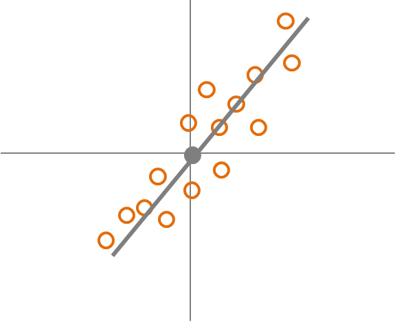
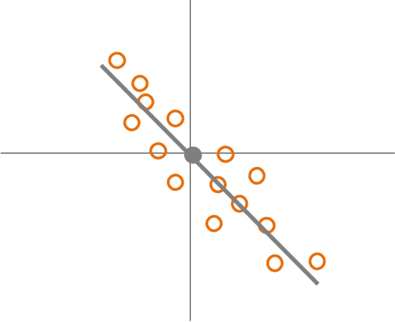
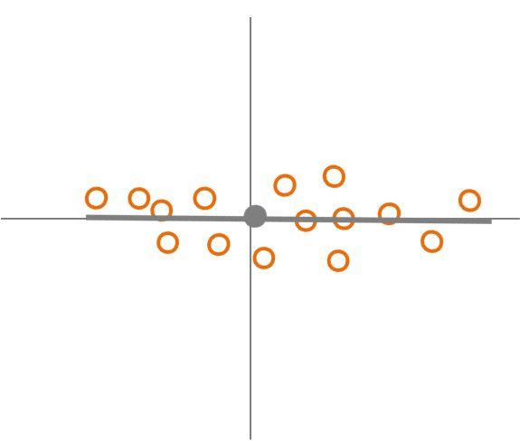
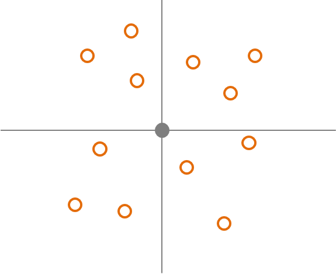

# Introduction to Methods Of Research Design

In this unit we will give a brief overview and introduction to some of the most used methods to evaluate programs and conduct research. In the last unity we discussed validity and reliability, and how that relates to why we do research in the first place. These concepts apply to any field of research. The concepts that we discuss in this unit will be discussed in more detail in future units. However, the important concepts will be introduced here to give a foundation of the methods. 

## Methods Of Research And The Relation To Validity And Reliability

In the last unit we discussed the importance of different types of validity and reliability. This is something that is very important to always keep in mind when considering the method of evaluation or research that should be used. Often, depending on the method of research and the specific design for that particular evaluation there can be different levels of validity and reliability. 

We should always aim for high validity and reliability. Unfortunately, research and evaluation must occur in a wide variety of settings, situations, and with a wide variety of people. These different research conditions often place limitations on the methods that can be used. This can lead to trade offs between the high and low validity of each of the different types and high and low reliability. We will discuss this in more details as we further investigate the different types of research methods. 

## The Relationship Between Variables

Before continuing to the overview of methods we will cover an important aspect of much research: the relationship between variables. We discussed correlation in Statistical Foundation of Program Evaluation. This is basically what we will discuss here. correlation is concerned with two factors: the strength and direction of the correlation. In most cases we aim for high strength of the relationship between variables. However, there are cases where we think that variables should have no relationship. We will discuss this further in this course.

The direction of the relationship is also important to our hypotheses, research design, and ultimately results. There are three possible types of directions: positive, negative, and zero or unrelated. Let us assume we have two variables: x, which is represented as the horizontal line on a scatter plot, and y, which is represented by the vertical line. If there is a positive relationship between x and y then as x increases y increases: the data points have a pattern of going from the bottom left to the upper right of the graph, Fig. 3.1.

### Positive Relationship Between Two Variables

Fig. 3.1

### Negative Relationship Between Two Variables

If there is a negative relationship between x and y then as x increases y decreases: the data points have a pattern of going from the upper left to the bottom right of the graph, Fig. 3.2.

### No Relationship Between Two Variables

If there is a zero or no relationship between x and y then as x increases y increases: the data points have a pattern of going from the bottom left to the upper right of the graph, Fig. 3.3 & Fig. 3.4

Fig. 3.3

Fig. 3.4

### From Relationships Between Variables To Methods Of Evaluating Relationships

Now that we have covered an important underlying theme of how variables are related to each other, we will now cover, in general, several main methods of collecting data for research. It is important to keep in mind some reasons why we evaluate programs. As discussed earlier, programs have many costs, including monetary, organizational change, potential training, etc. In addition, programs may have unforeseen negative factors. Therefore, it is very important to have methods to evaluate the success of the program, but also any negative aspects. Other reasons for research may be we are simply interested in the impacts of the many factors, the process of how the organization functions, or simply how the many factors that are part of the organization (variables) relate to each other. 

## Evaluating Relationships Of Variables In Programs And Outcomes

One very important aspect of designing research is properly define the variables that are involved. Organizations are very complex and dynamical systems with many moving parts. These different factors can all potentially play a role in how a program functions in an organization. Therefore, it is essential to define and understand how you believe these factors interact with the program, and each other once the program is or has been implemented.

Each of these factors could be a potential variable. Therefore, it is very important to think of these factors as potential varliables and how they may relate to the variables that are part of the program. At this point the next thing to consider is after identifying variables that could be factors is to consider how they function: are they factors that could be potential factors and causes of the outcomes of the program implementation or could they be potential factors that are results that are seen in the outcome or results of the program implementations?

These factors are important parts of program evaluation and statists that we have discussed previously: the independent and dependent variables. Let us review the function and differences between independent variables and dependent variables. Independent variables are variables that are free to change or  that the researcher can actually manipulate directly. However, all variables change by definition, but independent variables are thought to be inputs rather than outcomes. In a program this would be factors that change when the program is implemented that could factor into, predict or cause the outcome of the program. 

Dependent variables also change. However, the researcher believes that the change is caused or influenced by the changes in the independent variables. The dependent variable would be the outcome of the implemented program and the independent variables. In the regression model the dependent variables are the $y$'s and the independent variables are the $x$'s.

So far we have focussed mostly on variables that are inputs and changes of the program and outcomes of the program. However, there is a third category of variables that must alwasy be considered when designing research. This third category includes inherent characteristics or factors that that are inherent to the organization and controlled variables other than the independent variable that is the focus of the of interest. Inherent characteristics and control variables are other variables that may predict or cause the outcome of the program. 

Often there are many additional factors that can play a role in the success of a program. Therefore, a good researcher will consider what factors may have a considerable role. Recall from Statistical Foundations of Program Evaluation that omitted variables can drastically affect how the included independend variables are related to the outcome. This is essentially the same issue here. Therefore, a good researcher must design the research considereing these factors.

First, let us consider inherent characteristics tha may be factors. Organizations come with many factors that are simply inherent to the culture of the organization, the structure of the organization, and widely variable characteristics that the people in the organization have. Usually these are characteristics the cannot be changed or are very likely not to be changed. 

As an example let us think about the characteristics that the people in the organization have. There are several that are very common and often used. For example, there are many demographic characteristics, such as living location, education, sex, race, age, and socio-economic status. These are all variables that we must consider, but are not part of the hypothesis or theory that is being evaluated. However, these are easily measured variables and the data should always be collected. The different cultures and structure of the organization also may need to be collected as data. The main point is that there are many uncontrollable factors and variables in organizations that may have an influence on the outcome or affect and interact with the other independent variables. This is why including some may address the omitted variable bias.

Let us discuss controlled variables. These are variables that we would hold constant during the research. In other words, these variables could take on different values, but keep them the same for all of the data that we collect. The reason is that we know they can influence the results, but we are interested in the independent variables of interest in the research. For, with pay raise and productivity, we know that there could be other factors, such as experience or age that may also may influence the productivity. Therefore, researchers often make sure that everyone that participates in the research have the same category of experience and age. One caution is that sometimes allowing these factors to vary often can tell us more about how the independent variable actually influences the outcome with the other more naturally changing factors. Therefore, it is important to consider how these variables are used.

## Overview Of Research Methods

Finally, we will move on a brief overview of very general research methods, which will be discussed in much more detail in later units. An important thing for a person that is conducting research is carefully design the method conducting the research and collecting the data. If the researched is designed poorly even great statistics will not be useful and often the study results are not worth much. One reason is that if that data are not to good level of validity, reliability, and as have errors, bias, inaccuracies or potentially represents or measures something different than the researcher intended then the results cannot be trusted. When thinking about all of the postential costs in program implementation and outcomes one can see why quality evaluation and research is incredible important. 

### Non-Experimental Methods

Non-experimental designs are often used in organizations due to certain limitations. These may include to conduct the evaluation after the program began or the program could be over, true experiments may be interuptive to the functioning of the organization, and also ethical concerns of conducting experiments with employees and members of the organization. For these reasons and possibly others, various types of non-experimental methods are used.

Observational methods are very common. Basically the researcher collects data by oberving the variables, often types of behavior, quality of functioning, and outcomes. We will discuss the advantages and disadvatages of obersvational research further.  Another very populare method is collecting data by using surveys. Simply asking people about how they make decisions, feel about things in the organization, and what they actually do in the organization can be very useful. A third method is using achival data. This is often used in organizations because the data either has already been collected prior to deciding to conduct an evaluation or the data will be collected because the program implementation is in the past. An important take-away here is that all of these methods have advantages and disadvantages, and that due to limitations only certain methods may be practical and offer the type of data that is needed. 

### Experimental Methods

There are several key components that make a research method a true experiment. The first component is that the independent variable, especially the independent variable that is the focuso of the study, is manipulated by the researcher. In observational studies the researcher simply observs how the independent variable changes naturally. In experimental studies the researcher directly changes the value or categore of the independent variable for each person or setting. This helps to make sure that each participant is assigned the experimental condition that is representing the independent variable. In observational studies the researcher does not know all of the factors or why each person is showing the level of the indpendent variable. In an experiment the reason is only because the researcher placed that person in the particular level of the independent variable.

There is one other component that is essential to true experiments. This is that participant or people that you are researching are randomly assigned to different conditions or levels of the independent variable. This accomplishes something that is very important to know in evaluation and research. The first component of having the researcher assign each participant to a specific condition or level of the independent variable helps to make sure that the reason that each participant is in that condition or level is due to the researcher and not some other reason that may expain why they are ther or the outcome. Again, this is related to the omitted variable problem.

The randomization helps to minimize the chance that there are other omitted variables that could explain the results. Randomization basically makes it very unlikely that there are other explanations for how the independent variable leads to the results. Randomization creates the different groups of paricipants that are in one of the different conditions or levels of the independent variable. This leads to minimizing the chance that the participants are differnt on average with other variables and characteristics, but differ only on the condition that they are in with respect to the independent variable. Because of this, researchers can feel more confident that the independent variable caused the change in the dependent variable. We will discuss this much in more detail later in the course. 

## Looking Ahead

We have seen the importance of considering many factors before beginning the evaluation or research of a program. The first important factor we discussed is are the variables and how they may be related to each other and how the independnt variables may be related to the dependent variable. These factors may be very complex and need to be thought about very carefully. The goal is to choose the best and most appropriate variables for the study that can accurately measure the inputs to the program and the ouctomes of the program. We also sall that we must be sure to consider altherative variables that may function as omitted variables.

We also sall there are different methods that we can use for evaluation and research. This is very integrated in the decision of what variables should be used. Each method has advantages and disadvantages, and also practical and ethical limitations may have a role in the appropriate method. Just as with choosing the most appropriate variables for the study, the researcher must deliberate over the different methods that should be used. As we will see the method design is very important in research and researchers should spend much time designing the evaluation and research.

* We will next discuss in much more detail the many methods of non-experimental methods.
* We will discuss the many advantages and disadvantages of non-experimental methods.
* We will begin to discuss the ethical issues in non-experimental methods

