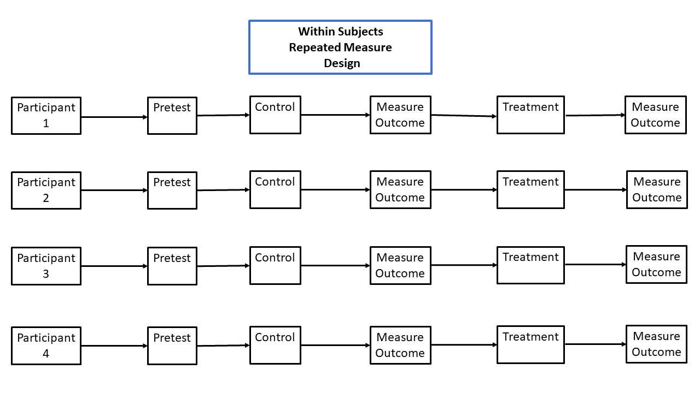

# Advanced Experimental Design

In the last unit we discussed two types of experimental designs. The first was simply measuring the outcome of the program or experiment. This is good because of the simplicity. However, conducting a pretest and post-test is useful because there is much more information about each group. This design allows for investigating changes from the beginning to the outcome of the program.

One disadvantage is that the pretest can potentially affect the outcome in the post-test. For example, simply measuring the members of the organization before starting the experiment may affect how they experience both the control and the treatment, which can alter the results. It also measures the same thing in both the pretest and post-test. This can lead to participants to improve the outcome because they had a chance to practice the outcome measurement/test before the experiment started. It can also lead to fatigue from taking the measurement/test more than once. We will discuss this further in this unit.

## The Solomon Four-Group Experimental Designs

Fig. 11.1 Shows a diagram of the solution. This solution is called the Soloman Four-Group Design. The diagram has actually four groups instead of the simple two. The two groups at the top of the diagram receive the pretest, whereas the bottom two groups do not. This allows for the comparison of the outcomes for those that receives the pretest and those that do not. If the pretest has an effect on the outcome this comparison will show differences in those that received the pretest and those that did not.

Fig. 11.1

Let us assume that we are interested in how a training program would increase skills at a certain task in an organization. The treatment group would receive training and the control group would not. If we used the simple pretest -post-test design we may see that the treatment group had a higher level of skill after the training program. Does this mean the training program worked? It may.

However, because the pretest uses the same or similar skills measurement, there is another possibility. If we use the Solomon Four-Group design we can compare the results of those that took the pretest with those that did not. We discover that the treatment group that took the pretest scored better in the skills measurement than the treatment group that did not take the pretest. One possible interpretation is that the skills training did work. However, because the treatment group that took the pretest scored higher than the treatment group that did not we could conclude that the pretest also had an effect on the post-test outcome.

Why might this be? One reason could be that the pretest treatment group had a chance to practice by taking the pretest before the training. This essentially supports the conclusion that taking the pretest also improved the scores on the outcome. Another possibility is that those that took the pretest had an idea of what the goal of the experiment was. This could lead participants to answer differently in the post-test. To further explore this we could compare the outcome of the control group that took the pretest to the outcome of the control group that did not. If the control group that did take the pretest had a better outcome score than the control group that did not then it is likely that the pretest had an effect on the outcome. This is important because the independent variable of interest is in the effect of the skills training and not the effect of the pretest.

## Between Subject Design And Within Subject/Repeated Measures Design

So far we have discussed what is called between subjects design. We have only looked at when there are separate groups for each level of the independent variable. This type of experiment is called between subjects design because it compares between different groups and each group consists of the different people. Also, each participant is only in one group or has their own unique value for the independent variable.

A within subjects design, also called a repeated measures design, creates the groups or levels of the independent variable with the participants in a different manner. In this case every participant is in every group. Therefore all of the groups consist of the same people. This is why it is called a within subjects design. The researcher does not compare groups of different people, but rather compares the same people for each group.

It is also called a repeated measures design for this reason. Each participant is subject to every treatment and the control group. Therefore, the measure or outcome/dependent variable is repeated for each participant. This is similar to a pretest post-test experiment where each person is measured on the outcome more than once repeatedly. Fig. 11.2 shows that each participant is in the control group and the treatment group, in addition that there are three measures of the outcome or dependent variable. You can also see that all of the participants experience each level of the independent variable.

Fig. 11.2

### Advantages And Disadvantages

One advantage with repeated measure design is the sample size. Because every participant experiences each level of the independent variable the same number of overall participants will increase the sample size compared to a between subjects design. In Fig. 11.2, which only shows 4 participants overall, suppose that we used 6 subjects instead. The sample size for each group would therefore be 6. However, if we also had 6 participants in the between subjects design we would only have 2 participants in each group because they must be distributed to each group. Therefore, with the same number of total participants the repeated measure design would have 3 times the amount of participants compared to the between subjects design. This would lead to more statistical power.

Another advantage is the the variability regarding characteristics of each group would be that they are essentially the same. This is because each group consists of the same participants. Therefore, important factors, such as the mean age, education levels, etc. will be identical for each group. As you recall that one important characteristic of experiments is that the groups are the same on average, which is accomplished by random assignment to each group. The characteristics of each group are often very important, even though they are not the independent variable of interest. 

As with the simple pretest post-test design, the fact that participants complete the outcome measure more than once could cause differences in the results. In the case of Fig. 11.2 they complete the outcome measure 3 times, including the pretest. Recall that taking the test can lead to the disadvantages of fatigue or practice effects. If there is fatigue from taking the measure multiple times this could lead to not completing the outcome measure carefully, which can lead to biasing the data. With practice effects the participants may gain expertise in complete the measure, which will lead to better responses as the study continues. However, we are not interested in the effect from taking the test multiple times, but rather the effect of the independent variable or program.

One disadvantage, which is related to practice and fatigue, is carryover or order effects. However, this more likely due to receiving each level of the  independent variable. In this case receiving each level of the the order may matter. A simple example is assume the study is interested in the effect of a cancer drug. If the treatments are given in the order of control or no drug, then a low dose, and finally a high dose it is likely that the order will affect the success of the drug. This can be especially true for those that receive the treatment. For example, some medications will build up in a person's body over time. This could change the effect of the drug and potentially be more successful in a person that received a low dose before receiving a high dose.

It is also possible that the drug builds tolerance and becomes less effective for people taking the high dosage after the low dosage. Because the purpose of drug studies is often to compare different dosages and the control the order is not what is of interest. Therefore, order effects are a big concern for researchers. This order may yield results for which the researcher may not have as much confidence.

Luckily there is a solution called counterbalancing. This basically changes the order for the different treatment groups, which in turn allows the comparison of each order to discover if the order did make a difference. For example, some participants will be exposed to the control, then the low dosage, and then the high dosage. Others will be exposed to the low dosage, then the high dosage, and then the control. This will be continued until every possible order has been investigated. Ideally there will be no order effects, but determining if there are is very important. 

## Looking Ahead

We have discussed several important types of experimental designs, including the advantages and disadvantages of post-test only pretest post-test designs. We also discussed the solution to minimize the effects of the pre-test. We Then discussed the advantages and disadvantages of the Solomon four-group design. Finally, we discussed between subjects and within subjects designs.

- We will discuss the counterfactuals. 

- We will discuss quasi-experimental designs

